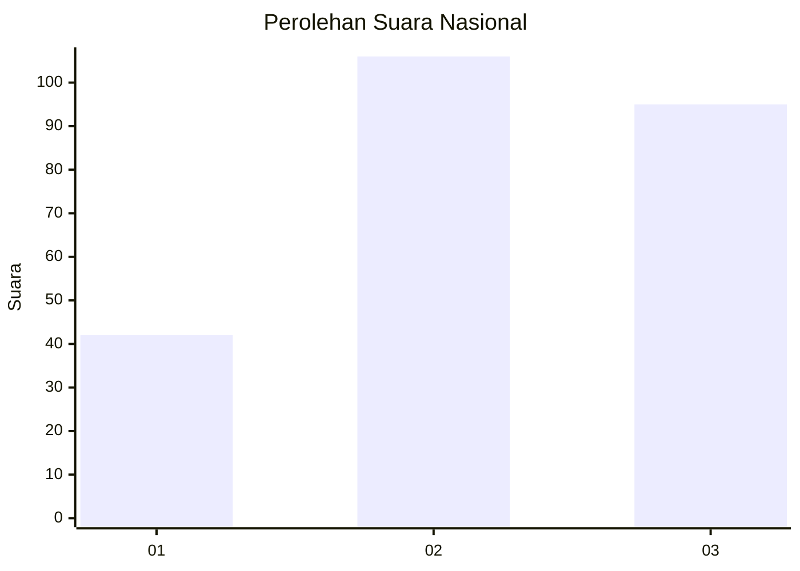
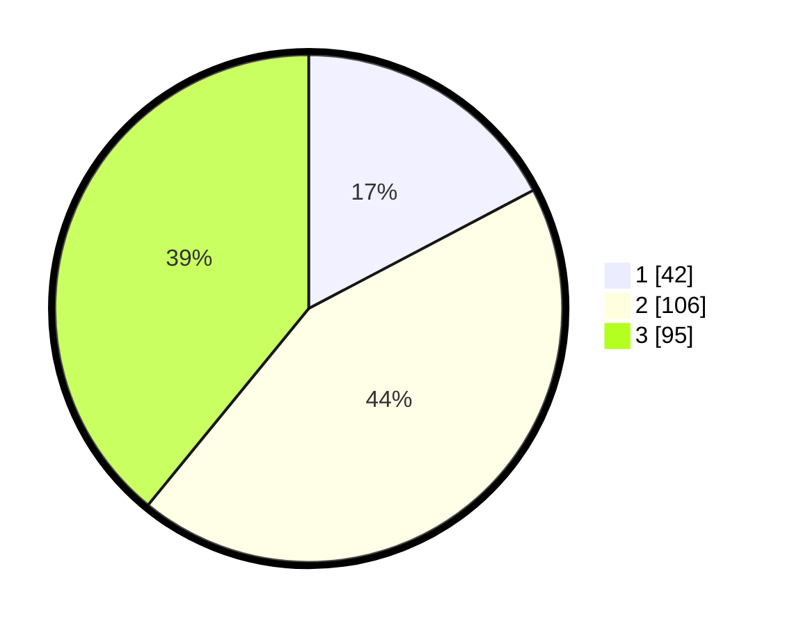

# Hasil

## Grafik

## Tabel

| No. | Nama Paslon    | Suara | Suara (raw) | Persentase |
|:--- |:-------------- | -----:| -----------:| ----------:|
| 1   | ANIES MUHAIMIN | 42    | [42][p-1]   | 17,28      |
| 2   | PRABOWO GIBRAN | 106   | [106][p-2]  | 43,62      |
| 3   | GANJAR MAHFUD  | 95    | [95][p-3]   | 39,09      |

[p-1]: https://github.com/gigit-pemilu/pemilu-2024/blob/main/pilpres/hitung-suara/sub/34-di-yogyakarta/sub/02-bantul/sub/17-sedayu/sub/2002-argorejo/sub/026-tps/sub/paslon-1.txt
[p-2]: https://github.com/gigit-pemilu/pemilu-2024/blob/main/pilpres/hitung-suara/sub/34-di-yogyakarta/sub/02-bantul/sub/17-sedayu/sub/2002-argorejo/sub/026-tps/sub/paslon-2.txt
[p-3]: https://github.com/gigit-pemilu/pemilu-2024/blob/main/pilpres/hitung-suara/sub/34-di-yogyakarta/sub/02-bantul/sub/17-sedayu/sub/2002-argorejo/sub/026-tps/sub/paslon-3.txt

## Foto C Plano

https://sirekap-obj-formc.kpu.go.id/b00c/pemilu/ppwp/34/02/17/20/02/3402172002026-20240215-021002--3dd3899b-d34f-4392-9bb6-1e47bf1d0fde.jpg

https://sirekap-obj-formc.kpu.go.id/b00c/pemilu/ppwp/34/02/17/20/02/3402172002026-20240215-021127--712af0c4-d039-4111-89f4-0e2b9b825c42.jpg

https://sirekap-obj-formc.kpu.go.id/b00c/pemilu/ppwp/34/02/17/20/02/3402172002026-20240215-021300--530241ef-ba20-46f7-86c3-8ad8f5d6c37c.jpg

## Metadata

| Key        | Value               |
| ---------- | ------------------- |
| Time Stamp | 2024-02-24 22:31:28 |

