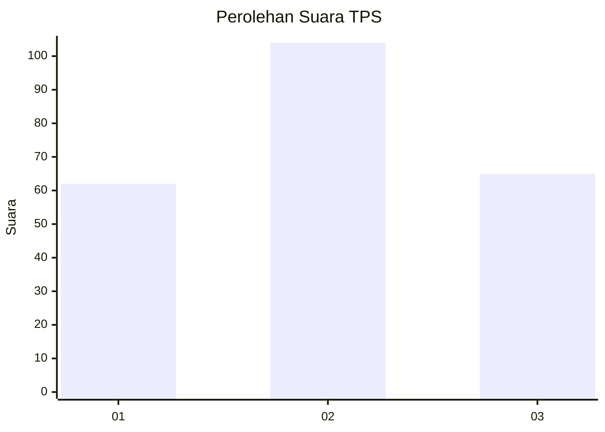
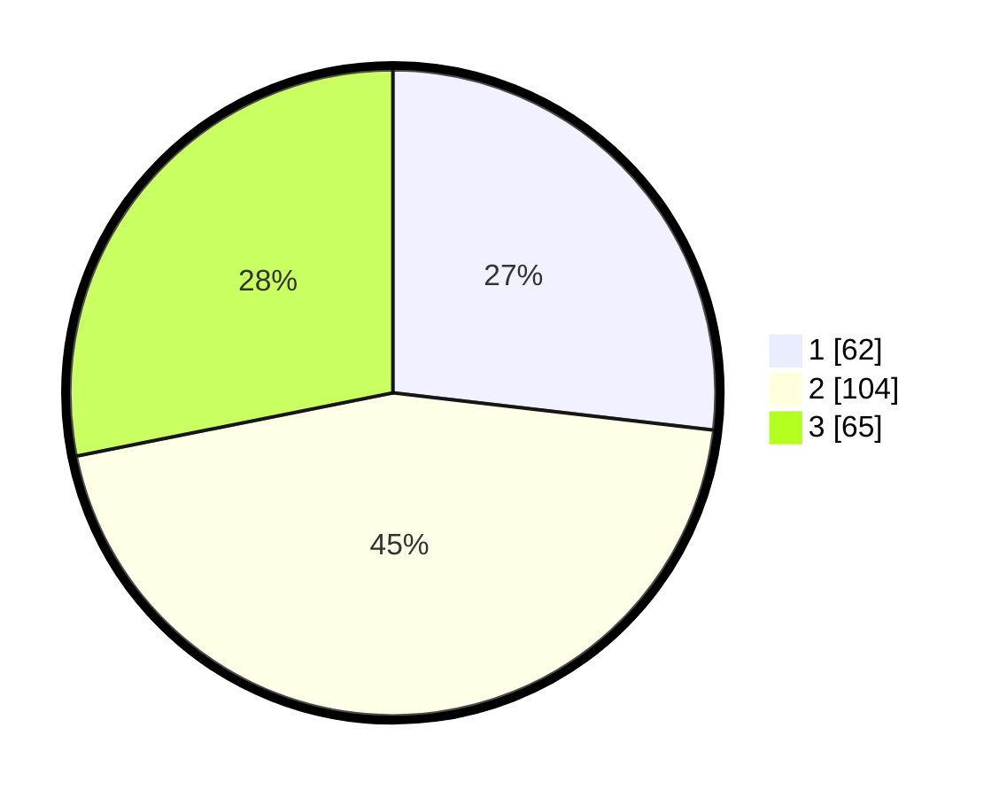

# Hasil

## Grafik

## Tabel

| No. | Nama Paslon    | Suara | Suara (raw) | Persentase |
|:--- |:-------------- | -----:| -----------:| ----------:|
| 1   | ANIES MUHAIMIN | 62    | [62][p-1]   | 26,84      |
| 2   | PRABOWO GIBRAN | 104   | [104][p-2]  | 45,02      |
| 3   | GANJAR MAHFUD  | 65    | [65][p-3]   | 28,14      |

[p-1]: https://github.com/gigit-pemilu/pemilu-2024-34-di-yogyakarta/blob/main/pilpres/hitung-suara/sub/34-di-yogyakarta/sub/02-bantul/sub/17-sedayu/sub/2002-argorejo/sub/027-tps/sub/paslon-1.txt
[p-2]: https://github.com/gigit-pemilu/pemilu-2024-34-di-yogyakarta/blob/main/pilpres/hitung-suara/sub/34-di-yogyakarta/sub/02-bantul/sub/17-sedayu/sub/2002-argorejo/sub/027-tps/sub/paslon-2.txt
[p-3]: https://github.com/gigit-pemilu/pemilu-2024-34-di-yogyakarta/blob/main/pilpres/hitung-suara/sub/34-di-yogyakarta/sub/02-bantul/sub/17-sedayu/sub/2002-argorejo/sub/027-tps/sub/paslon-3.txt

## Foto C Plano

https://sirekap-obj-formc.kpu.go.id/d2d5/pemilu/ppwp/34/02/17/20/02/3402172002027-20240214-192834--831de729-c432-40d9-93c7-9d8ebfc3b788.jpg

https://sirekap-obj-formc.kpu.go.id/d2d5/pemilu/ppwp/34/02/17/20/02/3402172002027-20240214-192852--24d55f12-30ed-4786-b7f9-99236ab6ce06.jpg

https://sirekap-obj-formc.kpu.go.id/d2d5/pemilu/ppwp/34/02/17/20/02/3402172002027-20240214-192906--890b17e9-5d50-4755-8fbe-5a9730c98507.jpg

## Metadata

| Key        | Value               |
| ---------- | ------------------- |
| Time Stamp | 2024-02-15 00:41:44 |

