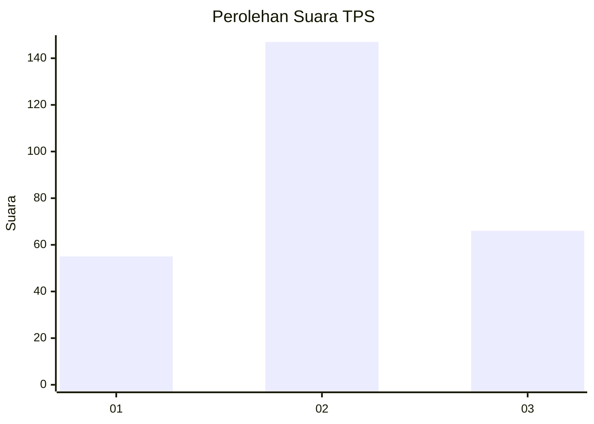
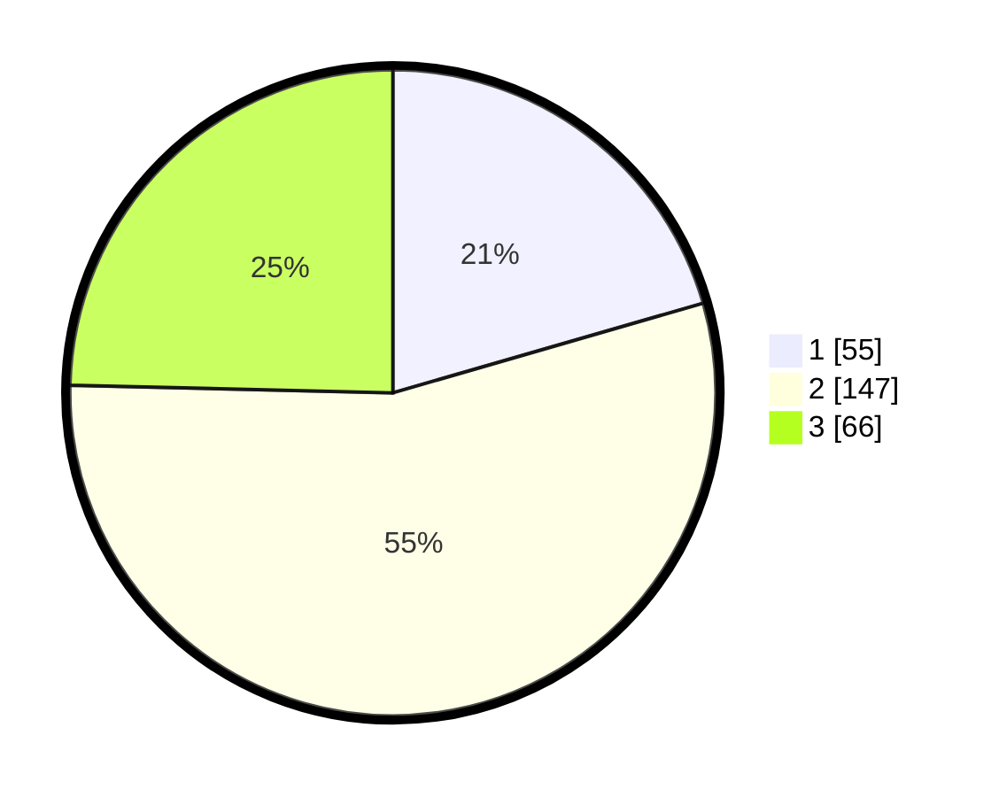

# Hasil

## Grafik

## Tabel

| No. | Nama Paslon    | Suara | Suara (raw) | Persentase |
|:--- |:-------------- | -----:| -----------:| ----------:|
| 1   | ANIES MUHAIMIN | 55    | [55][p-1]   | 20,52      |
| 2   | PRABOWO GIBRAN | 147   | [147][p-2]  | 54,85      |
| 3   | GANJAR MAHFUD  | 66    | [66][p-3]   | 24,63      |

[p-1]: https://github.com/gigit-pemilu/pemilu-2024-34-di-yogyakarta/blob/main/pilpres/hitung-suara/sub/34-di-yogyakarta/sub/02-bantul/sub/17-sedayu/sub/2002-argorejo/sub/028-tps/sub/paslon-1.txt
[p-2]: https://github.com/gigit-pemilu/pemilu-2024-34-di-yogyakarta/blob/main/pilpres/hitung-suara/sub/34-di-yogyakarta/sub/02-bantul/sub/17-sedayu/sub/2002-argorejo/sub/028-tps/sub/paslon-2.txt
[p-3]: https://github.com/gigit-pemilu/pemilu-2024-34-di-yogyakarta/blob/main/pilpres/hitung-suara/sub/34-di-yogyakarta/sub/02-bantul/sub/17-sedayu/sub/2002-argorejo/sub/028-tps/sub/paslon-3.txt

## Foto C Plano

https://sirekap-obj-formc.kpu.go.id/1dfb/pemilu/ppwp/34/02/17/20/02/3402172002028-20240215-011344--db249900-0078-4c24-8c21-d88011cbc667.jpg

https://sirekap-obj-formc.kpu.go.id/1dfb/pemilu/ppwp/34/02/17/20/02/3402172002028-20240215-011741--640ddc2c-0623-4e52-aed3-22f40310bcac.jpg

https://sirekap-obj-formc.kpu.go.id/1dfb/pemilu/ppwp/34/02/17/20/02/3402172002028-20240215-012216--d7d07c7f-c8a8-4b92-9481-e8c0e563a208.jpg

## Metadata

| Key        | Value               |
| ---------- | ------------------- |
| Time Stamp | 2024-02-24 22:31:28 |

