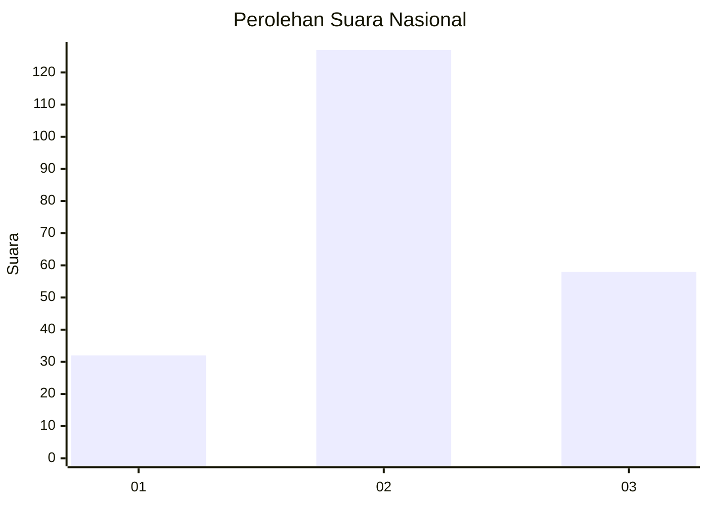
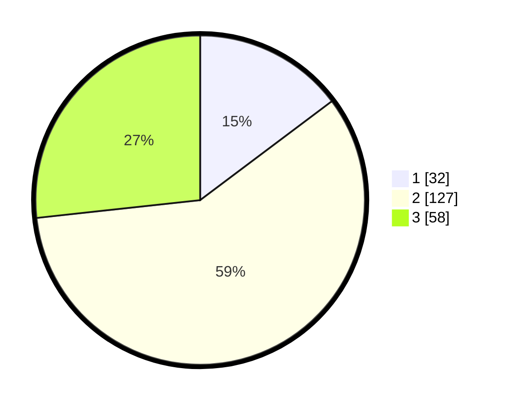

# Hasil

## Grafik

## Tabel

| No. | Nama Paslon    | Suara | Suara (raw) | Persentase |
|:--- |:-------------- | -----:| -----------:| ----------:|
| 1   | ANIES MUHAIMIN | 32    | [32][p-1]   | 14,75      |
| 2   | PRABOWO GIBRAN | 127   | [127][p-2]  | 58,53      |
| 3   | GANJAR MAHFUD  | 58    | [58][p-3]   | 26,73      |

[p-1]: https://github.com/gigit-pemilu/pemilu-2024/blob/main/pilpres/hitung-suara/sub/34-di-yogyakarta/sub/02-bantul/sub/17-sedayu/sub/2002-argorejo/sub/029-tps/sub/paslon-1.txt
[p-2]: https://github.com/gigit-pemilu/pemilu-2024/blob/main/pilpres/hitung-suara/sub/34-di-yogyakarta/sub/02-bantul/sub/17-sedayu/sub/2002-argorejo/sub/029-tps/sub/paslon-2.txt
[p-3]: https://github.com/gigit-pemilu/pemilu-2024/blob/main/pilpres/hitung-suara/sub/34-di-yogyakarta/sub/02-bantul/sub/17-sedayu/sub/2002-argorejo/sub/029-tps/sub/paslon-3.txt

## Foto C Plano

https://sirekap-obj-formc.kpu.go.id/3312/pemilu/ppwp/34/02/17/20/02/3402172002029-20240215-005600--8350981e-4635-45c4-a077-dcd0bc796d10.jpg

https://sirekap-obj-formc.kpu.go.id/3312/pemilu/ppwp/34/02/17/20/02/3402172002029-20240215-005214--1b7eb3ab-3348-48cb-9e90-47b16dfe8e4e.jpg

https://sirekap-obj-formc.kpu.go.id/3312/pemilu/ppwp/34/02/17/20/02/3402172002029-20240215-005453--bf2f02fc-4fdb-4b9d-b696-73dfd7475420.jpg

## Metadata

| Key        | Value               |
| ---------- | ------------------- |
| Time Stamp | 2024-02-15 07:00:44 |

