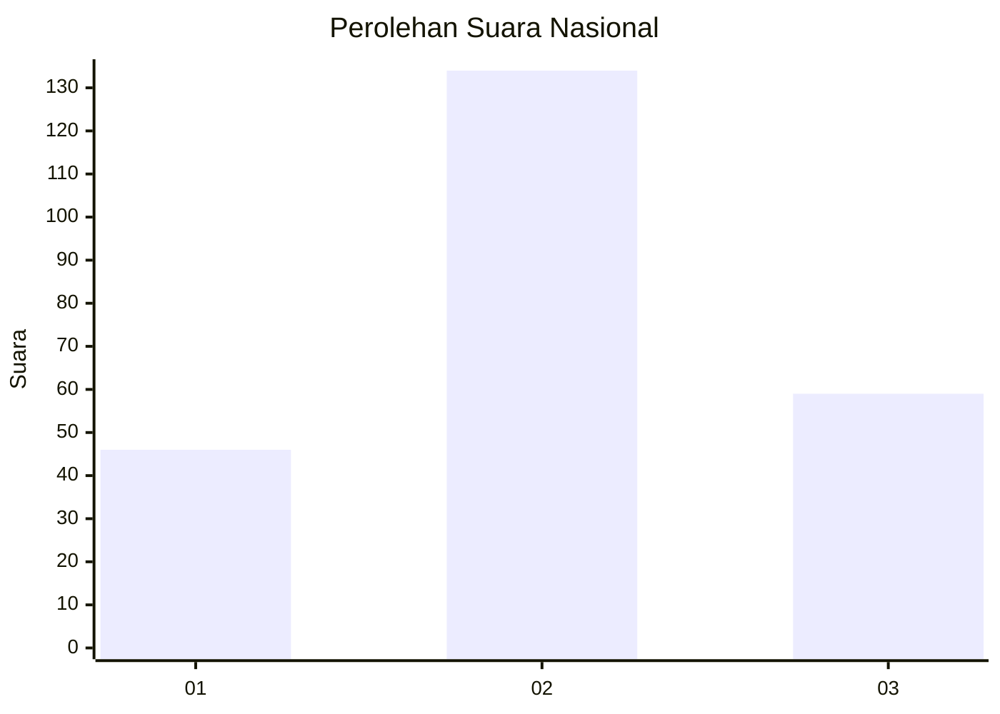
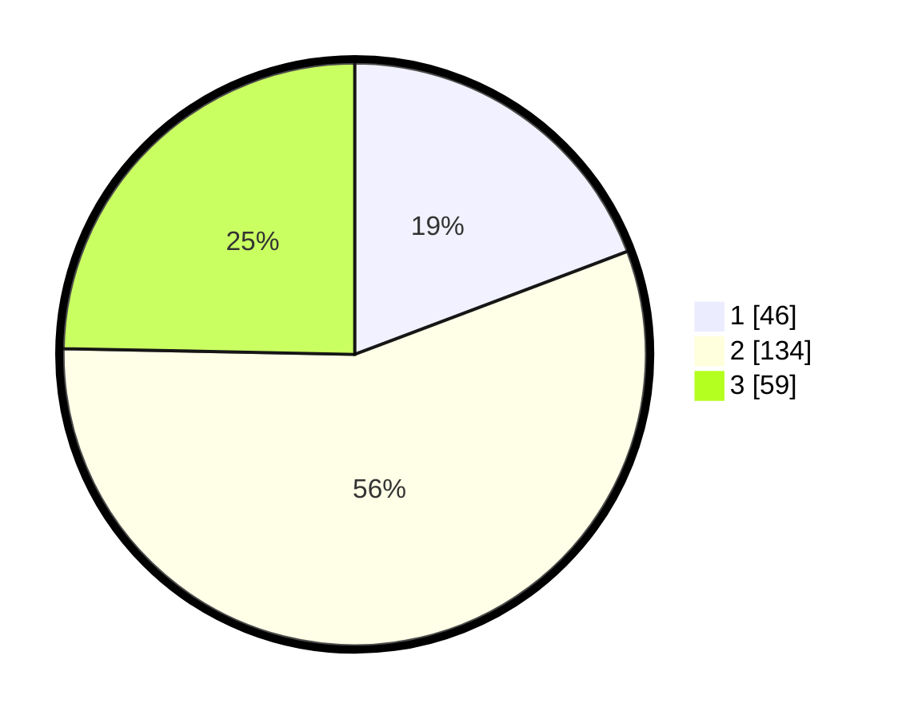

# Hasil

## Grafik

## Tabel

| No. | Nama Paslon    | Suara | Suara (raw) | Persentase |
|:--- |:-------------- | -----:| -----------:| ----------:|
| 1   | ANIES MUHAIMIN | 46    | [46][p-1]   | 19,25      |
| 2   | PRABOWO GIBRAN | 134   | [134][p-2]  | 56,07      |
| 3   | GANJAR MAHFUD  | 59    | [59][p-3]   | 24,69      |

[p-1]: https://github.com/gigit-pemilu/pemilu-2024/blob/main/pilpres/hitung-suara/sub/34-di-yogyakarta/sub/02-bantul/sub/17-sedayu/sub/2002-argorejo/sub/030-tps/sub/paslon-1.txt
[p-2]: https://github.com/gigit-pemilu/pemilu-2024/blob/main/pilpres/hitung-suara/sub/34-di-yogyakarta/sub/02-bantul/sub/17-sedayu/sub/2002-argorejo/sub/030-tps/sub/paslon-2.txt
[p-3]: https://github.com/gigit-pemilu/pemilu-2024/blob/main/pilpres/hitung-suara/sub/34-di-yogyakarta/sub/02-bantul/sub/17-sedayu/sub/2002-argorejo/sub/030-tps/sub/paslon-3.txt

## Foto C Plano

https://sirekap-obj-formc.kpu.go.id/d337/pemilu/ppwp/34/02/17/20/02/3402172002030-20240215-073327--2c9b1b76-6388-469b-ace2-ccf1eb645a45.jpg

https://sirekap-obj-formc.kpu.go.id/d337/pemilu/ppwp/34/02/17/20/02/3402172002030-20240215-073612--7a0d6ecb-869e-4dee-b429-dac777deaea4.jpg

https://sirekap-obj-formc.kpu.go.id/d337/pemilu/ppwp/34/02/17/20/02/3402172002030-20240215-075817--a8d325f0-e0c7-4228-8428-059a0d227d26.jpg

## Metadata

| Key        | Value               |
| ---------- | ------------------- |
| Time Stamp | 2024-02-24 23:00:00 |

