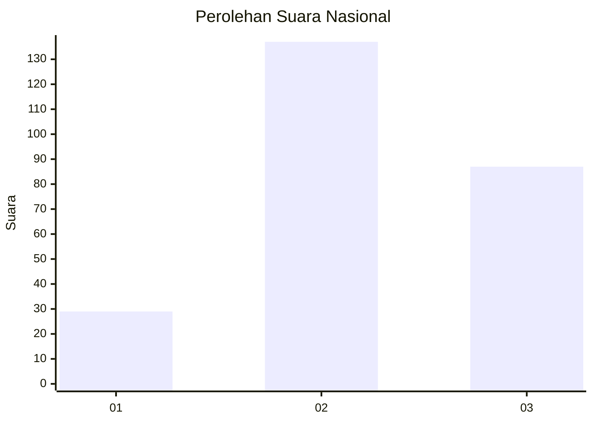
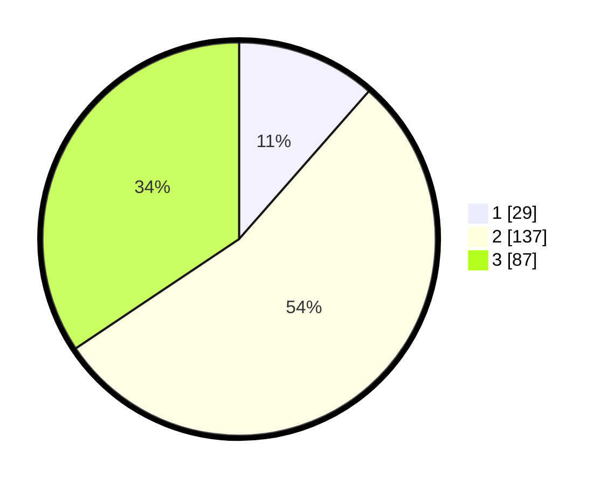

# Hasil

## Grafik

## Tabel

| No. | Nama Paslon    | Suara | Suara (raw) | Persentase |
|:--- |:-------------- | -----:| -----------:| ----------:|
| 1   | ANIES MUHAIMIN | 29    | [29][p-1]   | 11,46      |
| 2   | PRABOWO GIBRAN | 137   | [137][p-2]  | 54,15      |
| 3   | GANJAR MAHFUD  | 87    | [87][p-3]   | 34,39      |

[p-1]: https://github.com/gigit-pemilu/pemilu-2024/blob/main/pilpres/hitung-suara/sub/34-di-yogyakarta/sub/02-bantul/sub/17-sedayu/sub/2002-argorejo/sub/031-tps/sub/paslon-1.txt
[p-2]: https://github.com/gigit-pemilu/pemilu-2024/blob/main/pilpres/hitung-suara/sub/34-di-yogyakarta/sub/02-bantul/sub/17-sedayu/sub/2002-argorejo/sub/031-tps/sub/paslon-2.txt
[p-3]: https://github.com/gigit-pemilu/pemilu-2024/blob/main/pilpres/hitung-suara/sub/34-di-yogyakarta/sub/02-bantul/sub/17-sedayu/sub/2002-argorejo/sub/031-tps/sub/paslon-3.txt

## Foto C Plano

https://sirekap-obj-formc.kpu.go.id/a041/pemilu/ppwp/34/02/17/20/02/3402172002031-20240215-024603--593b1ca8-cd00-485e-bc75-f7c28d2fe9b1.jpg

https://sirekap-obj-formc.kpu.go.id/a041/pemilu/ppwp/34/02/17/20/02/3402172002031-20240214-214502--d225f5ce-7043-4db8-ae84-50813158883e.jpg

https://sirekap-obj-formc.kpu.go.id/a041/pemilu/ppwp/34/02/17/20/02/3402172002031-20240214-214619--78ac8e8e-15e9-4e65-a3ba-2ff8a420feb0.jpg

## Metadata

| Key        | Value               |
| ---------- | ------------------- |
| Time Stamp | 2024-02-15 19:30:26 |

