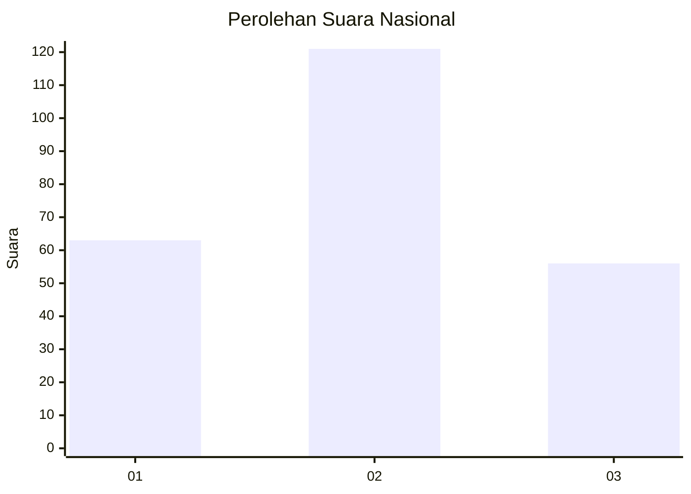
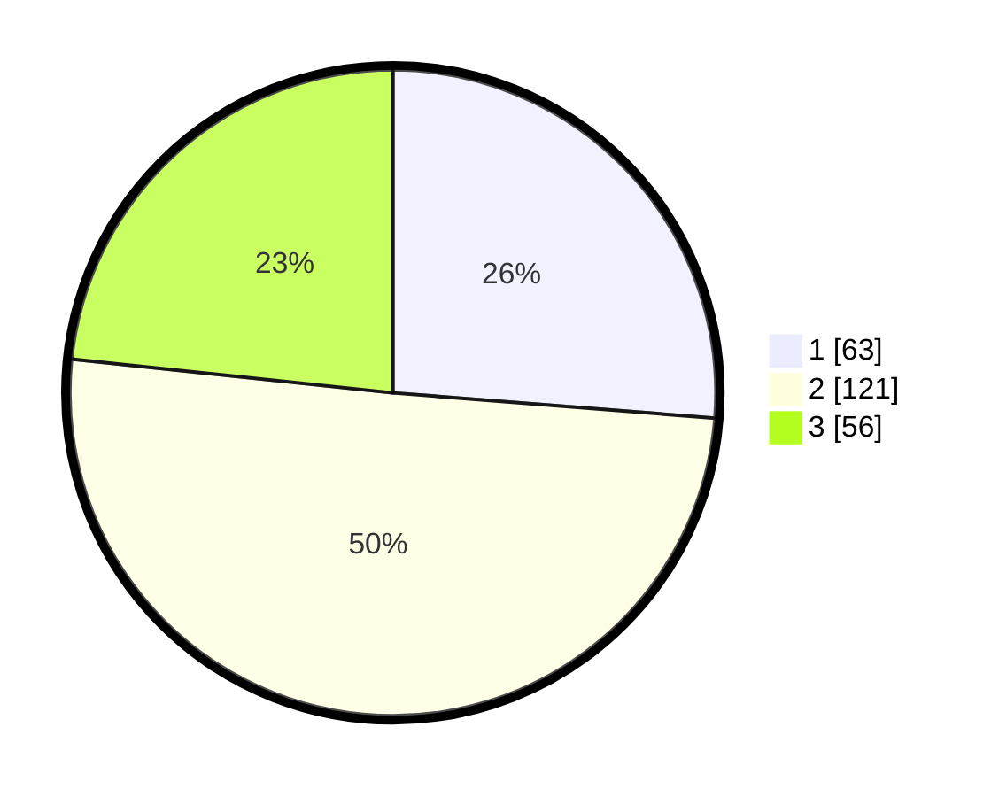

# Hasil

## Grafik

## Tabel

| No. | Nama Paslon    | Suara | Suara (raw) | Persentase |
|:--- |:-------------- | -----:| -----------:| ----------:|
| 1   | ANIES MUHAIMIN | 63    | [63][p-1]   | 26,25      |
| 2   | PRABOWO GIBRAN | 121   | [121][p-2]  | 50,42      |
| 3   | GANJAR MAHFUD  | 56    | [56][p-3]   | 23,33      |

[p-1]: https://github.com/gigit-pemilu/pemilu-2024/blob/main/pilpres/hitung-suara/sub/34-di-yogyakarta/sub/02-bantul/sub/17-sedayu/sub/2002-argorejo/sub/032-tps/sub/paslon-1.txt
[p-2]: https://github.com/gigit-pemilu/pemilu-2024/blob/main/pilpres/hitung-suara/sub/34-di-yogyakarta/sub/02-bantul/sub/17-sedayu/sub/2002-argorejo/sub/032-tps/sub/paslon-2.txt
[p-3]: https://github.com/gigit-pemilu/pemilu-2024/blob/main/pilpres/hitung-suara/sub/34-di-yogyakarta/sub/02-bantul/sub/17-sedayu/sub/2002-argorejo/sub/032-tps/sub/paslon-3.txt

## Foto C Plano

https://sirekap-obj-formc.kpu.go.id/d5b4/pemilu/ppwp/34/02/17/20/02/3402172002032-20240214-184547--9fddebe0-388a-449f-b418-d12288aa6b6a.jpg

https://sirekap-obj-formc.kpu.go.id/d5b4/pemilu/ppwp/34/02/17/20/02/3402172002032-20240214-192408--1f3eb399-41ed-4943-a1d1-f6cc9d670a75.jpg

https://sirekap-obj-formc.kpu.go.id/d5b4/pemilu/ppwp/34/02/17/20/02/3402172002032-20240214-193454--4fc3ac0a-4f1f-4cfd-9bc4-4ce6881a484f.jpg

## Metadata

| Key        | Value               |
| ---------- | ------------------- |
| Time Stamp | 2024-02-14 21:46:01 |

