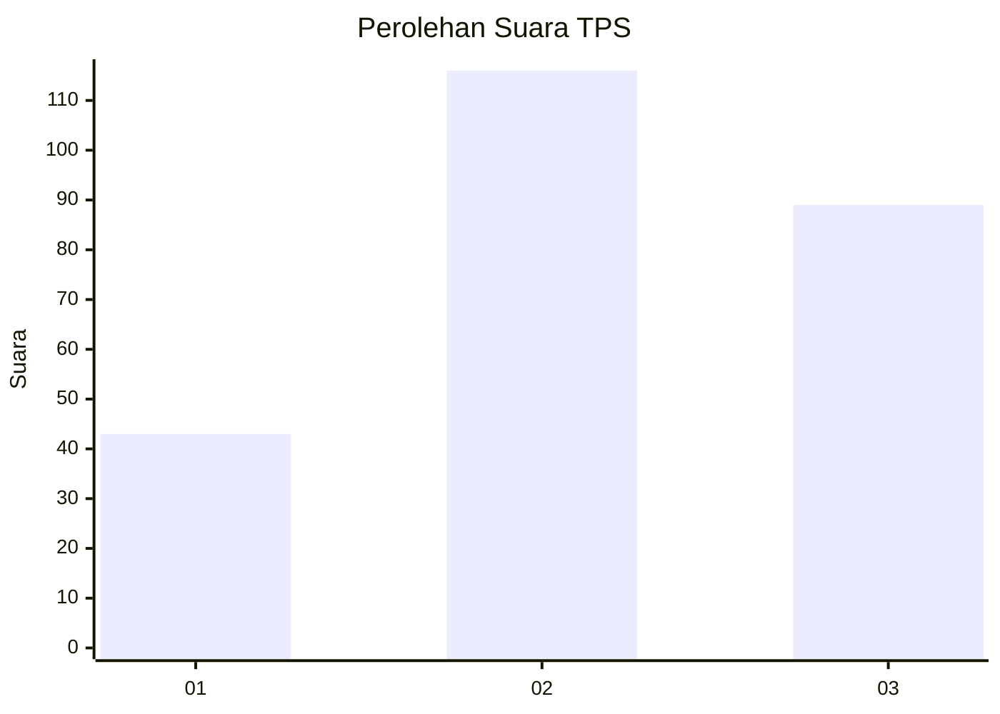
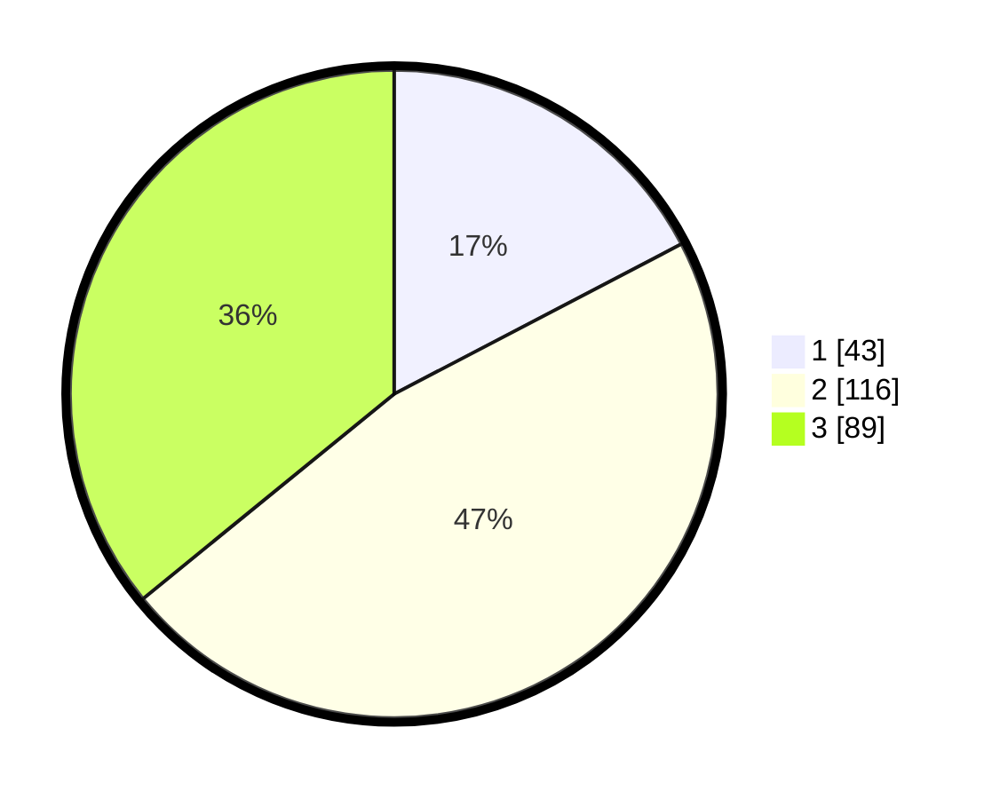

# Hasil

## Grafik

## Tabel

| No. | Nama Paslon    | Suara | Suara (raw) | Persentase |
|:--- |:-------------- | -----:| -----------:| ----------:|
| 1   | ANIES MUHAIMIN | 43    | [43][p-1]   | 17,34      |
| 2   | PRABOWO GIBRAN | 116   | [116][p-2]  | 46,77      |
| 3   | GANJAR MAHFUD  | 89    | [89][p-3]   | 35,89      |

[p-1]: https://github.com/gigit-pemilu/pemilu-2024-34-di-yogyakarta/blob/main/pilpres/hitung-suara/sub/34-di-yogyakarta/sub/02-bantul/sub/17-sedayu/sub/2002-argorejo/sub/033-tps/sub/paslon-1.txt
[p-2]: https://github.com/gigit-pemilu/pemilu-2024-34-di-yogyakarta/blob/main/pilpres/hitung-suara/sub/34-di-yogyakarta/sub/02-bantul/sub/17-sedayu/sub/2002-argorejo/sub/033-tps/sub/paslon-2.txt
[p-3]: https://github.com/gigit-pemilu/pemilu-2024-34-di-yogyakarta/blob/main/pilpres/hitung-suara/sub/34-di-yogyakarta/sub/02-bantul/sub/17-sedayu/sub/2002-argorejo/sub/033-tps/sub/paslon-3.txt

## Foto C Plano

https://sirekap-obj-formc.kpu.go.id/a4f8/pemilu/ppwp/34/02/17/20/02/3402172002033-20240215-031533--2e039798-dcf3-4998-aa58-51d7dc47cda4.jpg

https://sirekap-obj-formc.kpu.go.id/a4f8/pemilu/ppwp/34/02/17/20/02/3402172002033-20240215-032204--f48dc044-3621-40f2-ac94-bd6410c1db83.jpg

https://sirekap-obj-formc.kpu.go.id/a4f8/pemilu/ppwp/34/02/17/20/02/3402172002033-20240215-033555--e38cdeb0-9b81-4437-825a-08b000697b86.jpg

## Metadata

| Key        | Value               |
| ---------- | ------------------- |
| Time Stamp | 2024-02-24 22:31:28 |

