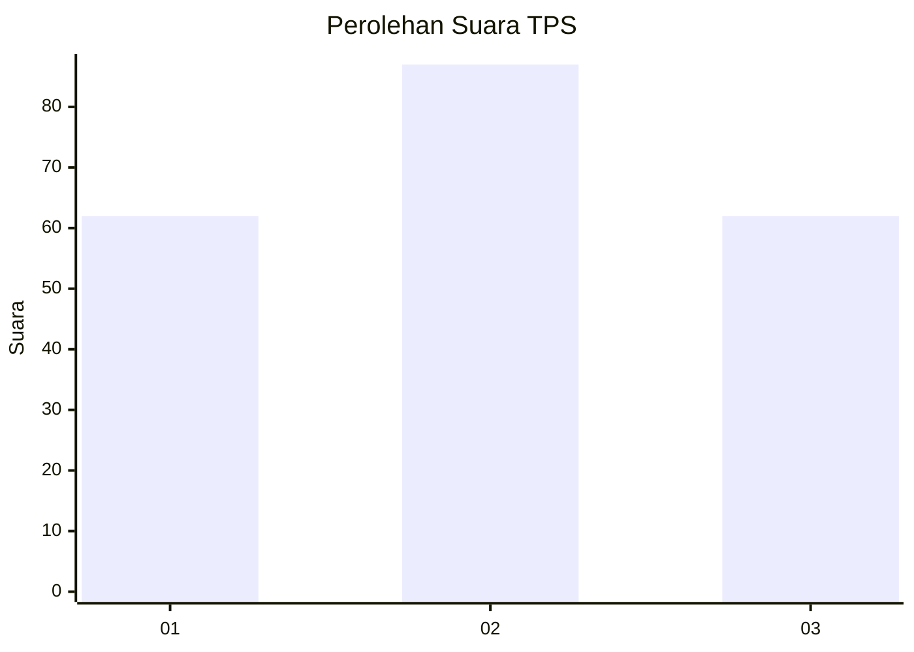
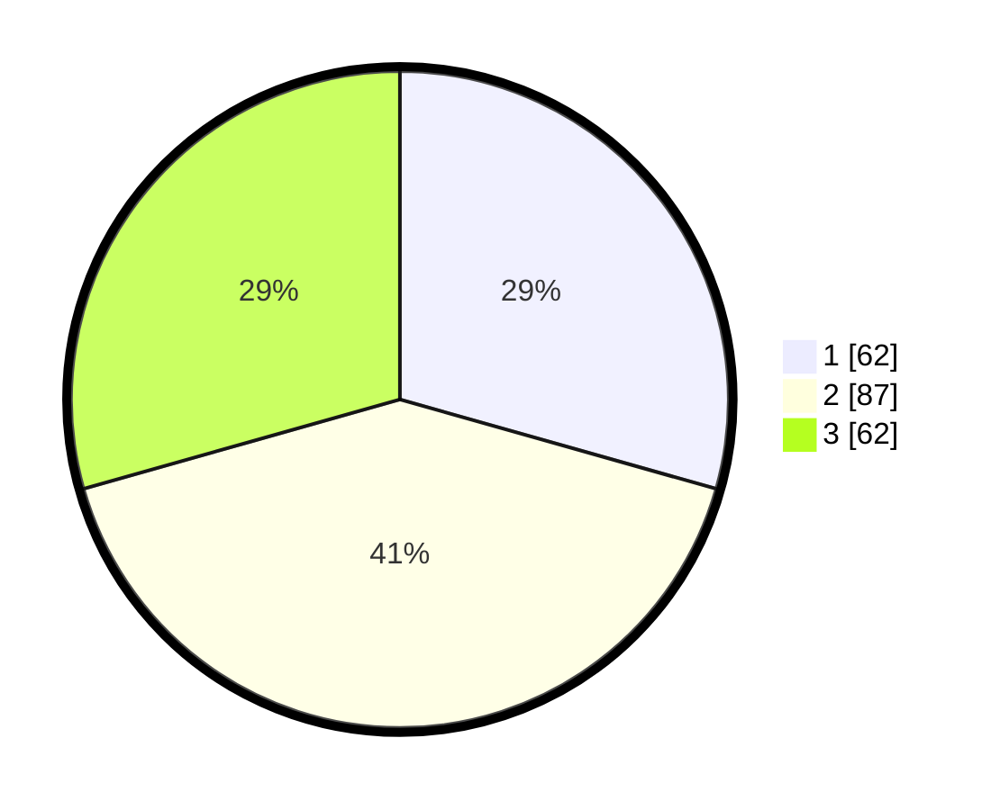

# Hasil

## Grafik

## Tabel

| No. | Nama Paslon    | Suara | Suara (raw) | Persentase |
|:--- |:-------------- | -----:| -----------:| ----------:|
| 1   | ANIES MUHAIMIN | 62    | [62][p-1]   | 29,38      |
| 2   | PRABOWO GIBRAN | 87    | [87][p-2]   | 41,23      |
| 3   | GANJAR MAHFUD  | 62    | [62][p-3]   | 29,38      |

[p-1]: https://github.com/gigit-pemilu/pemilu-2024-34-di-yogyakarta/blob/main/pilpres/hitung-suara/sub/34-di-yogyakarta/sub/02-bantul/sub/17-sedayu/sub/2002-argorejo/sub/036-tps/sub/paslon-1.txt
[p-2]: https://github.com/gigit-pemilu/pemilu-2024-34-di-yogyakarta/blob/main/pilpres/hitung-suara/sub/34-di-yogyakarta/sub/02-bantul/sub/17-sedayu/sub/2002-argorejo/sub/036-tps/sub/paslon-2.txt
[p-3]: https://github.com/gigit-pemilu/pemilu-2024-34-di-yogyakarta/blob/main/pilpres/hitung-suara/sub/34-di-yogyakarta/sub/02-bantul/sub/17-sedayu/sub/2002-argorejo/sub/036-tps/sub/paslon-3.txt

## Foto C Plano

https://sirekap-obj-formc.kpu.go.id/1da0/pemilu/ppwp/34/02/17/20/02/3402172002036-20240215-024947--fd06fcda-ba1c-41e9-b196-65aac318f946.jpg

https://sirekap-obj-formc.kpu.go.id/1da0/pemilu/ppwp/34/02/17/20/02/3402172002036-20240215-025142--098dd6ba-a4da-41a5-bde5-3dd9c3b51aa5.jpg

https://sirekap-obj-formc.kpu.go.id/1da0/pemilu/ppwp/34/02/17/20/02/3402172002036-20240215-030458--b191cac9-6502-4dc2-a925-231a5f91e4ab.jpg

## Metadata

| Key        | Value               |
| ---------- | ------------------- |
| Time Stamp | 2024-02-24 22:31:28 |

