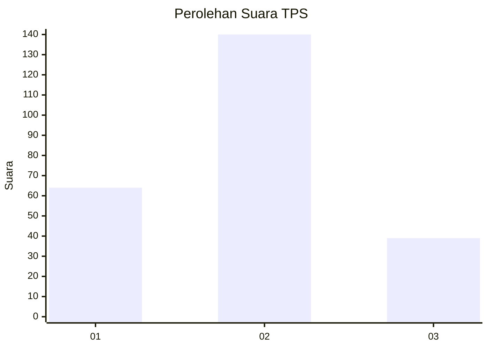

# Hasil

## Grafik

## Tabel

| No. | Nama Paslon    | Suara | Suara (raw) | Persentase |
|:--- |:-------------- | -----:| -----------:| ----------:|
| 1   | ANIES MUHAIMIN | 64    | [64][p-1]   | 26,34      |
| 2   | PRABOWO GIBRAN | 140   | [140][p-2]  | 57,61      |
| 3   | GANJAR MAHFUD  | 39    | [39][p-3]   | 16,05      |

[p-1]: https://github.com/gigit-pemilu/pemilu-2024-34-di-yogyakarta/blob/main/pilpres/hitung-suara/sub/34-di-yogyakarta/sub/02-bantul/sub/17-sedayu/sub/2002-argorejo/sub/039-tps/sub/paslon-1.txt
[p-2]: https://github.com/gigit-pemilu/pemilu-2024-34-di-yogyakarta/blob/main/pilpres/hitung-suara/sub/34-di-yogyakarta/sub/02-bantul/sub/17-sedayu/sub/2002-argorejo/sub/039-tps/sub/paslon-2.txt
[p-3]: https://github.com/gigit-pemilu/pemilu-2024-34-di-yogyakarta/blob/main/pilpres/hitung-suara/sub/34-di-yogyakarta/sub/02-bantul/sub/17-sedayu/sub/2002-argorejo/sub/039-tps/sub/paslon-3.txt

## Foto C Plano

https://sirekap-obj-formc.kpu.go.id/4d97/pemilu/ppwp/34/02/17/20/02/3402172002039-20240214-214415--ce07ff98-6203-4f99-bfd0-ff05cb4af9b1.jpg

https://sirekap-obj-formc.kpu.go.id/4d97/pemilu/ppwp/34/02/17/20/02/3402172002039-20240214-214429--9b9d2abe-8ae2-473e-8285-1f868538e285.jpg

https://sirekap-obj-formc.kpu.go.id/4d97/pemilu/ppwp/34/02/17/20/02/3402172002039-20240215-235252--f9724c09-a8a2-4628-b214-74ff53051bec.jpg

## Metadata

| Key        | Value               |
| ---------- | ------------------- |
| Time Stamp | 2024-02-24 22:31:28 |

