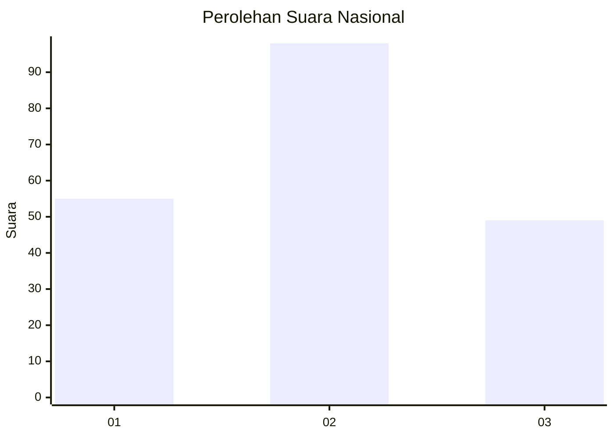
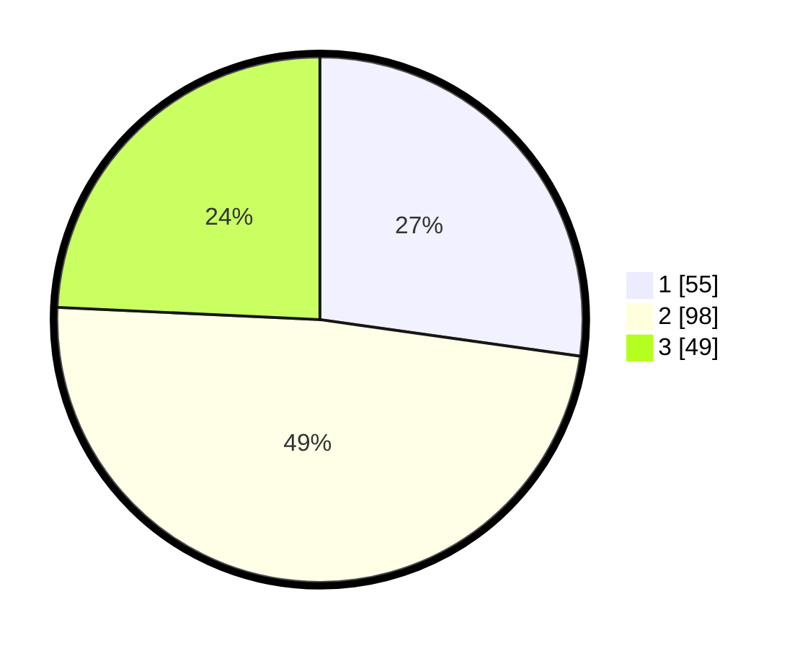

# Hasil

## Grafik

## Tabel

| No. | Nama Paslon    | Suara | Suara (raw) | Persentase |
|:--- |:-------------- | -----:| -----------:| ----------:|
| 1   | ANIES MUHAIMIN | 55    | [55][p-1]   | 27,23      |
| 2   | PRABOWO GIBRAN | 98    | [98][p-2]   | 48,51      |
| 3   | GANJAR MAHFUD  | 49    | [49][p-3]   | 24,26      |

[p-1]: https://github.com/gigit-pemilu/pemilu-2024/blob/main/pilpres/hitung-suara/sub/34-di-yogyakarta/sub/02-bantul/sub/17-sedayu/sub/2003-argosari/sub/007-tps/sub/paslon-1.txt
[p-2]: https://github.com/gigit-pemilu/pemilu-2024/blob/main/pilpres/hitung-suara/sub/34-di-yogyakarta/sub/02-bantul/sub/17-sedayu/sub/2003-argosari/sub/007-tps/sub/paslon-2.txt
[p-3]: https://github.com/gigit-pemilu/pemilu-2024/blob/main/pilpres/hitung-suara/sub/34-di-yogyakarta/sub/02-bantul/sub/17-sedayu/sub/2003-argosari/sub/007-tps/sub/paslon-3.txt

## Foto C Plano

https://sirekap-obj-formc.kpu.go.id/96eb/pemilu/ppwp/34/02/17/20/03/3402172003007-20240214-223437--54882d33-74fe-4a32-8882-1de0cbcc5117.jpg

https://sirekap-obj-formc.kpu.go.id/96eb/pemilu/ppwp/34/02/17/20/03/3402172003007-20240214-223537--337cb76e-0dab-4b09-a930-ae04b0ff5abe.jpg

https://sirekap-obj-formc.kpu.go.id/96eb/pemilu/ppwp/34/02/17/20/03/3402172003007-20240214-223826--08739e12-8d53-4384-9583-c9b1278ec4bb.jpg

## Metadata

| Key        | Value               |
| ---------- | ------------------- |
| Time Stamp | 2024-02-24 22:31:28 |

