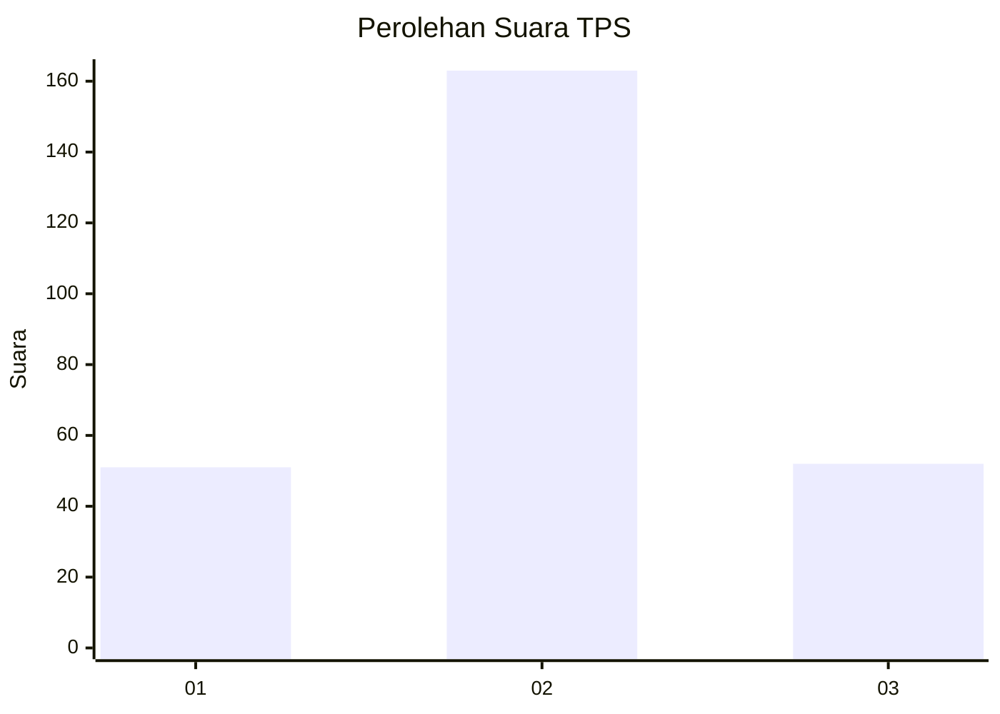
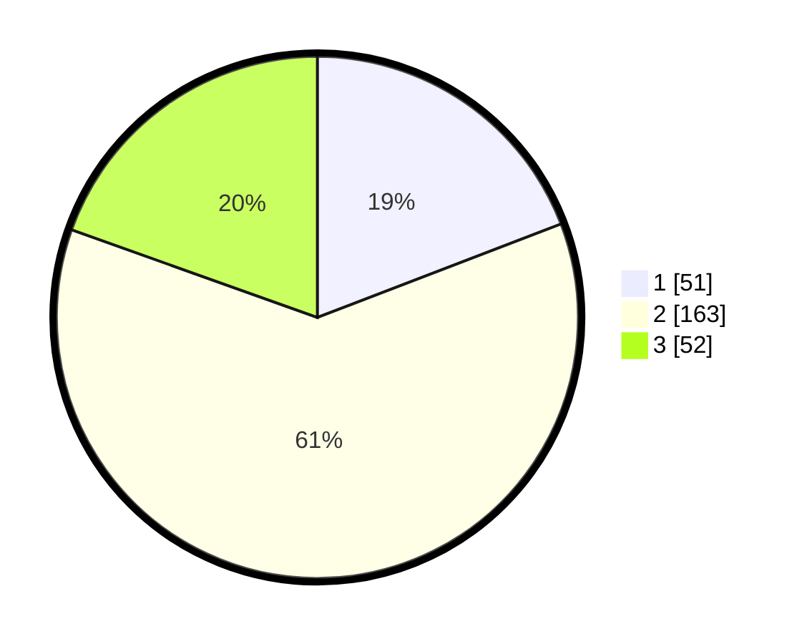

# Hasil

## Grafik

## Tabel

| No. | Nama Paslon    | Suara | Suara (raw) | Persentase |
|:--- |:-------------- | -----:| -----------:| ----------:|
| 1   | ANIES MUHAIMIN | 51    | [51][p-1]   | 19,17      |
| 2   | PRABOWO GIBRAN | 163   | [163][p-2]  | 61,28      |
| 3   | GANJAR MAHFUD  | 52    | [52][p-3]   | 19,55      |

[p-1]: https://github.com/gigit-pemilu/pemilu-2024-34-di-yogyakarta/blob/main/pilpres/hitung-suara/sub/34-di-yogyakarta/sub/02-bantul/sub/17-sedayu/sub/2003-argosari/sub/008-tps/sub/paslon-1.txt
[p-2]: https://github.com/gigit-pemilu/pemilu-2024-34-di-yogyakarta/blob/main/pilpres/hitung-suara/sub/34-di-yogyakarta/sub/02-bantul/sub/17-sedayu/sub/2003-argosari/sub/008-tps/sub/paslon-2.txt
[p-3]: https://github.com/gigit-pemilu/pemilu-2024-34-di-yogyakarta/blob/main/pilpres/hitung-suara/sub/34-di-yogyakarta/sub/02-bantul/sub/17-sedayu/sub/2003-argosari/sub/008-tps/sub/paslon-3.txt

## Foto C Plano

https://sirekap-obj-formc.kpu.go.id/214f/pemilu/ppwp/34/02/17/20/03/3402172003008-20240214-210727--bae050fb-69d2-4b11-b4ba-8534061c3267.jpg

https://sirekap-obj-formc.kpu.go.id/214f/pemilu/ppwp/34/02/17/20/03/3402172003008-20240215-015646--3f47ac2c-f131-4568-bd6e-3b4d6b819d74.jpg

https://sirekap-obj-formc.kpu.go.id/214f/pemilu/ppwp/34/02/17/20/03/3402172003008-20240215-015544--5454a72c-62df-472c-b848-1453d6023f29.jpg

## Metadata

| Key        | Value               |
| ---------- | ------------------- |
| Time Stamp | 2024-02-16 10:30:29 |

