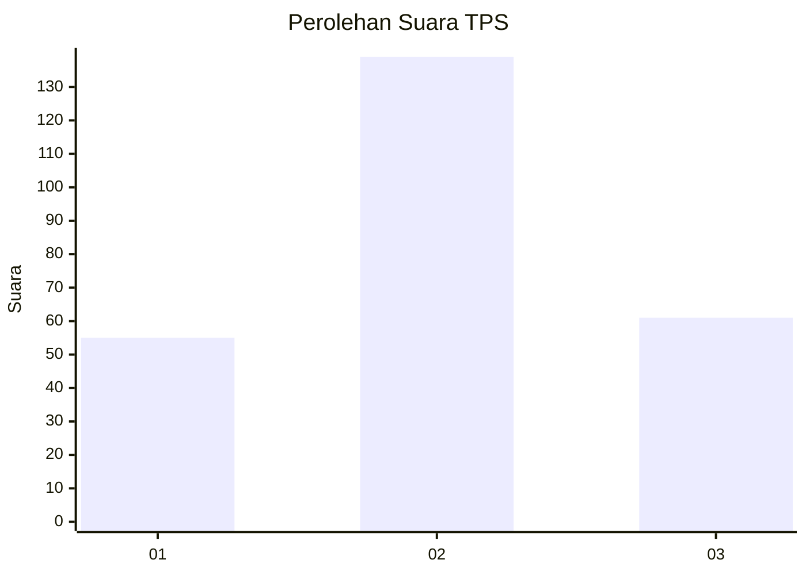
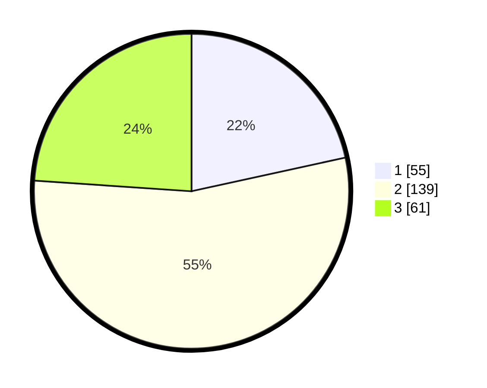

# Hasil

## Grafik

## Tabel

| No. | Nama Paslon    | Suara | Suara (raw) | Persentase |
|:--- |:-------------- | -----:| -----------:| ----------:|
| 1   | ANIES MUHAIMIN | 55    | [55][p-1]   | 21,57      |
| 2   | PRABOWO GIBRAN | 139   | [139][p-2]  | 54,51      |
| 3   | GANJAR MAHFUD  | 61    | [61][p-3]   | 23,92      |

[p-1]: https://github.com/gigit-pemilu/pemilu-2024-34-di-yogyakarta/blob/main/pilpres/hitung-suara/sub/34-di-yogyakarta/sub/02-bantul/sub/17-sedayu/sub/2003-argosari/sub/012-tps/sub/paslon-1.txt
[p-2]: https://github.com/gigit-pemilu/pemilu-2024-34-di-yogyakarta/blob/main/pilpres/hitung-suara/sub/34-di-yogyakarta/sub/02-bantul/sub/17-sedayu/sub/2003-argosari/sub/012-tps/sub/paslon-2.txt
[p-3]: https://github.com/gigit-pemilu/pemilu-2024-34-di-yogyakarta/blob/main/pilpres/hitung-suara/sub/34-di-yogyakarta/sub/02-bantul/sub/17-sedayu/sub/2003-argosari/sub/012-tps/sub/paslon-3.txt

## Foto C Plano

https://sirekap-obj-formc.kpu.go.id/b41a/pemilu/ppwp/34/02/17/20/03/3402172003012-20240214-211242--e85948a7-801a-4404-8e7a-f49cf74090cf.jpg

https://sirekap-obj-formc.kpu.go.id/b41a/pemilu/ppwp/34/02/17/20/03/3402172003012-20240215-001807--fb8f5b99-7309-46df-9ac0-226831543d47.jpg

https://sirekap-obj-formc.kpu.go.id/b41a/pemilu/ppwp/34/02/17/20/03/3402172003012-20240215-001000--f3a4af13-dad0-41ca-ba70-3094f68f5553.jpg

## Metadata

| Key        | Value               |
| ---------- | ------------------- |
| Time Stamp | 2024-02-25 12:00:00 |

