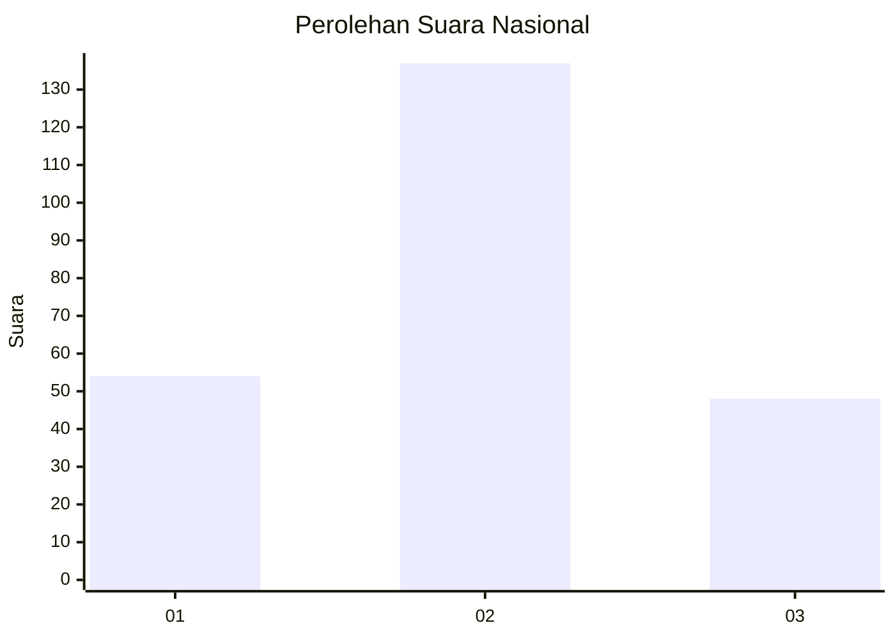
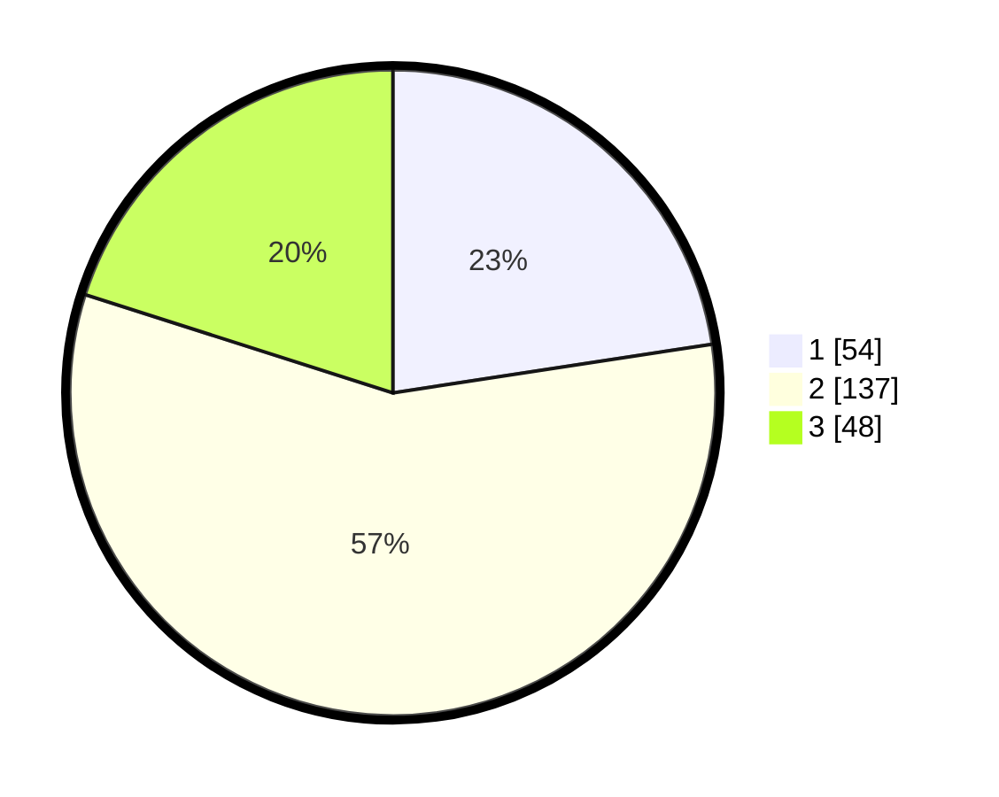

# Hasil

## Grafik

## Tabel

| No. | Nama Paslon    | Suara | Suara (raw) | Persentase |
|:--- |:-------------- | -----:| -----------:| ----------:|
| 1   | ANIES MUHAIMIN | 54    | [54][p-1]   | 22,59      |
| 2   | PRABOWO GIBRAN | 137   | [137][p-2]  | 57,32      |
| 3   | GANJAR MAHFUD  | 48    | [48][p-3]   | 20,08      |

[p-1]: https://github.com/gigit-pemilu/pemilu-2024/blob/main/pilpres/hitung-suara/sub/34-di-yogyakarta/sub/02-bantul/sub/17-sedayu/sub/2003-argosari/sub/014-tps/sub/paslon-1.txt
[p-2]: https://github.com/gigit-pemilu/pemilu-2024/blob/main/pilpres/hitung-suara/sub/34-di-yogyakarta/sub/02-bantul/sub/17-sedayu/sub/2003-argosari/sub/014-tps/sub/paslon-2.txt
[p-3]: https://github.com/gigit-pemilu/pemilu-2024/blob/main/pilpres/hitung-suara/sub/34-di-yogyakarta/sub/02-bantul/sub/17-sedayu/sub/2003-argosari/sub/014-tps/sub/paslon-3.txt

## Foto C Plano

https://sirekap-obj-formc.kpu.go.id/0bc7/pemilu/ppwp/34/02/17/20/03/3402172003014-20240215-035404--764b07cc-a5c0-4445-880a-cb572f142890.jpg

https://sirekap-obj-formc.kpu.go.id/0bc7/pemilu/ppwp/34/02/17/20/03/3402172003014-20240215-035515--8470a475-bcc4-4a8a-8d13-6b3204028fb8.jpg

https://sirekap-obj-formc.kpu.go.id/0bc7/pemilu/ppwp/34/02/17/20/03/3402172003014-20240215-035626--d3bf5fa2-6114-4506-8ca9-c8cb2f96f94b.jpg

## Metadata

| Key        | Value               |
| ---------- | ------------------- |
| Time Stamp | 2024-02-24 22:31:28 |

