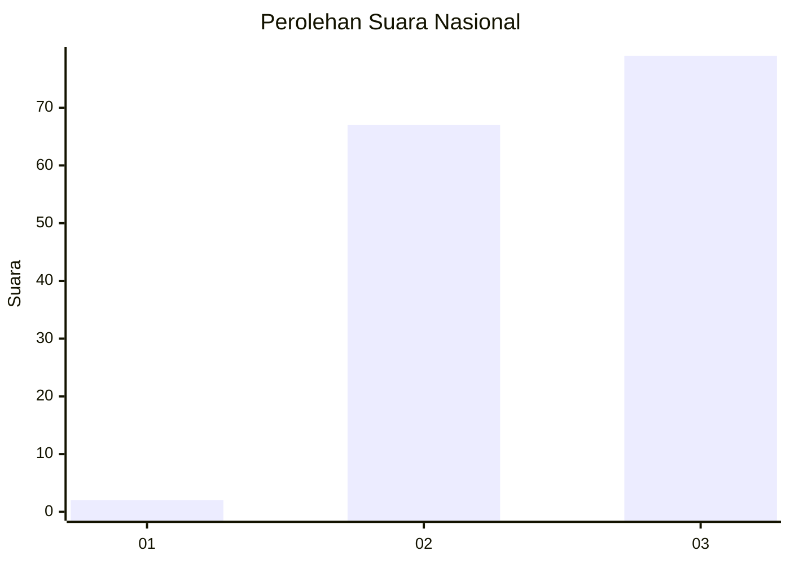
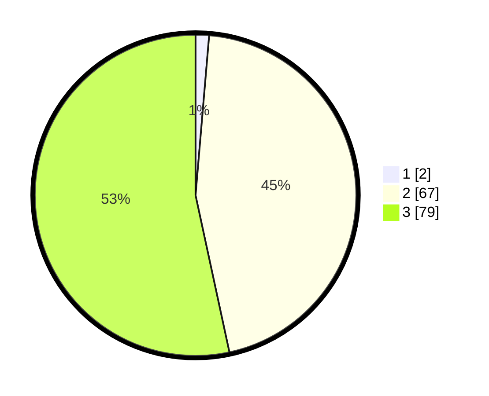

# Hasil

## Grafik

## Tabel

| No. | Nama Paslon    | Suara | Suara (raw) | Persentase |
|:--- |:-------------- | -----:| -----------:| ----------:|
| 1   | ANIES MUHAIMIN | 2     | [2][p-1]    | 1,35       |
| 2   | PRABOWO GIBRAN | 67    | [67][p-2]   | 45,27      |
| 3   | GANJAR MAHFUD  | 79    | [79][p-3]   | 53,38      |

[p-1]: https://github.com/gigit-pemilu/pemilu-2024/blob/main/pilpres/hitung-suara/sub/34-di-yogyakarta/sub/02-bantul/sub/17-sedayu/sub/2003-argosari/sub/024-tps/sub/paslon-1.txt
[p-2]: https://github.com/gigit-pemilu/pemilu-2024/blob/main/pilpres/hitung-suara/sub/34-di-yogyakarta/sub/02-bantul/sub/17-sedayu/sub/2003-argosari/sub/024-tps/sub/paslon-2.txt
[p-3]: https://github.com/gigit-pemilu/pemilu-2024/blob/main/pilpres/hitung-suara/sub/34-di-yogyakarta/sub/02-bantul/sub/17-sedayu/sub/2003-argosari/sub/024-tps/sub/paslon-3.txt

## Foto C Plano

https://sirekap-obj-formc.kpu.go.id/786d/pemilu/ppwp/34/02/17/20/03/3402172003024-20240214-234007--3203f613-eee5-42ed-8ae8-35b5cea8fb37.jpg

https://sirekap-obj-formc.kpu.go.id/786d/pemilu/ppwp/34/02/17/20/03/3402172003024-20240214-234114--9ca39dec-5c33-42e1-bb9a-111135a2e927.jpg

https://sirekap-obj-formc.kpu.go.id/786d/pemilu/ppwp/34/02/17/20/03/3402172003024-20240214-234211--3b6003f8-2b1f-432d-8123-5037abceab87.jpg

## Metadata

| Key        | Value               |
| ---------- | ------------------- |
| Time Stamp | 2024-02-24 22:31:28 |

