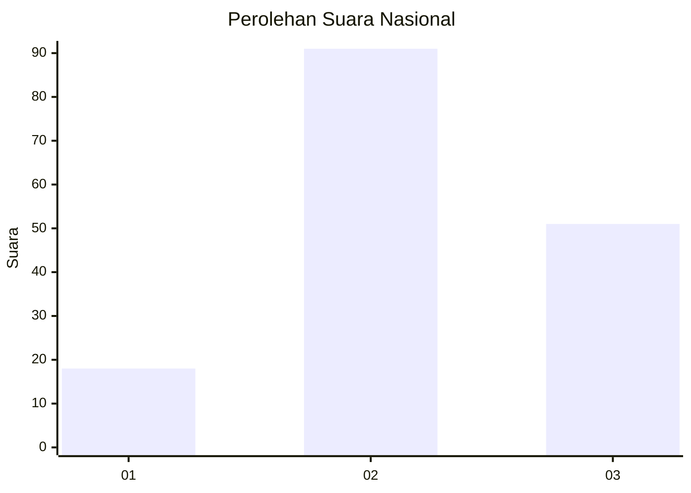
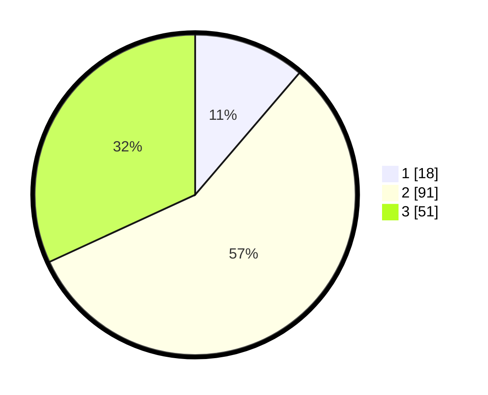

# Hasil

## Grafik

## Tabel

| No. | Nama Paslon    | Suara | Suara (raw) | Persentase |
|:--- |:-------------- | -----:| -----------:| ----------:|
| 1   | ANIES MUHAIMIN | 18    | [18][p-1]   | 11,25      |
| 2   | PRABOWO GIBRAN | 91    | [91][p-2]   | 56,88      |
| 3   | GANJAR MAHFUD  | 51    | [51][p-3]   | 31,88      |

[p-1]: https://github.com/gigit-pemilu/pemilu-2024/blob/main/pilpres/hitung-suara/sub/34-di-yogyakarta/sub/02-bantul/sub/17-sedayu/sub/2003-argosari/sub/031-tps/sub/paslon-1.txt
[p-2]: https://github.com/gigit-pemilu/pemilu-2024/blob/main/pilpres/hitung-suara/sub/34-di-yogyakarta/sub/02-bantul/sub/17-sedayu/sub/2003-argosari/sub/031-tps/sub/paslon-2.txt
[p-3]: https://github.com/gigit-pemilu/pemilu-2024/blob/main/pilpres/hitung-suara/sub/34-di-yogyakarta/sub/02-bantul/sub/17-sedayu/sub/2003-argosari/sub/031-tps/sub/paslon-3.txt

## Foto C Plano

https://sirekap-obj-formc.kpu.go.id/61f7/pemilu/ppwp/34/02/17/20/03/3402172003031-20240215-202758--a2d9fb74-ccb3-4be1-b132-ae1c2f37bb9d.jpg

https://sirekap-obj-formc.kpu.go.id/61f7/pemilu/ppwp/34/02/17/20/03/3402172003031-20240216-010935--6570cc59-8700-4559-9657-3530eeccbca1.jpg

https://sirekap-obj-formc.kpu.go.id/61f7/pemilu/ppwp/34/02/17/20/03/3402172003031-20240215-202803--8c01060c-f033-4a60-9a71-16f84d61dc3f.jpg

## Metadata

| Key        | Value               |
| ---------- | ------------------- |
| Time Stamp | 2024-02-16 10:00:28 |

## DATA PEMILIH TETAP

Jumlah pemilih dalam DPT: **180**.
 * L: **86**.
 * P: **94**.

## DATA PENGGUNA HAK PILIH

Jumlah pengguna hak pilih dalam DPT: **148**.
 * L: **69**.
 * P: **79**.

Jumlah pengguna hak pilih dalam DPTb: **2**.
 * L: **1**.
 * P: **1**.

Jumlah pengguna hak pilih dalam DPK: **12**.
 * L: **7**.
 * P: **5**.

Jumlah pengguna hak pilih: **162**.
 * L: **77**.
 * P: **85**.

## JUMLAH SUARA SAH DAN TIDAK SAH

JUMLAH SELURUH SUARA SAH: **160**.

JUMLAH SUARA TIDAK SAH: **2**.

JUMLAH SELURUH SUARA SAH DAN SUARA TIDAK SAH: **162**.

