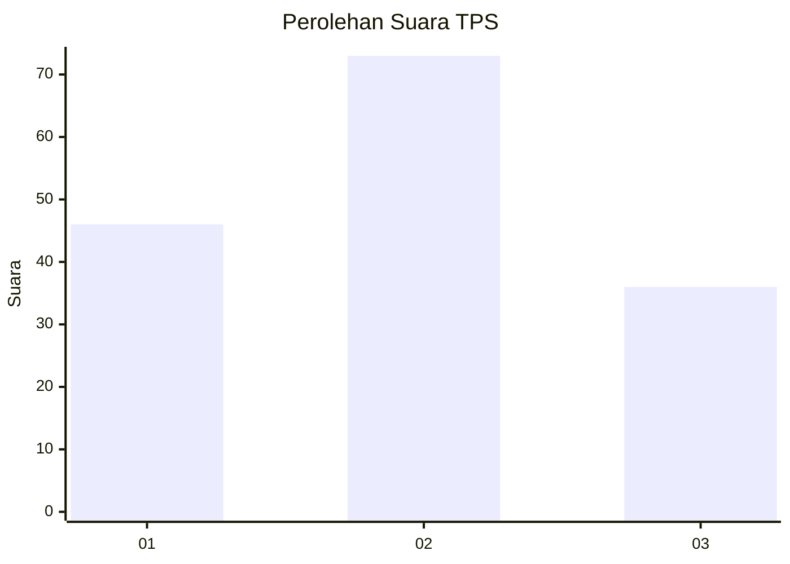
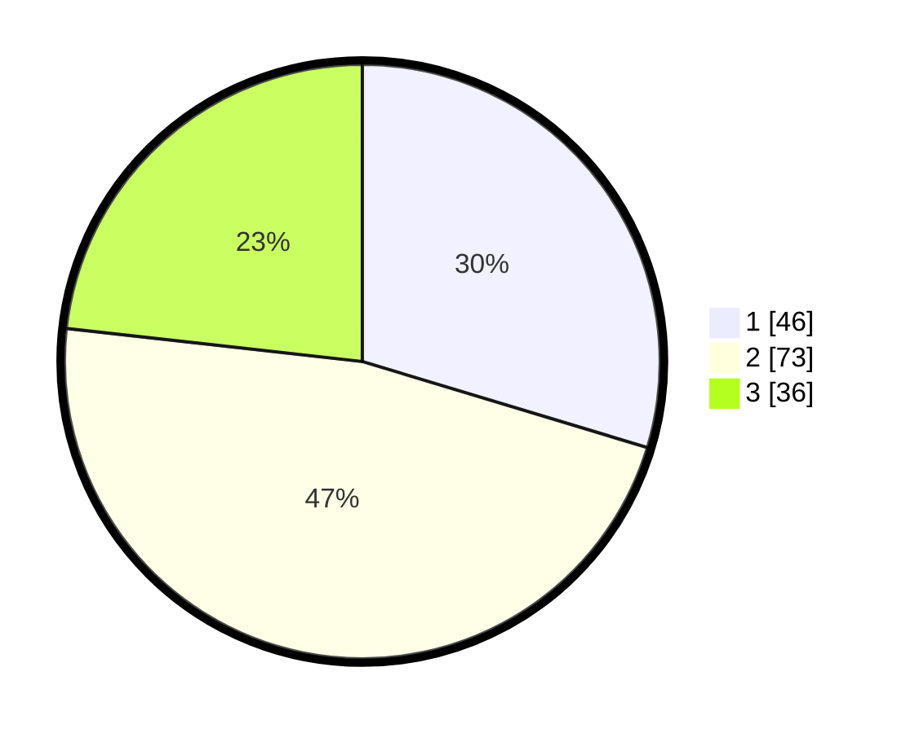

# Hasil

## Grafik

## Tabel

| No. | Nama Paslon    | Suara | Suara (raw) | Persentase |
|:--- |:-------------- | -----:| -----------:| ----------:|
| 1   | ANIES MUHAIMIN | 46    | [46][p-1]   | 29,68      |
| 2   | PRABOWO GIBRAN | 73    | [73][p-2]   | 47,10      |
| 3   | GANJAR MAHFUD  | 36    | [36][p-3]   | 23,23      |

[p-1]: https://github.com/gigit-pemilu/pemilu-2024-34-di-yogyakarta/blob/main/pilpres/hitung-suara/sub/34-di-yogyakarta/sub/02-bantul/sub/17-sedayu/sub/2004-argomulyo/sub/006-tps/sub/paslon-1.txt
[p-2]: https://github.com/gigit-pemilu/pemilu-2024-34-di-yogyakarta/blob/main/pilpres/hitung-suara/sub/34-di-yogyakarta/sub/02-bantul/sub/17-sedayu/sub/2004-argomulyo/sub/006-tps/sub/paslon-2.txt
[p-3]: https://github.com/gigit-pemilu/pemilu-2024-34-di-yogyakarta/blob/main/pilpres/hitung-suara/sub/34-di-yogyakarta/sub/02-bantul/sub/17-sedayu/sub/2004-argomulyo/sub/006-tps/sub/paslon-3.txt

## Foto C Plano

https://sirekap-obj-formc.kpu.go.id/6a1e/pemilu/ppwp/34/02/17/20/04/3402172004006-20240214-233257--8bcb081b-ccad-4407-a50a-fc5b117ef7c7.jpg

https://sirekap-obj-formc.kpu.go.id/6a1e/pemilu/ppwp/34/02/17/20/04/3402172004006-20240214-233305--a8dbfcc0-9729-42d0-8cc6-43e2f99144fc.jpg

https://sirekap-obj-formc.kpu.go.id/6a1e/pemilu/ppwp/34/02/17/20/04/3402172004006-20240214-233313--868440ea-a6cf-4acf-9b8d-7b95073d845a.jpg

## Metadata

| Key        | Value               |
| ---------- | ------------------- |
| Time Stamp | 2024-02-25 11:00:00 |

