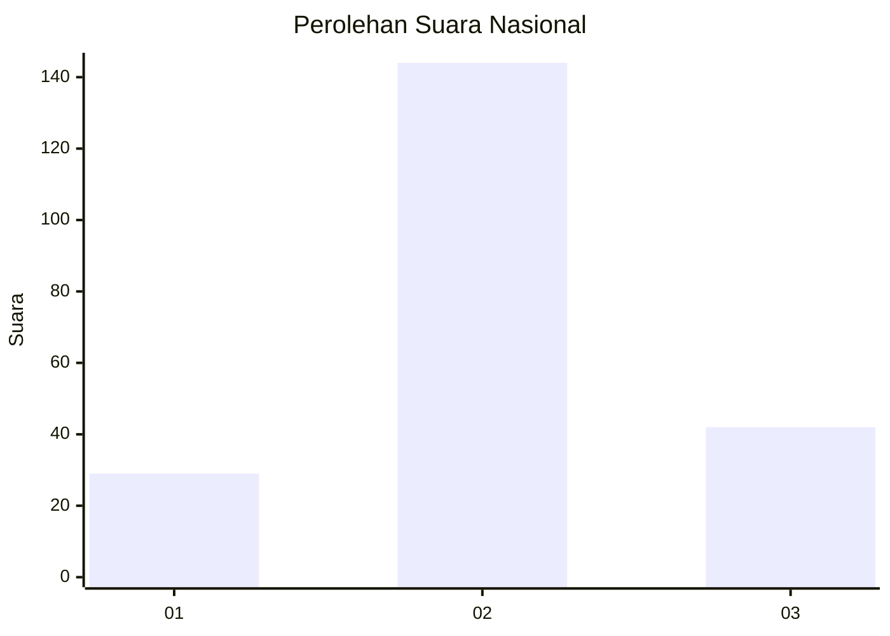
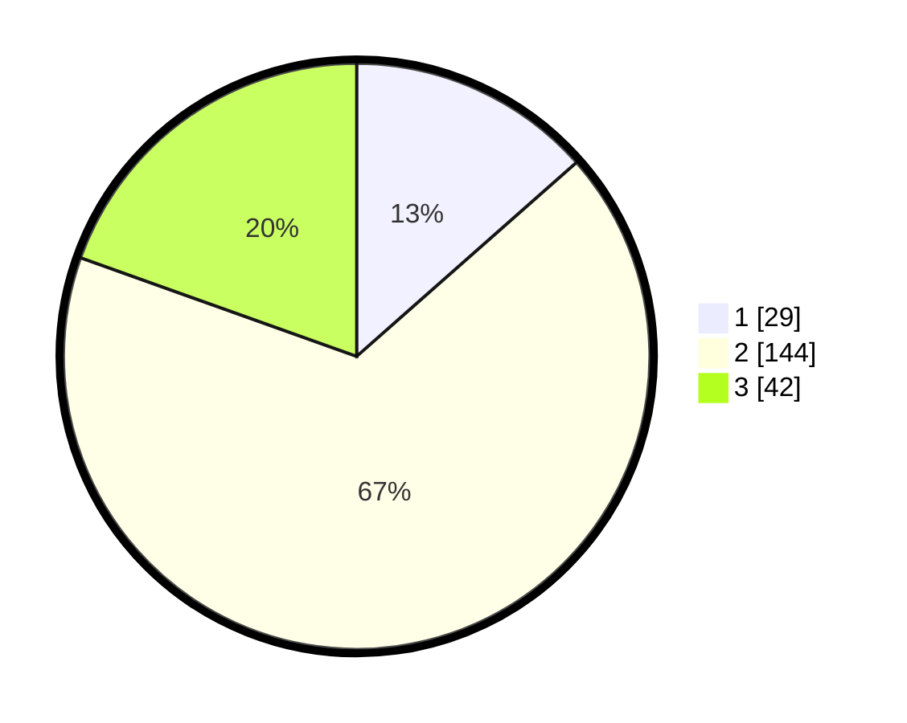

# Hasil

## Grafik

## Tabel

| No. | Nama Paslon    | Suara | Suara (raw) | Persentase |
|:--- |:-------------- | -----:| -----------:| ----------:|
| 1   | ANIES MUHAIMIN | 29    | [29][p-1]   | 13,49      |
| 2   | PRABOWO GIBRAN | 144   | [144][p-2]  | 66,98      |
| 3   | GANJAR MAHFUD  | 42    | [42][p-3]   | 19,53      |

[p-1]: https://github.com/gigit-pemilu/pemilu-2024/blob/main/pilpres/hitung-suara/sub/34-di-yogyakarta/sub/02-bantul/sub/17-sedayu/sub/2004-argomulyo/sub/019-tps/sub/paslon-1.txt
[p-2]: https://github.com/gigit-pemilu/pemilu-2024/blob/main/pilpres/hitung-suara/sub/34-di-yogyakarta/sub/02-bantul/sub/17-sedayu/sub/2004-argomulyo/sub/019-tps/sub/paslon-2.txt
[p-3]: https://github.com/gigit-pemilu/pemilu-2024/blob/main/pilpres/hitung-suara/sub/34-di-yogyakarta/sub/02-bantul/sub/17-sedayu/sub/2004-argomulyo/sub/019-tps/sub/paslon-3.txt

## Foto C Plano

https://sirekap-obj-formc.kpu.go.id/99ef/pemilu/ppwp/34/02/17/20/04/3402172004019-20240215-043400--7d4d4c19-4c6e-4f7e-9292-6dca9fb08a89.jpg

https://sirekap-obj-formc.kpu.go.id/99ef/pemilu/ppwp/34/02/17/20/04/3402172004019-20240215-052006--05069855-1baa-4948-95a2-0839472454c5.jpg

https://sirekap-obj-formc.kpu.go.id/99ef/pemilu/ppwp/34/02/17/20/04/3402172004019-20240215-043628--8d60e151-49cf-484f-a0e1-fce013c92ec7.jpg

## Metadata

| Key        | Value               |
| ---------- | ------------------- |
| Time Stamp | 2024-02-25 12:00:00 |

