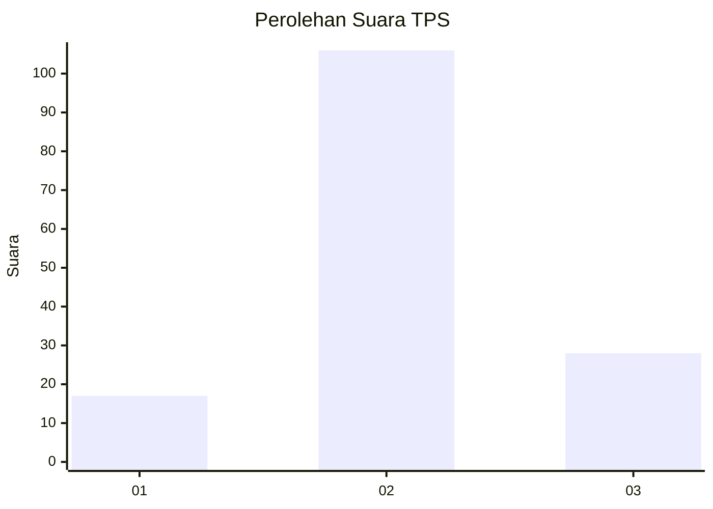
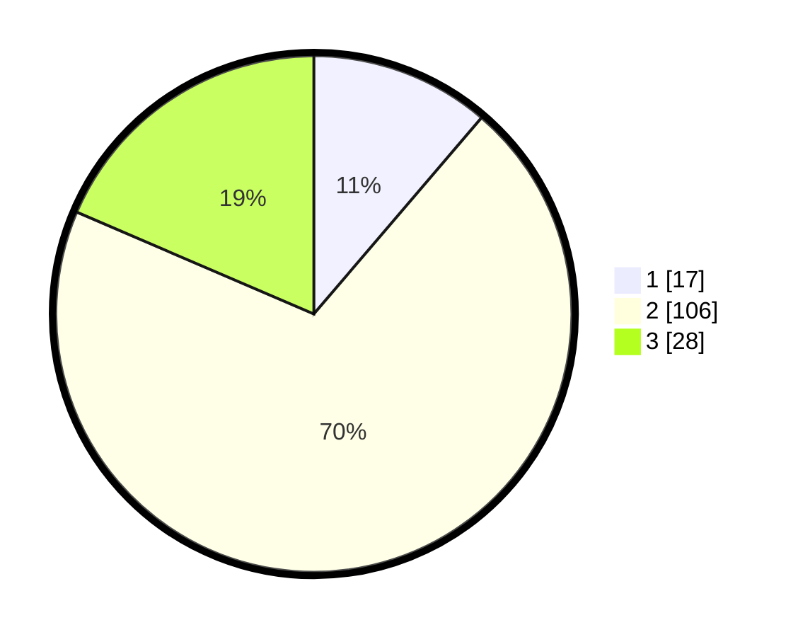

# Hasil

## Grafik

## Tabel

| No. | Nama Paslon    | Suara | Suara (raw) | Persentase |
|:--- |:-------------- | -----:| -----------:| ----------:|
| 1   | ANIES MUHAIMIN | 17    | [17][p-1]   | 11,26      |
| 2   | PRABOWO GIBRAN | 106   | [106][p-2]  | 70,20      |
| 3   | GANJAR MAHFUD  | 28    | [28][p-3]   | 18,54      |

[p-1]: https://github.com/gigit-pemilu/pemilu-2024-34-di-yogyakarta/blob/main/pilpres/hitung-suara/sub/34-di-yogyakarta/sub/02-bantul/sub/17-sedayu/sub/2004-argomulyo/sub/020-tps/sub/paslon-1.txt
[p-2]: https://github.com/gigit-pemilu/pemilu-2024-34-di-yogyakarta/blob/main/pilpres/hitung-suara/sub/34-di-yogyakarta/sub/02-bantul/sub/17-sedayu/sub/2004-argomulyo/sub/020-tps/sub/paslon-2.txt
[p-3]: https://github.com/gigit-pemilu/pemilu-2024-34-di-yogyakarta/blob/main/pilpres/hitung-suara/sub/34-di-yogyakarta/sub/02-bantul/sub/17-sedayu/sub/2004-argomulyo/sub/020-tps/sub/paslon-3.txt

## Foto C Plano

https://sirekap-obj-formc.kpu.go.id/0f71/pemilu/ppwp/34/02/17/20/04/3402172004020-20240214-201813--2e6e6fb0-77bd-4b0e-b844-705e5978075a.jpg

https://sirekap-obj-formc.kpu.go.id/0f71/pemilu/ppwp/34/02/17/20/04/3402172004020-20240214-193249--e21bc72d-3b75-453e-81d2-1e9a7ec48cf7.jpg

https://sirekap-obj-formc.kpu.go.id/0f71/pemilu/ppwp/34/02/17/20/04/3402172004020-20240214-201916--482d1c90-2012-47ab-8351-1ab38820b0ca.jpg

## Metadata

| Key        | Value               |
| ---------- | ------------------- |
| Time Stamp | 2024-02-24 22:31:28 |

