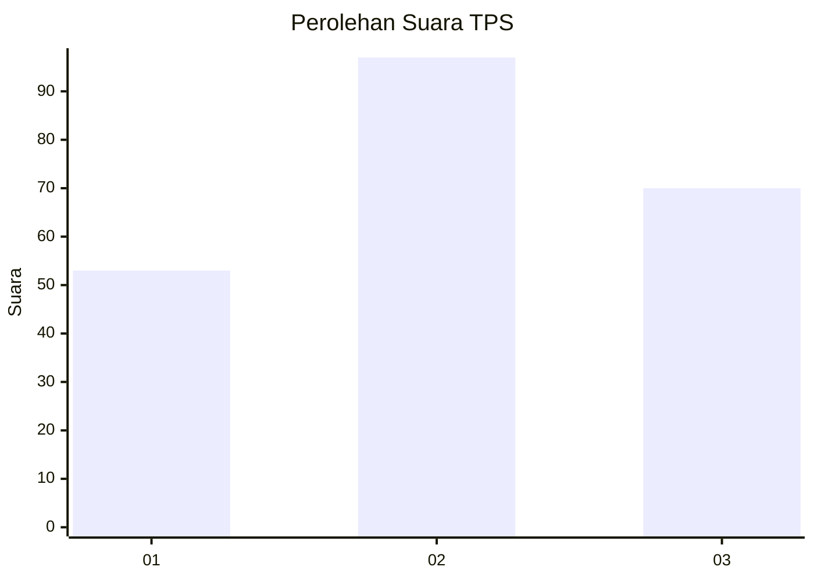
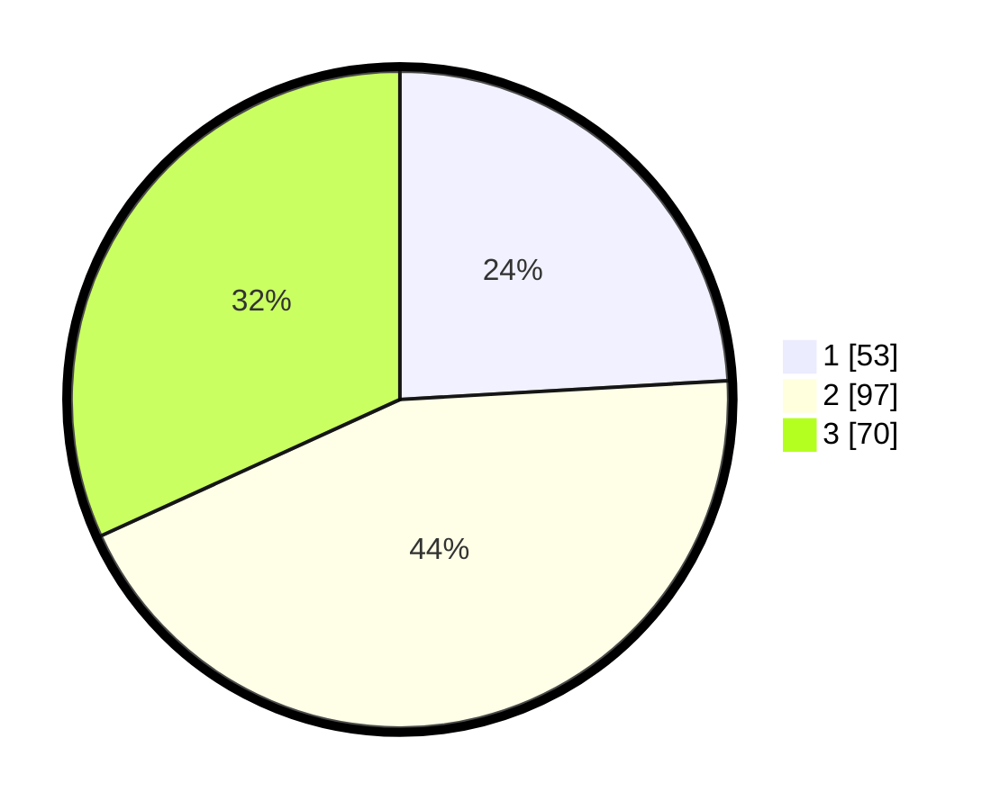

# Hasil

## Grafik

## Tabel

| No. | Nama Paslon    | Suara | Suara (raw) | Persentase |
|:--- |:-------------- | -----:| -----------:| ----------:|
| 1   | ANIES MUHAIMIN | 53    | [53][p-1]   | 24,09      |
| 2   | PRABOWO GIBRAN | 97    | [97][p-2]   | 44,09      |
| 3   | GANJAR MAHFUD  | 70    | [70][p-3]   | 31,82      |

[p-1]: https://github.com/gigit-pemilu/pemilu-2024-34-di-yogyakarta/blob/main/pilpres/hitung-suara/sub/34-di-yogyakarta/sub/02-bantul/sub/17-sedayu/sub/2004-argomulyo/sub/022-tps/sub/paslon-1.txt
[p-2]: https://github.com/gigit-pemilu/pemilu-2024-34-di-yogyakarta/blob/main/pilpres/hitung-suara/sub/34-di-yogyakarta/sub/02-bantul/sub/17-sedayu/sub/2004-argomulyo/sub/022-tps/sub/paslon-2.txt
[p-3]: https://github.com/gigit-pemilu/pemilu-2024-34-di-yogyakarta/blob/main/pilpres/hitung-suara/sub/34-di-yogyakarta/sub/02-bantul/sub/17-sedayu/sub/2004-argomulyo/sub/022-tps/sub/paslon-3.txt

## Foto C Plano

https://sirekap-obj-formc.kpu.go.id/c455/pemilu/ppwp/34/02/17/20/04/3402172004022-20240214-224509--9ee3695f-6778-4a43-aff1-6060a184e630.jpg

https://sirekap-obj-formc.kpu.go.id/c455/pemilu/ppwp/34/02/17/20/04/3402172004022-20240214-224803--84ffd004-968b-4d6f-b79d-cb371024374f.jpg

https://sirekap-obj-formc.kpu.go.id/c455/pemilu/ppwp/34/02/17/20/04/3402172004022-20240214-225203--e2c2b282-1e3b-474d-aa9c-53ae03aab642.jpg

## Metadata

| Key        | Value               |
| ---------- | ------------------- |
| Time Stamp | 2024-02-24 22:31:28 |

