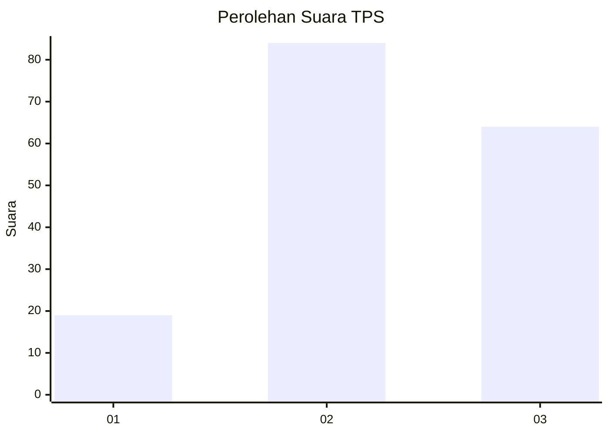
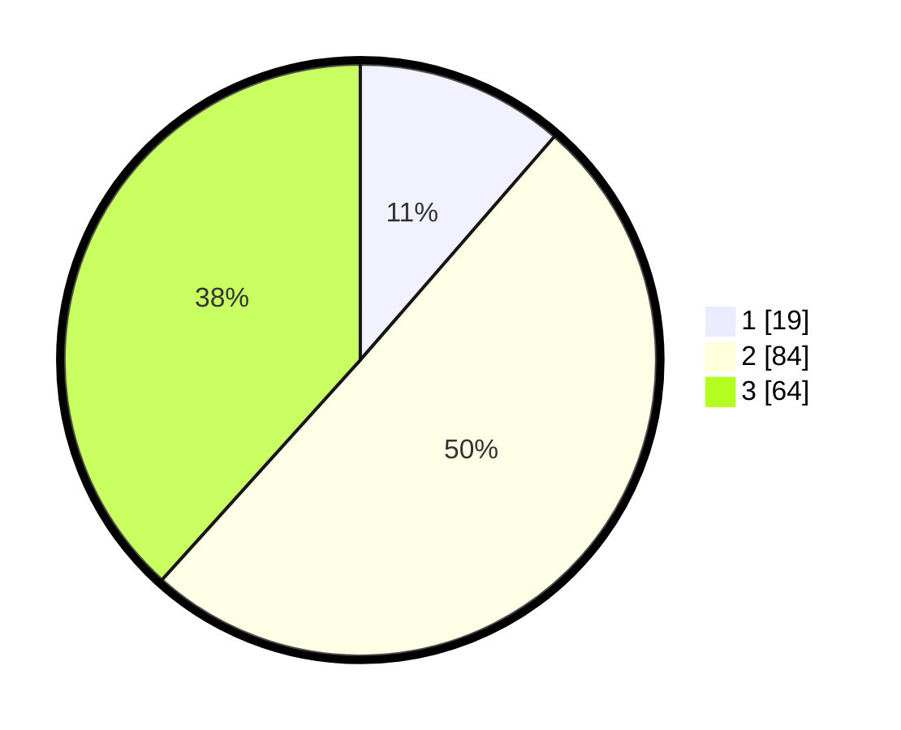

# Hasil

## Grafik

## Tabel

| No. | Nama Paslon    | Suara | Suara (raw) | Persentase |
|:--- |:-------------- | -----:| -----------:| ----------:|
| 1   | ANIES MUHAIMIN | 19    | [19][p-1]   | 11,38      |
| 2   | PRABOWO GIBRAN | 84    | [84][p-2]   | 50,30      |
| 3   | GANJAR MAHFUD  | 64    | [64][p-3]   | 38,32      |

[p-1]: https://github.com/gigit-pemilu/pemilu-2024-34-di-yogyakarta/blob/main/pilpres/hitung-suara/sub/34-di-yogyakarta/sub/02-bantul/sub/17-sedayu/sub/2004-argomulyo/sub/025-tps/sub/paslon-1.txt
[p-2]: https://github.com/gigit-pemilu/pemilu-2024-34-di-yogyakarta/blob/main/pilpres/hitung-suara/sub/34-di-yogyakarta/sub/02-bantul/sub/17-sedayu/sub/2004-argomulyo/sub/025-tps/sub/paslon-2.txt
[p-3]: https://github.com/gigit-pemilu/pemilu-2024-34-di-yogyakarta/blob/main/pilpres/hitung-suara/sub/34-di-yogyakarta/sub/02-bantul/sub/17-sedayu/sub/2004-argomulyo/sub/025-tps/sub/paslon-3.txt

## Foto C Plano

https://sirekap-obj-formc.kpu.go.id/3997/pemilu/ppwp/34/02/17/20/04/3402172004025-20240214-233106--52120af9-0823-483f-afa0-5fd1b8d9bef4.jpg

https://sirekap-obj-formc.kpu.go.id/3997/pemilu/ppwp/34/02/17/20/04/3402172004025-20240214-233229--81c828d1-a3c7-47e6-87ad-a628fc78cead.jpg

https://sirekap-obj-formc.kpu.go.id/3997/pemilu/ppwp/34/02/17/20/04/3402172004025-20240214-233443--a66b9887-6433-4962-a4e2-abaf4db3caa3.jpg

## Metadata

| Key        | Value               |
| ---------- | ------------------- |
| Time Stamp | 2024-02-24 22:31:28 |

