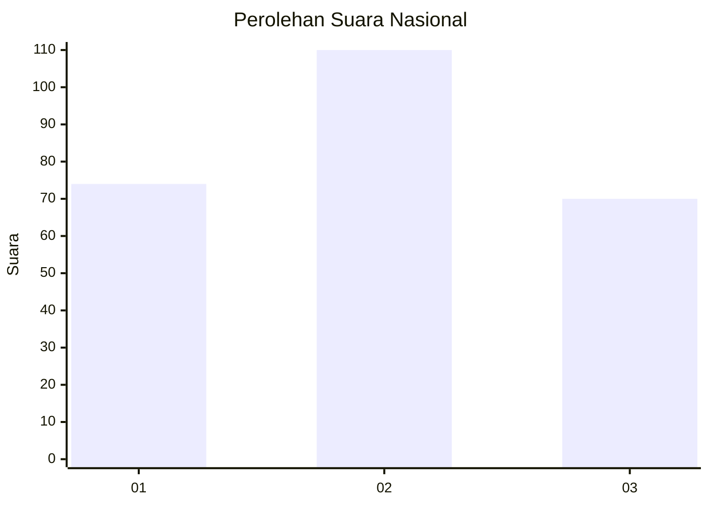
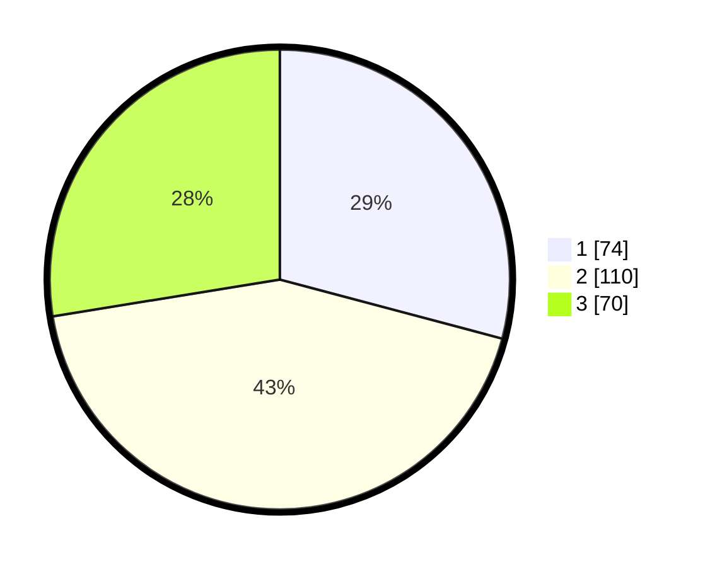

# Hasil

## Grafik

## Tabel

| No. | Nama Paslon    | Suara | Suara (raw) | Persentase |
|:--- |:-------------- | -----:| -----------:| ----------:|
| 1   | ANIES MUHAIMIN | 74    | [74][p-1]   | 29,13      |
| 2   | PRABOWO GIBRAN | 110   | [110][p-2]  | 43,31      |
| 3   | GANJAR MAHFUD  | 70    | [70][p-3]   | 27,56      |

[p-1]: https://github.com/gigit-pemilu/pemilu-2024/blob/main/pilpres/hitung-suara/sub/34-di-yogyakarta/sub/02-bantul/sub/17-sedayu/sub/2004-argomulyo/sub/027-tps/sub/paslon-1.txt
[p-2]: https://github.com/gigit-pemilu/pemilu-2024/blob/main/pilpres/hitung-suara/sub/34-di-yogyakarta/sub/02-bantul/sub/17-sedayu/sub/2004-argomulyo/sub/027-tps/sub/paslon-2.txt
[p-3]: https://github.com/gigit-pemilu/pemilu-2024/blob/main/pilpres/hitung-suara/sub/34-di-yogyakarta/sub/02-bantul/sub/17-sedayu/sub/2004-argomulyo/sub/027-tps/sub/paslon-3.txt

## Foto C Plano

https://sirekap-obj-formc.kpu.go.id/560f/pemilu/ppwp/34/02/17/20/04/3402172004027-20240216-103909--e4532d1e-31ab-4edd-8202-c4b75ab91c9b.jpg

https://sirekap-obj-formc.kpu.go.id/560f/pemilu/ppwp/34/02/17/20/04/3402172004027-20240216-103911--7d3714dc-0638-49bf-ac35-713b37e80d87.jpg

https://sirekap-obj-formc.kpu.go.id/560f/pemilu/ppwp/34/02/17/20/04/3402172004027-20240216-103910--33d9d4b7-bf74-47ed-a9fa-e9bcd1c21f5e.jpg

## Metadata

| Key        | Value               |
| ---------- | ------------------- |
| Time Stamp | 2024-02-16 12:51:22 |

## DATA PEMILIH TETAP

Jumlah pemilih dalam DPT: **295**.
 * L: **142**.
 * P: **153**.

## DATA PENGGUNA HAK PILIH

Jumlah pengguna hak pilih dalam DPT: **246**.
 * L: **117**.
 * P: **129**.

Jumlah pengguna hak pilih dalam DPTb: **9**.
 * L: **1**.
 * P: **8**.

Jumlah pengguna hak pilih dalam DPK: **1**.
 * L: **0**.
 * P: **1**.

Jumlah pengguna hak pilih: **256**.
 * L: **118**.
 * P: **138**.

## JUMLAH SUARA SAH DAN TIDAK SAH

JUMLAH SELURUH SUARA SAH: **254**.

JUMLAH SUARA TIDAK SAH: **2**.

JUMLAH SELURUH SUARA SAH DAN SUARA TIDAK SAH: **256**.

