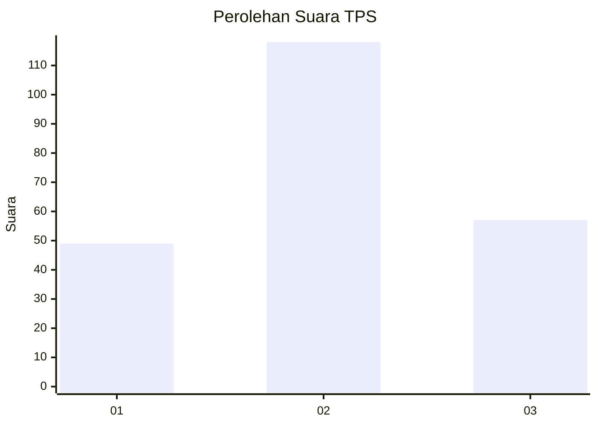
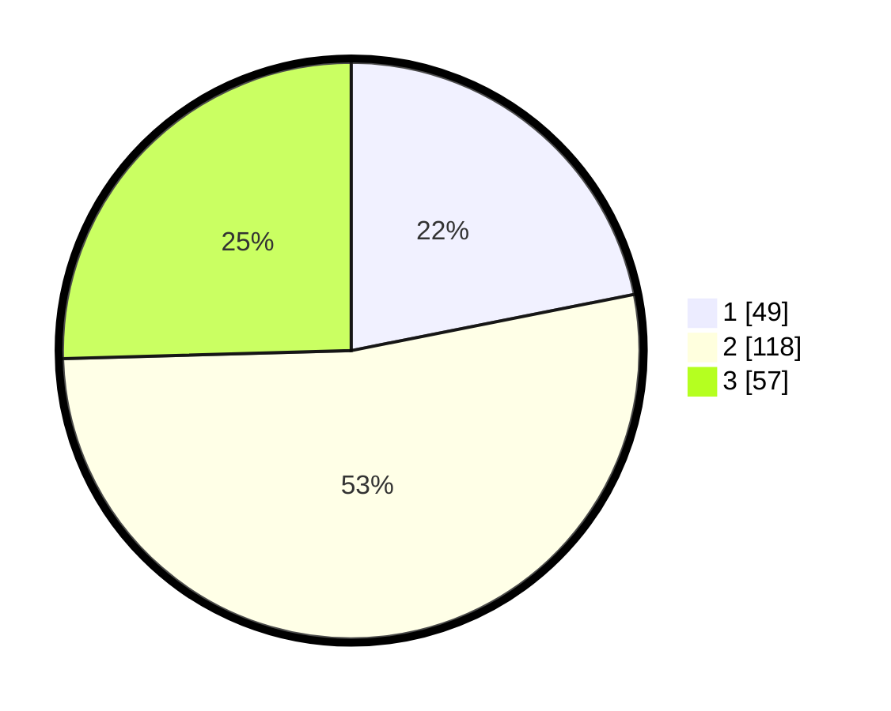

# Hasil

## Grafik

## Tabel

| No. | Nama Paslon    | Suara | Suara (raw) | Persentase |
|:--- |:-------------- | -----:| -----------:| ----------:|
| 1   | ANIES MUHAIMIN | 49    | [49][p-1]   | 21,88      |
| 2   | PRABOWO GIBRAN | 118   | [118][p-2]  | 52,68      |
| 3   | GANJAR MAHFUD  | 57    | [57][p-3]   | 25,45      |

[p-1]: https://github.com/gigit-pemilu/pemilu-2024-34-di-yogyakarta/blob/main/pilpres/hitung-suara/sub/34-di-yogyakarta/sub/02-bantul/sub/17-sedayu/sub/2004-argomulyo/sub/028-tps/sub/paslon-1.txt
[p-2]: https://github.com/gigit-pemilu/pemilu-2024-34-di-yogyakarta/blob/main/pilpres/hitung-suara/sub/34-di-yogyakarta/sub/02-bantul/sub/17-sedayu/sub/2004-argomulyo/sub/028-tps/sub/paslon-2.txt
[p-3]: https://github.com/gigit-pemilu/pemilu-2024-34-di-yogyakarta/blob/main/pilpres/hitung-suara/sub/34-di-yogyakarta/sub/02-bantul/sub/17-sedayu/sub/2004-argomulyo/sub/028-tps/sub/paslon-3.txt

## Foto C Plano

https://sirekap-obj-formc.kpu.go.id/a7ef/pemilu/ppwp/34/02/17/20/04/3402172004028-20240214-192536--7d77310e-3864-4994-a9da-434c7eee6eec.jpg

https://sirekap-obj-formc.kpu.go.id/a7ef/pemilu/ppwp/34/02/17/20/04/3402172004028-20240214-192539--b2c7fb67-26be-42f1-9632-d3da3b89f158.jpg

https://sirekap-obj-formc.kpu.go.id/a7ef/pemilu/ppwp/34/02/17/20/04/3402172004028-20240214-192512--1d393560-0b3d-4ab6-a3f8-c0c418db508c.jpg

## Metadata

| Key        | Value               |
| ---------- | ------------------- |
| Time Stamp | 2024-02-24 22:31:28 |

