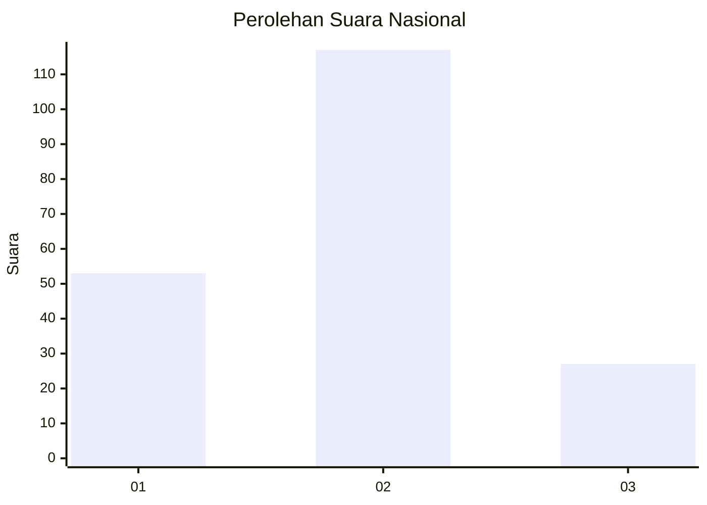
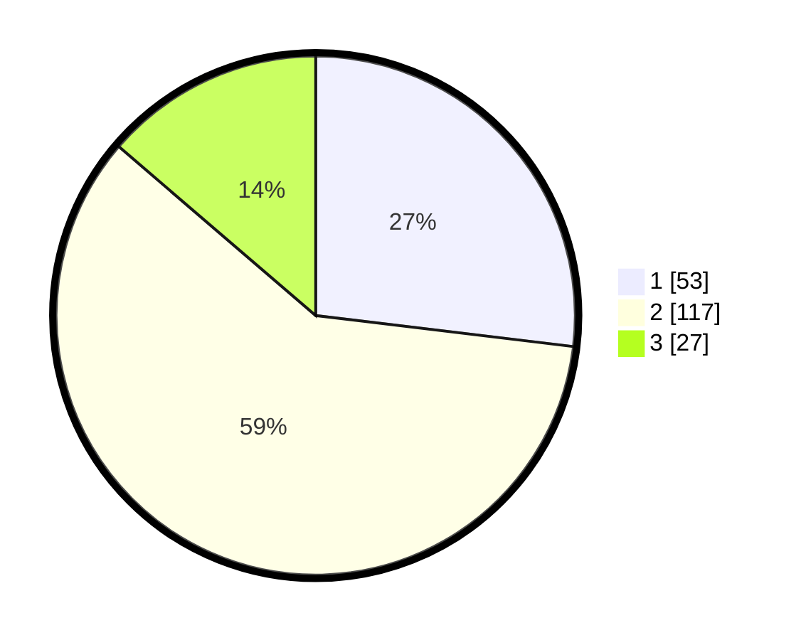

# Hasil

## Grafik

## Tabel

| No. | Nama Paslon    | Suara | Suara (raw) | Persentase |
|:--- |:-------------- | -----:| -----------:| ----------:|
| 1   | ANIES MUHAIMIN | 53    | [53][p-1]   | 26,90      |
| 2   | PRABOWO GIBRAN | 117   | [117][p-2]  | 59,39      |
| 3   | GANJAR MAHFUD  | 27    | [27][p-3]   | 13,71      |

[p-1]: https://github.com/gigit-pemilu/pemilu-2024/blob/main/pilpres/hitung-suara/sub/34-di-yogyakarta/sub/02-bantul/sub/17-sedayu/sub/2004-argomulyo/sub/029-tps/sub/paslon-1.txt
[p-2]: https://github.com/gigit-pemilu/pemilu-2024/blob/main/pilpres/hitung-suara/sub/34-di-yogyakarta/sub/02-bantul/sub/17-sedayu/sub/2004-argomulyo/sub/029-tps/sub/paslon-2.txt
[p-3]: https://github.com/gigit-pemilu/pemilu-2024/blob/main/pilpres/hitung-suara/sub/34-di-yogyakarta/sub/02-bantul/sub/17-sedayu/sub/2004-argomulyo/sub/029-tps/sub/paslon-3.txt

## Foto C Plano

https://sirekap-obj-formc.kpu.go.id/0078/pemilu/ppwp/34/02/17/20/04/3402172004029-20240214-155314--f856de4a-7acc-4e86-8093-290c22e7c3f1.jpg

https://sirekap-obj-formc.kpu.go.id/0078/pemilu/ppwp/34/02/17/20/04/3402172004029-20240214-155350--640e8d62-84e0-4148-abba-ce5404bf5fb5.jpg

https://sirekap-obj-formc.kpu.go.id/0078/pemilu/ppwp/34/02/17/20/04/3402172004029-20240214-155921--0fc5b781-498c-46a9-803b-cef7da7def3f.jpg

## Metadata

| Key        | Value               |
| ---------- | ------------------- |
| Time Stamp | 2024-02-25 12:00:00 |

