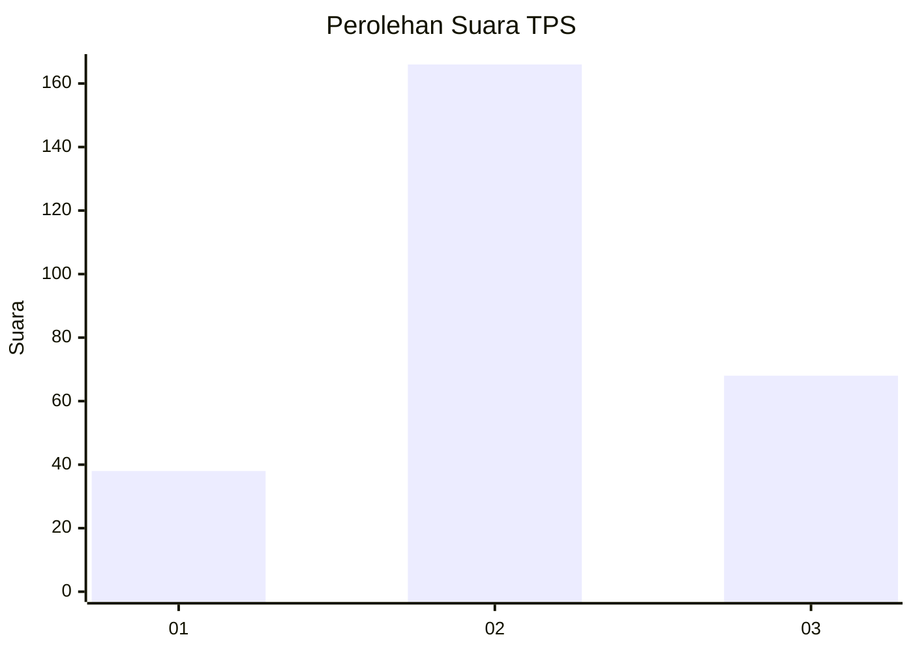
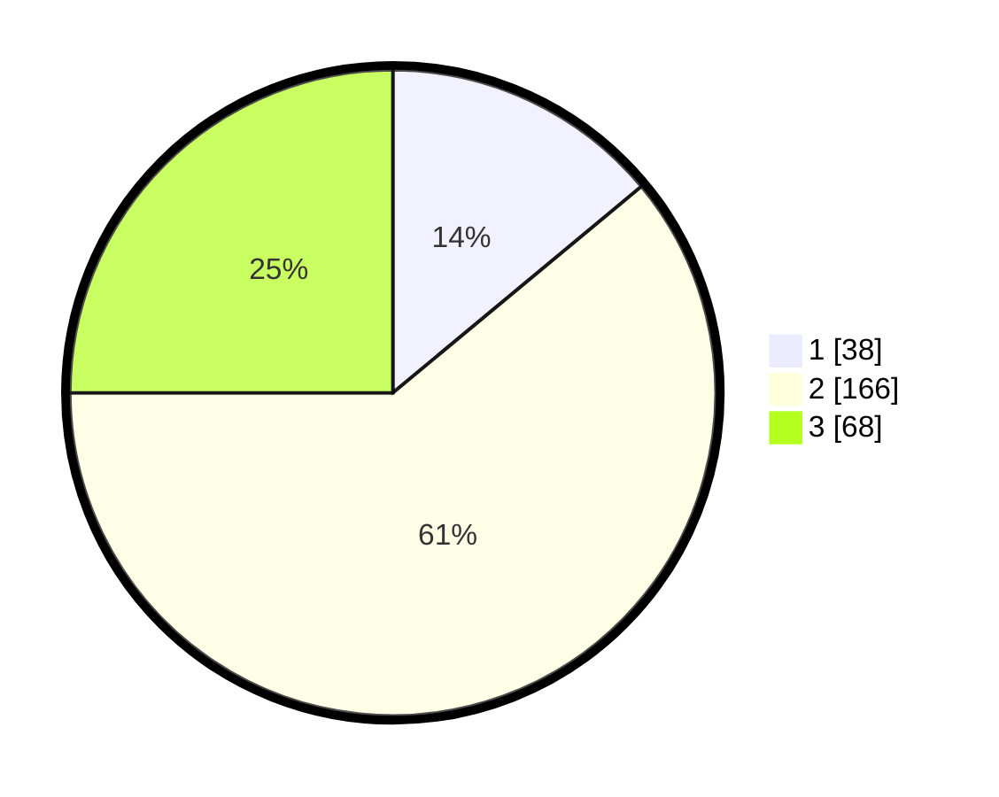

# Hasil

## Grafik

## Tabel

| No. | Nama Paslon    | Suara | Suara (raw) | Persentase |
|:--- |:-------------- | -----:| -----------:| ----------:|
| 1   | ANIES MUHAIMIN | 38    | [38][p-1]   | 13,97      |
| 2   | PRABOWO GIBRAN | 166   | [166][p-2]  | 61,03      |
| 3   | GANJAR MAHFUD  | 68    | [68][p-3]   | 25,00      |

[p-1]: https://github.com/gigit-pemilu/pemilu-2024-34-di-yogyakarta/blob/main/pilpres/hitung-suara/sub/34-di-yogyakarta/sub/02-bantul/sub/17-sedayu/sub/2004-argomulyo/sub/036-tps/sub/paslon-1.txt
[p-2]: https://github.com/gigit-pemilu/pemilu-2024-34-di-yogyakarta/blob/main/pilpres/hitung-suara/sub/34-di-yogyakarta/sub/02-bantul/sub/17-sedayu/sub/2004-argomulyo/sub/036-tps/sub/paslon-2.txt
[p-3]: https://github.com/gigit-pemilu/pemilu-2024-34-di-yogyakarta/blob/main/pilpres/hitung-suara/sub/34-di-yogyakarta/sub/02-bantul/sub/17-sedayu/sub/2004-argomulyo/sub/036-tps/sub/paslon-3.txt

## Foto C Plano

https://sirekap-obj-formc.kpu.go.id/3f7a/pemilu/ppwp/34/02/17/20/04/3402172004036-20240215-074240--10c6db64-ddef-49bc-8621-17f629777f2c.jpg

https://sirekap-obj-formc.kpu.go.id/3f7a/pemilu/ppwp/34/02/17/20/04/3402172004036-20240215-074053--b4622bb5-f95b-49ad-a7dd-38877aa9cd86.jpg

https://sirekap-obj-formc.kpu.go.id/3f7a/pemilu/ppwp/34/02/17/20/04/3402172004036-20240215-074657--d8ba762a-af9c-4715-9861-aeda1c301339.jpg

## Metadata

| Key        | Value               |
| ---------- | ------------------- |
| Time Stamp | 2024-02-19 19:00:00 |

