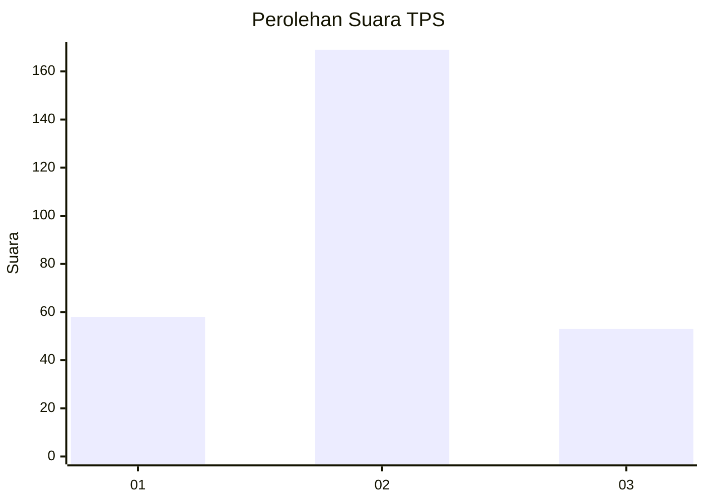
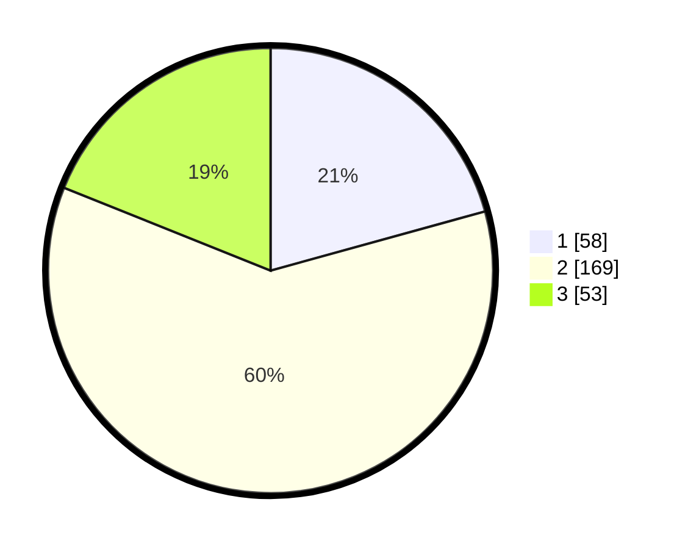

# Hasil

## Grafik

## Tabel

| No. | Nama Paslon    | Suara | Suara (raw) | Persentase |
|:--- |:-------------- | -----:| -----------:| ----------:|
| 1   | ANIES MUHAIMIN | 58    | [58][p-1]   | 20,71      |
| 2   | PRABOWO GIBRAN | 169   | [169][p-2]  | 60,36      |
| 3   | GANJAR MAHFUD  | 53    | [53][p-3]   | 18,93      |

[p-1]: https://github.com/gigit-pemilu/pemilu-2024-34-di-yogyakarta/blob/main/pilpres/hitung-suara/sub/34-di-yogyakarta/sub/02-bantul/sub/17-sedayu/sub/2004-argomulyo/sub/037-tps/sub/paslon-1.txt
[p-2]: https://github.com/gigit-pemilu/pemilu-2024-34-di-yogyakarta/blob/main/pilpres/hitung-suara/sub/34-di-yogyakarta/sub/02-bantul/sub/17-sedayu/sub/2004-argomulyo/sub/037-tps/sub/paslon-2.txt
[p-3]: https://github.com/gigit-pemilu/pemilu-2024-34-di-yogyakarta/blob/main/pilpres/hitung-suara/sub/34-di-yogyakarta/sub/02-bantul/sub/17-sedayu/sub/2004-argomulyo/sub/037-tps/sub/paslon-3.txt

## Foto C Plano

https://sirekap-obj-formc.kpu.go.id/019c/pemilu/ppwp/34/02/17/20/04/3402172004037-20240214-191749--209abd73-5fe8-4b01-943a-717be24272be.jpg

https://sirekap-obj-formc.kpu.go.id/019c/pemilu/ppwp/34/02/17/20/04/3402172004037-20240214-192149--248bb5a0-de62-49f7-9585-c5fa4c3e398d.jpg

https://sirekap-obj-formc.kpu.go.id/019c/pemilu/ppwp/34/02/17/20/04/3402172004037-20240214-192256--3c6e2f93-cb87-43a7-8c14-806cb9e81727.jpg

## Metadata

| Key        | Value               |
| ---------- | ------------------- |
| Time Stamp | 2024-02-24 22:31:28 |

