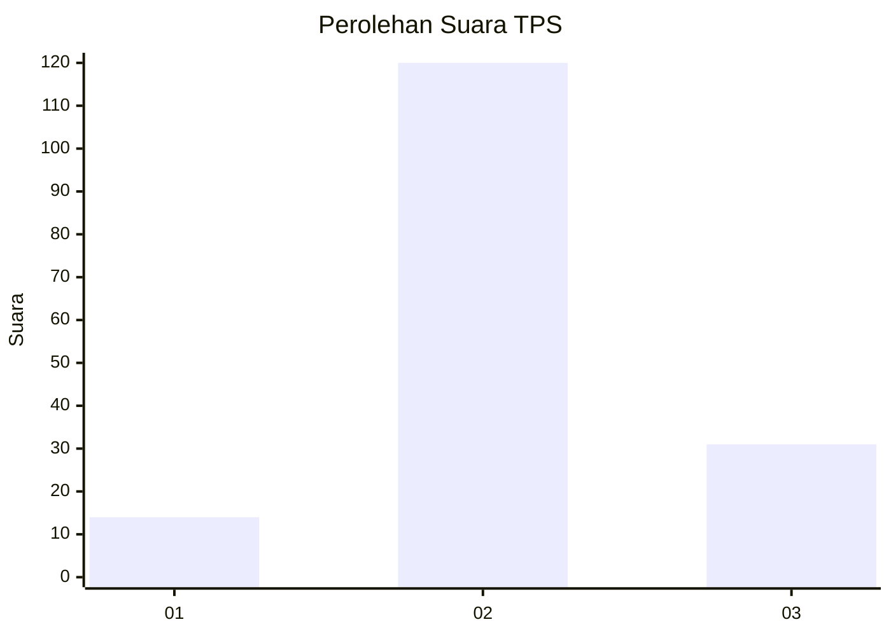
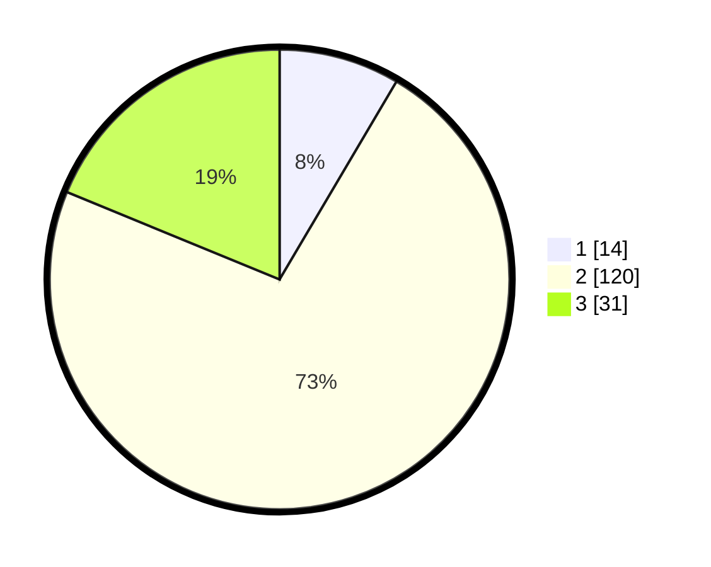

# Hasil

## Grafik

## Tabel

| No. | Nama Paslon    | Suara | Suara (raw) | Persentase |
|:--- |:-------------- | -----:| -----------:| ----------:|
| 1   | ANIES MUHAIMIN | 14    | [14][p-1]   | 8,48       |
| 2   | PRABOWO GIBRAN | 120   | [120][p-2]  | 72,73      |
| 3   | GANJAR MAHFUD  | 31    | [31][p-3]   | 18,79      |

[p-1]: https://github.com/gigit-pemilu/pemilu-2024-34-di-yogyakarta/blob/main/pilpres/hitung-suara/sub/34-di-yogyakarta/sub/02-bantul/sub/17-sedayu/sub/2004-argomulyo/sub/039-tps/sub/paslon-1.txt
[p-2]: https://github.com/gigit-pemilu/pemilu-2024-34-di-yogyakarta/blob/main/pilpres/hitung-suara/sub/34-di-yogyakarta/sub/02-bantul/sub/17-sedayu/sub/2004-argomulyo/sub/039-tps/sub/paslon-2.txt
[p-3]: https://github.com/gigit-pemilu/pemilu-2024-34-di-yogyakarta/blob/main/pilpres/hitung-suara/sub/34-di-yogyakarta/sub/02-bantul/sub/17-sedayu/sub/2004-argomulyo/sub/039-tps/sub/paslon-3.txt

## Foto C Plano

https://sirekap-obj-formc.kpu.go.id/d4b8/pemilu/ppwp/34/02/17/20/04/3402172004039-20240214-200039--18d5dfcc-724b-49e9-9674-f3aad16c2b4d.jpg

https://sirekap-obj-formc.kpu.go.id/d4b8/pemilu/ppwp/34/02/17/20/04/3402172004039-20240214-200043--62235592-d6f1-4552-9fa9-08fe63f4a2da.jpg

https://sirekap-obj-formc.kpu.go.id/d4b8/pemilu/ppwp/34/02/17/20/04/3402172004039-20240214-200046--12b6ee60-aab9-43e0-a3b4-1c996748c928.jpg

## Metadata

| Key        | Value               |
| ---------- | ------------------- |
| Time Stamp | 2024-02-15 07:00:44 |

