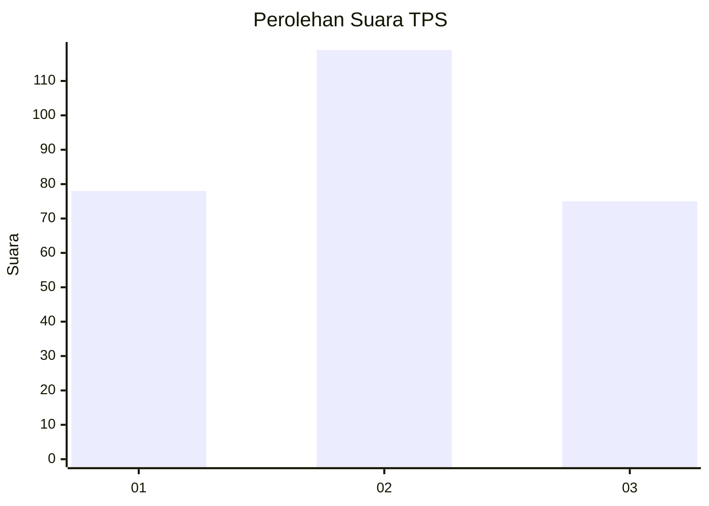
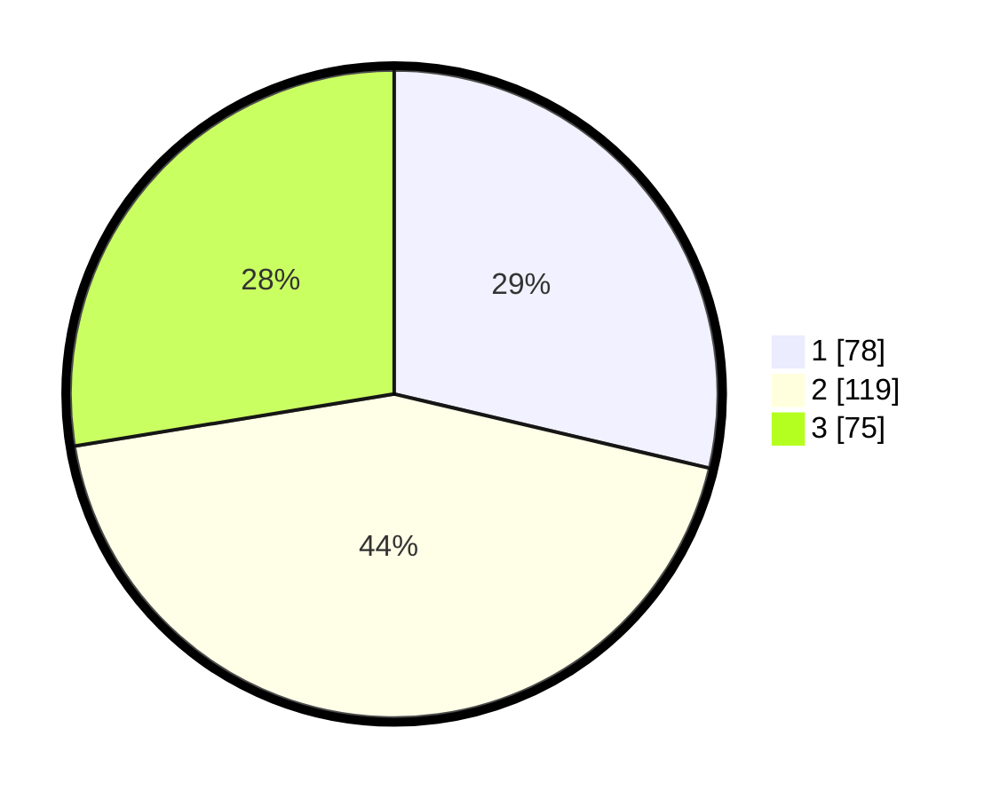

# Hasil

## Grafik

## Tabel

| No. | Nama Paslon    | Suara | Suara (raw) | Persentase |
|:--- |:-------------- | -----:| -----------:| ----------:|
| 1   | ANIES MUHAIMIN | 78    | [78][p-1]   | 28,68      |
| 2   | PRABOWO GIBRAN | 119   | [119][p-2]  | 43,75      |
| 3   | GANJAR MAHFUD  | 75    | [75][p-3]   | 27,57      |

[p-1]: https://github.com/gigit-pemilu/pemilu-2024-34-di-yogyakarta/blob/main/pilpres/hitung-suara/sub/34-di-yogyakarta/sub/02-bantul/sub/17-sedayu/sub/2004-argomulyo/sub/041-tps/sub/paslon-1.txt
[p-2]: https://github.com/gigit-pemilu/pemilu-2024-34-di-yogyakarta/blob/main/pilpres/hitung-suara/sub/34-di-yogyakarta/sub/02-bantul/sub/17-sedayu/sub/2004-argomulyo/sub/041-tps/sub/paslon-2.txt
[p-3]: https://github.com/gigit-pemilu/pemilu-2024-34-di-yogyakarta/blob/main/pilpres/hitung-suara/sub/34-di-yogyakarta/sub/02-bantul/sub/17-sedayu/sub/2004-argomulyo/sub/041-tps/sub/paslon-3.txt

## Foto C Plano

https://sirekap-obj-formc.kpu.go.id/d4ac/pemilu/ppwp/34/02/17/20/04/3402172004041-20240215-003627--22a83035-b889-41aa-b014-893bc339502f.jpg

https://sirekap-obj-formc.kpu.go.id/d4ac/pemilu/ppwp/34/02/17/20/04/3402172004041-20240215-004352--15d58613-1e3f-4ec5-a44f-e6abd442e4fb.jpg

https://sirekap-obj-formc.kpu.go.id/d4ac/pemilu/ppwp/34/02/17/20/04/3402172004041-20240215-004613--4176e9cf-a44f-42e1-a3c5-e4154b6dd11a.jpg

## Metadata

| Key        | Value               |
| ---------- | ------------------- |
| Time Stamp | 2024-02-24 22:31:28 |

