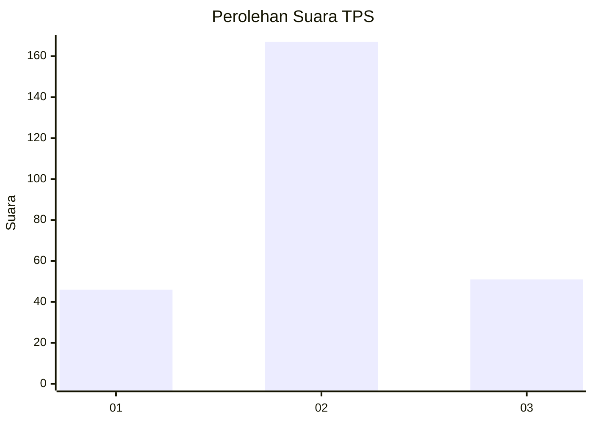
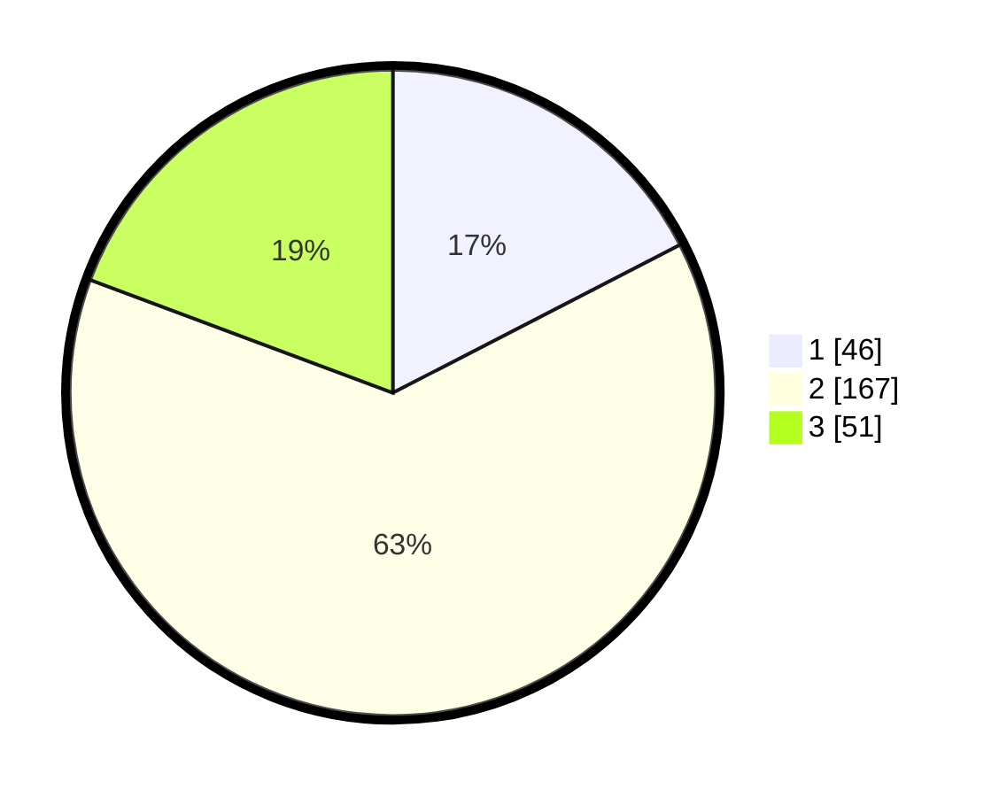

# Hasil

## Grafik

## Tabel

| No. | Nama Paslon    | Suara | Suara (raw) | Persentase |
|:--- |:-------------- | -----:| -----------:| ----------:|
| 1   | ANIES MUHAIMIN | 46    | [46][p-1]   | 17,42      |
| 2   | PRABOWO GIBRAN | 167   | [167][p-2]  | 63,26      |
| 3   | GANJAR MAHFUD  | 51    | [51][p-3]   | 19,32      |

[p-1]: https://github.com/gigit-pemilu/pemilu-2024-34-di-yogyakarta/blob/main/pilpres/hitung-suara/sub/34-di-yogyakarta/sub/02-bantul/sub/17-sedayu/sub/2004-argomulyo/sub/042-tps/sub/paslon-1.txt
[p-2]: https://github.com/gigit-pemilu/pemilu-2024-34-di-yogyakarta/blob/main/pilpres/hitung-suara/sub/34-di-yogyakarta/sub/02-bantul/sub/17-sedayu/sub/2004-argomulyo/sub/042-tps/sub/paslon-2.txt
[p-3]: https://github.com/gigit-pemilu/pemilu-2024-34-di-yogyakarta/blob/main/pilpres/hitung-suara/sub/34-di-yogyakarta/sub/02-bantul/sub/17-sedayu/sub/2004-argomulyo/sub/042-tps/sub/paslon-3.txt

## Foto C Plano

https://sirekap-obj-formc.kpu.go.id/9f3f/pemilu/ppwp/34/02/17/20/04/3402172004042-20240215-050223--b01d0de3-8e53-4566-adf2-79d8bc656ed4.jpg

https://sirekap-obj-formc.kpu.go.id/9f3f/pemilu/ppwp/34/02/17/20/04/3402172004042-20240215-050754--2fb310d1-8973-4c99-9d99-d90fd5b11fc1.jpg

https://sirekap-obj-formc.kpu.go.id/9f3f/pemilu/ppwp/34/02/17/20/04/3402172004042-20240215-051130--e11edda0-b2af-4131-8b1f-6cc6aa820737.jpg

## Metadata

| Key        | Value               |
| ---------- | ------------------- |
| Time Stamp | 2024-02-25 13:00:00 |

