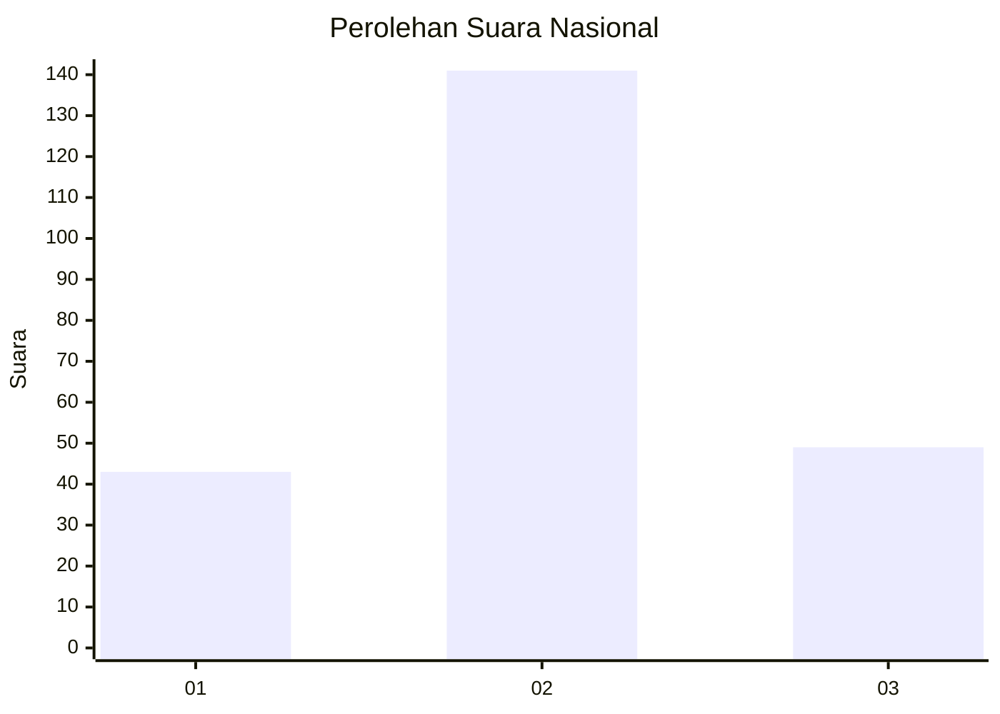
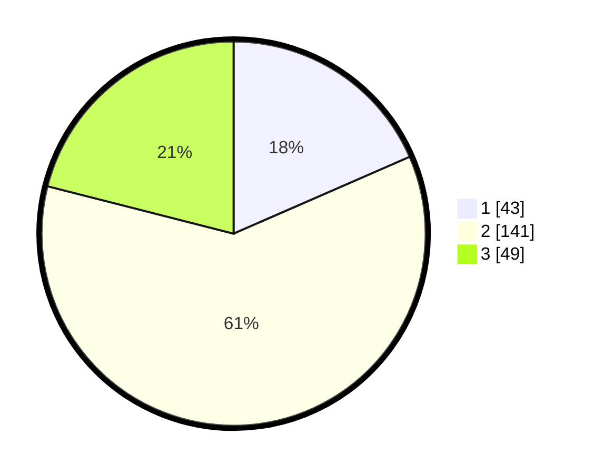

# Hasil

## Grafik

## Tabel

| No. | Nama Paslon    | Suara | Suara (raw) | Persentase |
|:--- |:-------------- | -----:| -----------:| ----------:|
| 1   | ANIES MUHAIMIN | 43    | [43][p-1]   | 18,45      |
| 2   | PRABOWO GIBRAN | 141   | [141][p-2]  | 60,52      |
| 3   | GANJAR MAHFUD  | 49    | [49][p-3]   | 21,03      |

[p-1]: https://github.com/gigit-pemilu/pemilu-2024/blob/main/pilpres/hitung-suara/sub/34-di-yogyakarta/sub/02-bantul/sub/17-sedayu/sub/2004-argomulyo/sub/044-tps/sub/paslon-1.txt
[p-2]: https://github.com/gigit-pemilu/pemilu-2024/blob/main/pilpres/hitung-suara/sub/34-di-yogyakarta/sub/02-bantul/sub/17-sedayu/sub/2004-argomulyo/sub/044-tps/sub/paslon-2.txt
[p-3]: https://github.com/gigit-pemilu/pemilu-2024/blob/main/pilpres/hitung-suara/sub/34-di-yogyakarta/sub/02-bantul/sub/17-sedayu/sub/2004-argomulyo/sub/044-tps/sub/paslon-3.txt

## Foto C Plano

https://sirekap-obj-formc.kpu.go.id/70b1/pemilu/ppwp/34/02/17/20/04/3402172004044-20240215-062714--48b4def3-5a4f-45a4-88db-9993f09a3bb6.jpg

https://sirekap-obj-formc.kpu.go.id/70b1/pemilu/ppwp/34/02/17/20/04/3402172004044-20240215-065015--cf255f58-0112-4272-bad4-97d7044b6ec3.jpg

https://sirekap-obj-formc.kpu.go.id/70b1/pemilu/ppwp/34/02/17/20/04/3402172004044-20240215-065109--ca87c420-96f5-4e31-a9f9-de0431406a5b.jpg

## Metadata

| Key        | Value               |
| ---------- | ------------------- |
| Time Stamp | 2024-02-15 19:00:26 |

