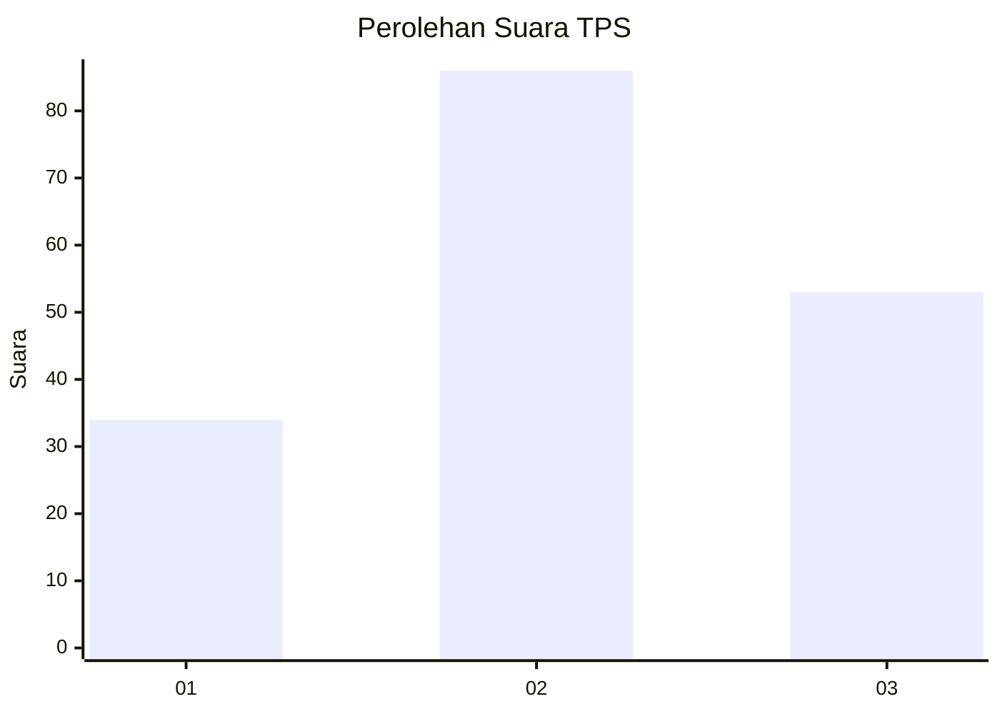
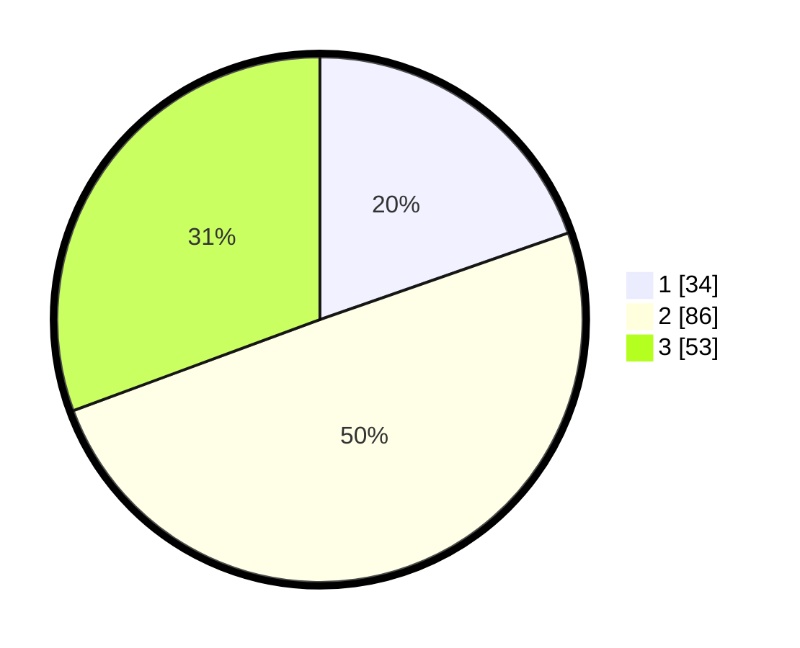

# Hasil

## Grafik

## Tabel

| No. | Nama Paslon    | Suara | Suara (raw) | Persentase |
|:--- |:-------------- | -----:| -----------:| ----------:|
| 1   | ANIES MUHAIMIN | 34    | [34][p-1]   | 19,65      |
| 2   | PRABOWO GIBRAN | 86    | [86][p-2]   | 49,71      |
| 3   | GANJAR MAHFUD  | 53    | [53][p-3]   | 30,64      |

[p-1]: https://github.com/gigit-pemilu/pemilu-2024-34-di-yogyakarta/blob/main/pilpres/hitung-suara/sub/34-di-yogyakarta/sub/02-bantul/sub/17-sedayu/sub/2004-argomulyo/sub/045-tps/sub/paslon-1.txt
[p-2]: https://github.com/gigit-pemilu/pemilu-2024-34-di-yogyakarta/blob/main/pilpres/hitung-suara/sub/34-di-yogyakarta/sub/02-bantul/sub/17-sedayu/sub/2004-argomulyo/sub/045-tps/sub/paslon-2.txt
[p-3]: https://github.com/gigit-pemilu/pemilu-2024-34-di-yogyakarta/blob/main/pilpres/hitung-suara/sub/34-di-yogyakarta/sub/02-bantul/sub/17-sedayu/sub/2004-argomulyo/sub/045-tps/sub/paslon-3.txt

## Foto C Plano

https://sirekap-obj-formc.kpu.go.id/58a3/pemilu/ppwp/34/02/17/20/04/3402172004045-20240214-194721--5989f37d-8d31-4cc9-82f0-df637c8870c4.jpg

https://sirekap-obj-formc.kpu.go.id/58a3/pemilu/ppwp/34/02/17/20/04/3402172004045-20240215-001153--3c267f35-1c48-495a-b19a-99dd25a757ce.jpg

https://sirekap-obj-formc.kpu.go.id/58a3/pemilu/ppwp/34/02/17/20/04/3402172004045-20240214-194951--422d5abb-38ab-44f1-b0e2-907afac741a4.jpg

## Metadata

| Key        | Value               |
| ---------- | ------------------- |
| Time Stamp | 2024-02-25 17:00:00 |

