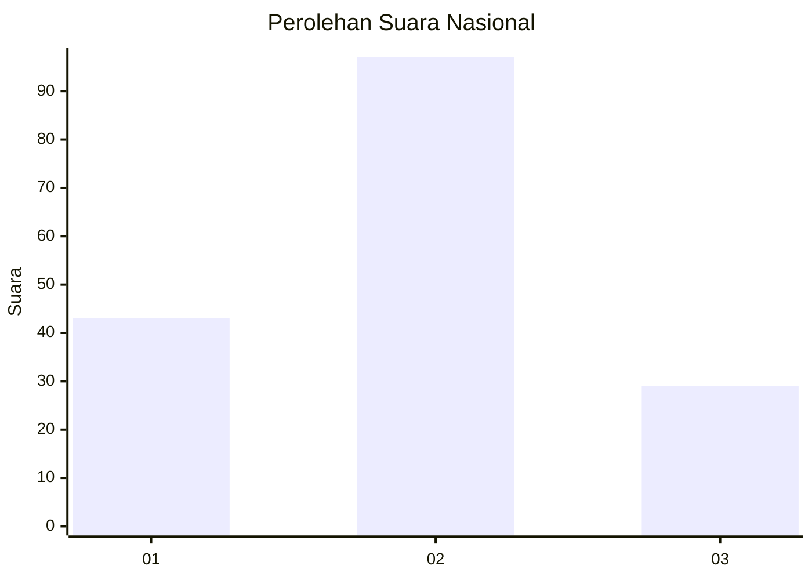

# Hasil

## Grafik

## Tabel

| No. | Nama Paslon    | Suara | Suara (raw) | Persentase |
|:--- |:-------------- | -----:| -----------:| ----------:|
| 1   | ANIES MUHAIMIN | 43    | [43][p-1]   | 25,44      |
| 2   | PRABOWO GIBRAN | 97    | [97][p-2]   | 57,40      |
| 3   | GANJAR MAHFUD  | 29    | [29][p-3]   | 17,16      |

[p-1]: https://github.com/gigit-pemilu/pemilu-2024/blob/main/pilpres/hitung-suara/sub/34-di-yogyakarta/sub/02-bantul/sub/17-sedayu/sub/2004-argomulyo/sub/046-tps/sub/paslon-1.txt
[p-2]: https://github.com/gigit-pemilu/pemilu-2024/blob/main/pilpres/hitung-suara/sub/34-di-yogyakarta/sub/02-bantul/sub/17-sedayu/sub/2004-argomulyo/sub/046-tps/sub/paslon-2.txt
[p-3]: https://github.com/gigit-pemilu/pemilu-2024/blob/main/pilpres/hitung-suara/sub/34-di-yogyakarta/sub/02-bantul/sub/17-sedayu/sub/2004-argomulyo/sub/046-tps/sub/paslon-3.txt

## Foto C Plano

https://sirekap-obj-formc.kpu.go.id/9e88/pemilu/ppwp/34/02/17/20/04/3402172004046-20240215-002559--8a750c2e-ef76-4af1-91e7-459c6f4c9d02.jpg

https://sirekap-obj-formc.kpu.go.id/9e88/pemilu/ppwp/34/02/17/20/04/3402172004046-20240214-230047--83ac42e0-9afe-4de5-8c2b-f56d2e9141ba.jpg

https://sirekap-obj-formc.kpu.go.id/9e88/pemilu/ppwp/34/02/17/20/04/3402172004046-20240215-002756--0c3e5328-1b6a-4306-aa60-fdeab4fc6cde.jpg

## Metadata

| Key        | Value               |
| ---------- | ------------------- |
| Time Stamp | 2024-02-15 15:00:29 |

