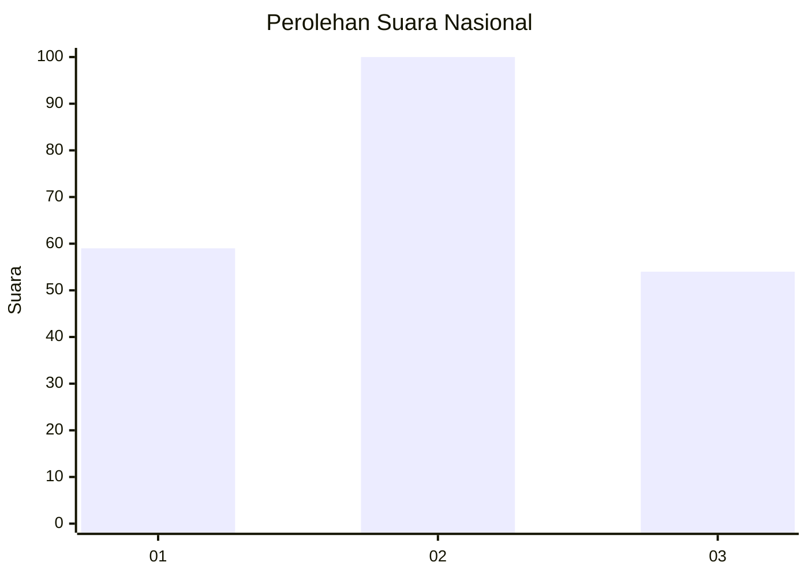
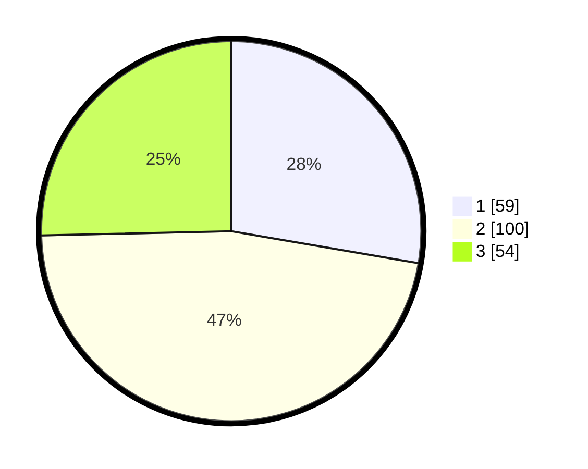

# Hasil

## Grafik

## Tabel

| No. | Nama Paslon    | Suara | Suara (raw) | Persentase |
|:--- |:-------------- | -----:| -----------:| ----------:|
| 1   | ANIES MUHAIMIN | 59    | [59][p-1]   | 27,70      |
| 2   | PRABOWO GIBRAN | 100   | [100][p-2]  | 46,95      |
| 3   | GANJAR MAHFUD  | 54    | [54][p-3]   | 25,35      |

[p-1]: https://github.com/gigit-pemilu/pemilu-2024/blob/main/pilpres/hitung-suara/sub/34-di-yogyakarta/sub/03-gunungkidul/sub/01-wonosari/sub/2001-wonosari/sub/001-tps/sub/paslon-1.txt
[p-2]: https://github.com/gigit-pemilu/pemilu-2024/blob/main/pilpres/hitung-suara/sub/34-di-yogyakarta/sub/03-gunungkidul/sub/01-wonosari/sub/2001-wonosari/sub/001-tps/sub/paslon-2.txt
[p-3]: https://github.com/gigit-pemilu/pemilu-2024/blob/main/pilpres/hitung-suara/sub/34-di-yogyakarta/sub/03-gunungkidul/sub/01-wonosari/sub/2001-wonosari/sub/001-tps/sub/paslon-3.txt

## Foto C Plano

https://sirekap-obj-formc.kpu.go.id/d431/pemilu/ppwp/34/03/01/20/01/3403012001001-20240214-210946--2a50f553-9185-4735-9b41-eec861f0d46f.jpg

https://sirekap-obj-formc.kpu.go.id/d431/pemilu/ppwp/34/03/01/20/01/3403012001001-20240214-203124--719e8f96-d52d-484c-9b0b-62f17ce028c0.jpg

https://sirekap-obj-formc.kpu.go.id/d431/pemilu/ppwp/34/03/01/20/01/3403012001001-20240214-203257--b50cbe26-ec2b-4eba-b17f-fcbda9bc6943.jpg

## Metadata

| Key        | Value               |
| ---------- | ------------------- |
| Time Stamp | 2024-02-16 22:01:00 |

