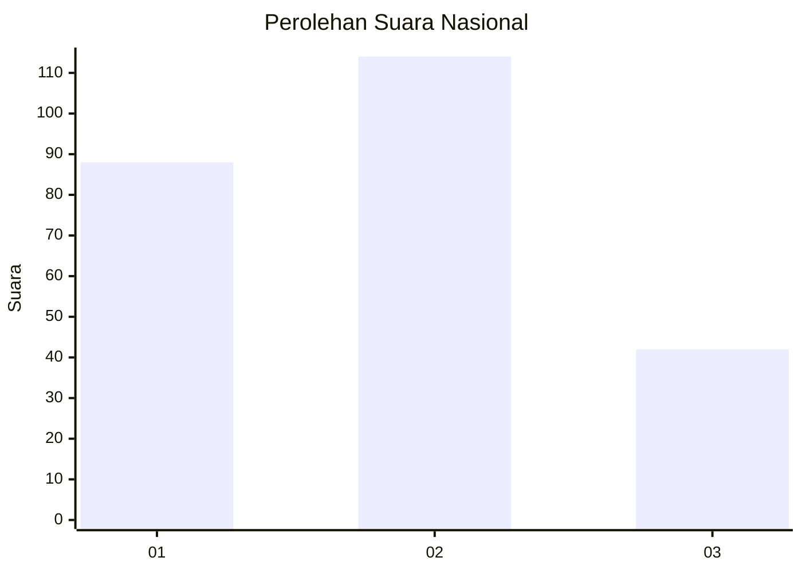
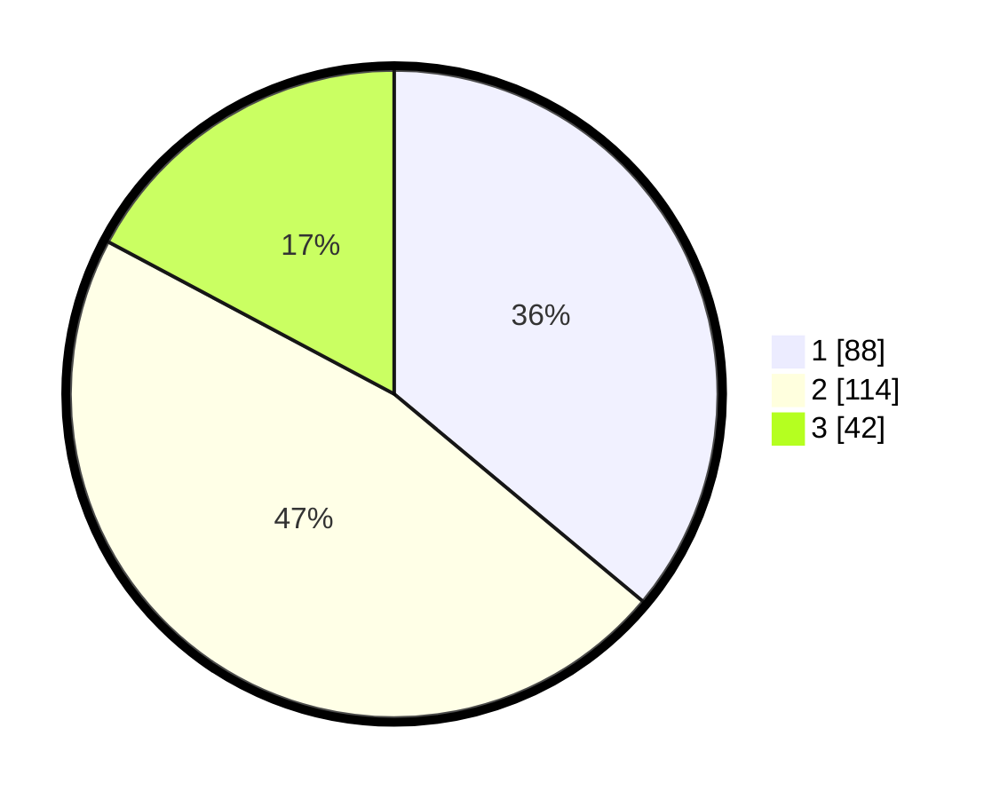

# Hasil

## Grafik

## Tabel

| No. | Nama Paslon    | Suara | Suara (raw) | Persentase |
|:--- |:-------------- | -----:| -----------:| ----------:|
| 1   | ANIES MUHAIMIN | 88    | [88][p-1]   | 36,07      |
| 2   | PRABOWO GIBRAN | 114   | [114][p-2]  | 46,72      |
| 3   | GANJAR MAHFUD  | 42    | [42][p-3]   | 17,21      |

[p-1]: https://github.com/gigit-pemilu/pemilu-2024/blob/main/pilpres/hitung-suara/sub/34-di-yogyakarta/sub/03-gunungkidul/sub/01-wonosari/sub/2001-wonosari/sub/002-tps/sub/paslon-1.txt
[p-2]: https://github.com/gigit-pemilu/pemilu-2024/blob/main/pilpres/hitung-suara/sub/34-di-yogyakarta/sub/03-gunungkidul/sub/01-wonosari/sub/2001-wonosari/sub/002-tps/sub/paslon-2.txt
[p-3]: https://github.com/gigit-pemilu/pemilu-2024/blob/main/pilpres/hitung-suara/sub/34-di-yogyakarta/sub/03-gunungkidul/sub/01-wonosari/sub/2001-wonosari/sub/002-tps/sub/paslon-3.txt

## Foto C Plano

https://sirekap-obj-formc.kpu.go.id/20db/pemilu/ppwp/34/03/01/20/01/3403012001002-20240216-140901--2ea7905e-0ce7-4987-94eb-e30e191aa22e.jpg

https://sirekap-obj-formc.kpu.go.id/20db/pemilu/ppwp/34/03/01/20/01/3403012001002-20240215-032728--7e86d761-5ac6-4db1-a905-78a9f5d09603.jpg

https://sirekap-obj-formc.kpu.go.id/20db/pemilu/ppwp/34/03/01/20/01/3403012001002-20240216-140902--1519c949-9841-49b4-90aa-fc33b33502a5.jpg

## Metadata

| Key        | Value               |
| ---------- | ------------------- |
| Time Stamp | 2024-02-16 14:30:33 |

## DATA PEMILIH TETAP

Jumlah pemilih dalam DPT: **277**.
 * L: **141**.
 * P: **136**.

## DATA PENGGUNA HAK PILIH

Jumlah pengguna hak pilih dalam DPT: **244**.
 * L: **116**.
 * P: **128**.

Jumlah pengguna hak pilih dalam DPTb: **4**.
 * L: **1**.
 * P: **3**.

Jumlah pengguna hak pilih dalam DPK: **3**.
 * L: **2**.
 * P: **1**.

Jumlah pengguna hak pilih: **251**.
 * L: **119**.
 * P: **132**.

## JUMLAH SUARA SAH DAN TIDAK SAH

JUMLAH SELURUH SUARA SAH: **244**.

JUMLAH SUARA TIDAK SAH: **7**.

JUMLAH SELURUH SUARA SAH DAN SUARA TIDAK SAH: **251**.

