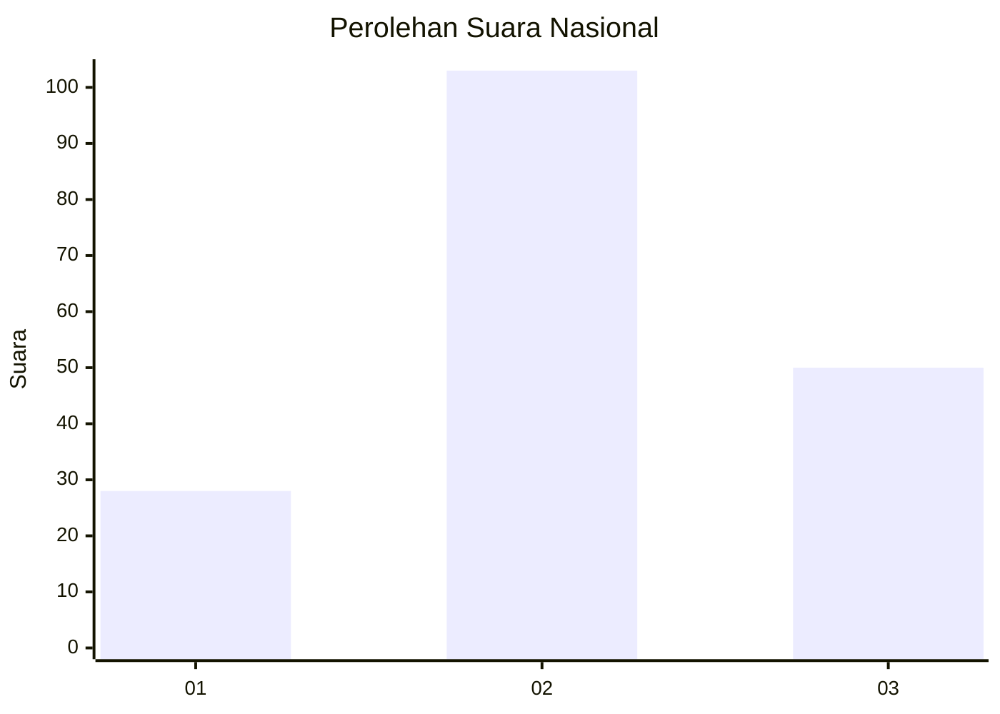
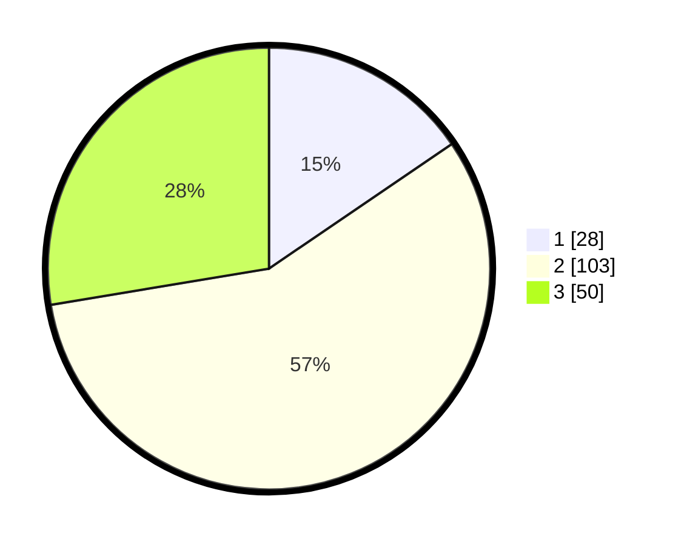

# Hasil

## Grafik

## Tabel

| No. | Nama Paslon    | Suara | Suara (raw) | Persentase |
|:--- |:-------------- | -----:| -----------:| ----------:|
| 1   | ANIES MUHAIMIN | 28    | [28][p-1]   | 15,47      |
| 2   | PRABOWO GIBRAN | 103   | [103][p-2]  | 56,91      |
| 3   | GANJAR MAHFUD  | 50    | [50][p-3]   | 27,62      |

[p-1]: https://github.com/gigit-pemilu/pemilu-2024/blob/main/pilpres/hitung-suara/sub/34-di-yogyakarta/sub/03-gunungkidul/sub/01-wonosari/sub/2001-wonosari/sub/003-tps/sub/paslon-1.txt
[p-2]: https://github.com/gigit-pemilu/pemilu-2024/blob/main/pilpres/hitung-suara/sub/34-di-yogyakarta/sub/03-gunungkidul/sub/01-wonosari/sub/2001-wonosari/sub/003-tps/sub/paslon-2.txt
[p-3]: https://github.com/gigit-pemilu/pemilu-2024/blob/main/pilpres/hitung-suara/sub/34-di-yogyakarta/sub/03-gunungkidul/sub/01-wonosari/sub/2001-wonosari/sub/003-tps/sub/paslon-3.txt

## Foto C Plano

https://sirekap-obj-formc.kpu.go.id/3a6e/pemilu/ppwp/34/03/01/20/01/3403012001003-20240216-111930--82851db5-8b7f-47ce-b0e7-0375e4ae0ecb.jpg

https://sirekap-obj-formc.kpu.go.id/3a6e/pemilu/ppwp/34/03/01/20/01/3403012001003-20240216-111932--bf2ac68d-7f20-4f6a-a253-4e119cef2200.jpg

https://sirekap-obj-formc.kpu.go.id/3a6e/pemilu/ppwp/34/03/01/20/01/3403012001003-20240216-111931--40f5d09e-b1a0-4ace-b8d1-51e013058538.jpg

## Metadata

| Key        | Value               |
| ---------- | ------------------- |
| Time Stamp | 2024-02-16 16:25:10 |

## DATA PEMILIH TETAP

Jumlah pemilih dalam DPT: **214**.
 * L: **103**.
 * P: **111**.

## DATA PENGGUNA HAK PILIH

Jumlah pengguna hak pilih dalam DPT: **185**.
 * L: **88**.
 * P: **97**.

Jumlah pengguna hak pilih dalam DPTb: **1**.
 * L: **1**.
 * P: **0**.

Jumlah pengguna hak pilih dalam DPK: **0**.
 * L: **0**.
 * P: **0**.

Jumlah pengguna hak pilih: **186**.
 * L: **89**.
 * P: **97**.

## JUMLAH SUARA SAH DAN TIDAK SAH

JUMLAH SELURUH SUARA SAH: **181**.

JUMLAH SUARA TIDAK SAH: **5**.

JUMLAH SELURUH SUARA SAH DAN SUARA TIDAK SAH: **186**.

