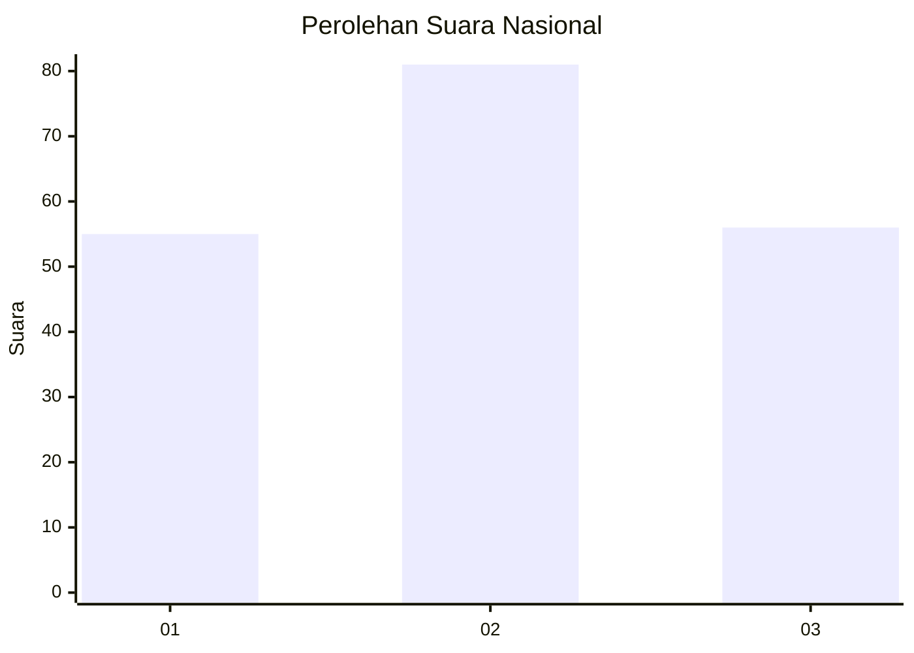
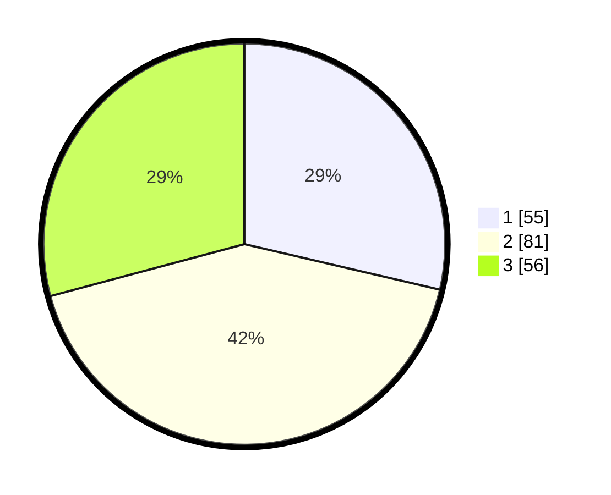

# Hasil

## Grafik

## Tabel

| No. | Nama Paslon    | Suara | Suara (raw) | Persentase |
|:--- |:-------------- | -----:| -----------:| ----------:|
| 1   | ANIES MUHAIMIN | 55    | [55][p-1]   | 28,65      |
| 2   | PRABOWO GIBRAN | 81    | [81][p-2]   | 42,19      |
| 3   | GANJAR MAHFUD  | 56    | [56][p-3]   | 29,17      |

[p-1]: https://github.com/gigit-pemilu/pemilu-2024/blob/main/pilpres/hitung-suara/sub/34-di-yogyakarta/sub/03-gunungkidul/sub/01-wonosari/sub/2001-wonosari/sub/004-tps/sub/paslon-1.txt
[p-2]: https://github.com/gigit-pemilu/pemilu-2024/blob/main/pilpres/hitung-suara/sub/34-di-yogyakarta/sub/03-gunungkidul/sub/01-wonosari/sub/2001-wonosari/sub/004-tps/sub/paslon-2.txt
[p-3]: https://github.com/gigit-pemilu/pemilu-2024/blob/main/pilpres/hitung-suara/sub/34-di-yogyakarta/sub/03-gunungkidul/sub/01-wonosari/sub/2001-wonosari/sub/004-tps/sub/paslon-3.txt

## Foto C Plano

https://sirekap-obj-formc.kpu.go.id/a80c/pemilu/ppwp/34/03/01/20/01/3403012001004-20240216-001601--65a42455-4808-41db-aa52-c50f42558f0e.jpg

https://sirekap-obj-formc.kpu.go.id/a80c/pemilu/ppwp/34/03/01/20/01/3403012001004-20240216-001604--5819d644-18cf-4d65-bae6-58d0aa681720.jpg

https://sirekap-obj-formc.kpu.go.id/a80c/pemilu/ppwp/34/03/01/20/01/3403012001004-20240216-001603--91225ab7-fcf2-43b8-92d9-0cc20ea238ac.jpg

## Metadata

| Key        | Value               |
| ---------- | ------------------- |
| Time Stamp | 2024-02-16 10:00:28 |

## DATA PEMILIH TETAP

Jumlah pemilih dalam DPT: **239**.
 * L: **119**.
 * P: **120**.

## DATA PENGGUNA HAK PILIH

Jumlah pengguna hak pilih dalam DPT: **202**.
 * L: **100**.
 * P: **102**.

Jumlah pengguna hak pilih dalam DPTb: **1**.
 * L: **0**.
 * P: **1**.

Jumlah pengguna hak pilih dalam DPK: **4**.
 * L: **2**.
 * P: **2**.

Jumlah pengguna hak pilih: **207**.
 * L: **102**.
 * P: **105**.

## JUMLAH SUARA SAH DAN TIDAK SAH

JUMLAH SELURUH SUARA SAH: **192**.

JUMLAH SUARA TIDAK SAH: **15**.

JUMLAH SELURUH SUARA SAH DAN SUARA TIDAK SAH: **207**.

