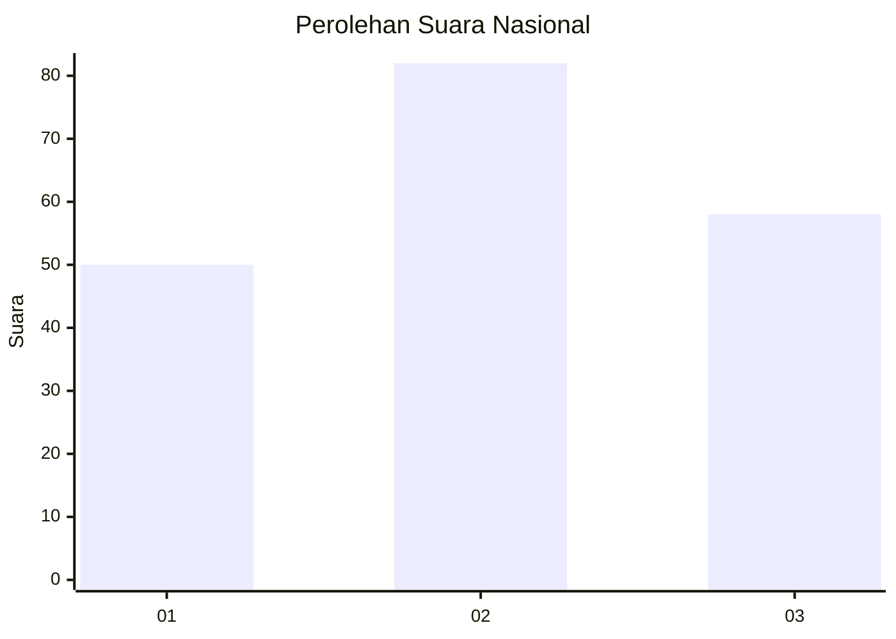
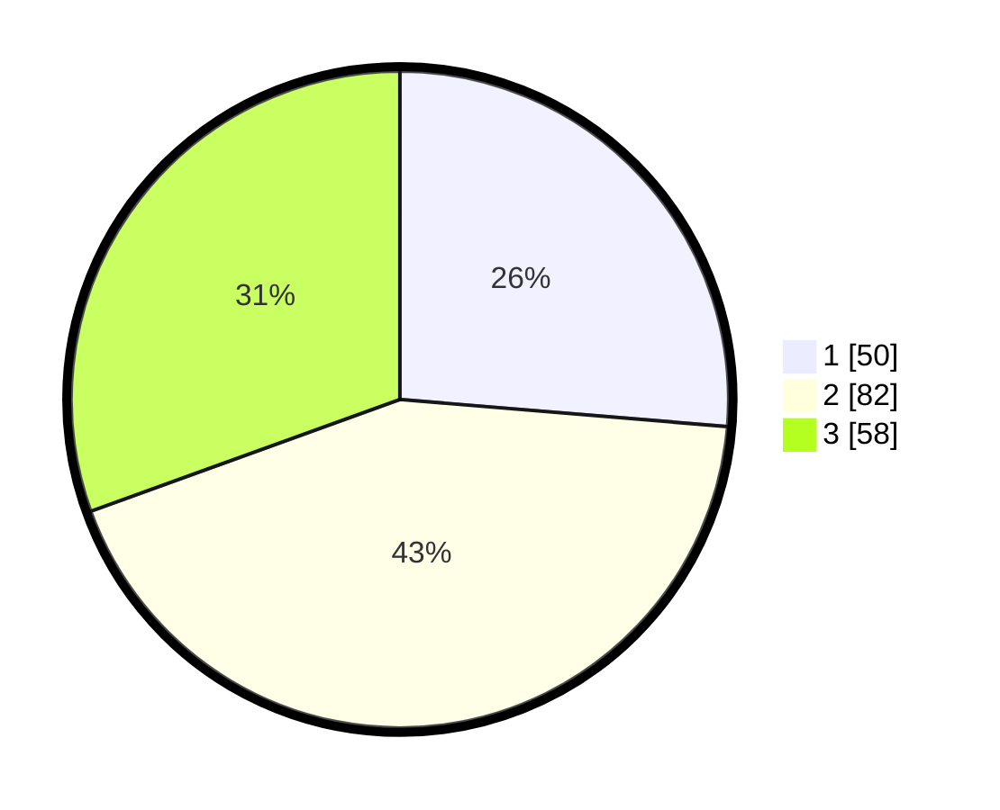

# Hasil

## Grafik

## Tabel

| No. | Nama Paslon    | Suara | Suara (raw) | Persentase |
|:--- |:-------------- | -----:| -----------:| ----------:|
| 1   | ANIES MUHAIMIN | 50    | [50][p-1]   | 26,32      |
| 2   | PRABOWO GIBRAN | 82    | [82][p-2]   | 43,16      |
| 3   | GANJAR MAHFUD  | 58    | [58][p-3]   | 30,53      |

[p-1]: https://github.com/gigit-pemilu/pemilu-2024/blob/main/pilpres/hitung-suara/sub/34-di-yogyakarta/sub/03-gunungkidul/sub/01-wonosari/sub/2001-wonosari/sub/005-tps/sub/paslon-1.txt
[p-2]: https://github.com/gigit-pemilu/pemilu-2024/blob/main/pilpres/hitung-suara/sub/34-di-yogyakarta/sub/03-gunungkidul/sub/01-wonosari/sub/2001-wonosari/sub/005-tps/sub/paslon-2.txt
[p-3]: https://github.com/gigit-pemilu/pemilu-2024/blob/main/pilpres/hitung-suara/sub/34-di-yogyakarta/sub/03-gunungkidul/sub/01-wonosari/sub/2001-wonosari/sub/005-tps/sub/paslon-3.txt

## Foto C Plano

https://sirekap-obj-formc.kpu.go.id/411a/pemilu/ppwp/34/03/01/20/01/3403012001005-20240216-145320--58ae52c7-1b93-4f2a-aeef-48860efca8d3.jpg

https://sirekap-obj-formc.kpu.go.id/411a/pemilu/ppwp/34/03/01/20/01/3403012001005-20240216-104926--8f1d1845-f94a-4412-bc35-106f9159191c.jpg

https://sirekap-obj-formc.kpu.go.id/411a/pemilu/ppwp/34/03/01/20/01/3403012001005-20240216-104924--5fc63073-e497-4597-bc17-4dbebd0ce304.jpg

## Metadata

| Key        | Value               |
| ---------- | ------------------- |
| Time Stamp | 2024-02-16 16:25:10 |

## DATA PEMILIH TETAP

Jumlah pemilih dalam DPT: **225**.
 * L: **103**.
 * P: **122**.

## DATA PENGGUNA HAK PILIH

Jumlah pengguna hak pilih dalam DPT: **194**.
 * L: **88**.
 * P: **106**.

Jumlah pengguna hak pilih dalam DPTb: **1**.
 * L: **1**.
 * P: **0**.

Jumlah pengguna hak pilih dalam DPK: **0**.
 * L: **0**.
 * P: **0**.

Jumlah pengguna hak pilih: **195**.
 * L: **89**.
 * P: **106**.

## JUMLAH SUARA SAH DAN TIDAK SAH

JUMLAH SELURUH SUARA SAH: **190**.

JUMLAH SUARA TIDAK SAH: **5**.

JUMLAH SELURUH SUARA SAH DAN SUARA TIDAK SAH: **195**.

