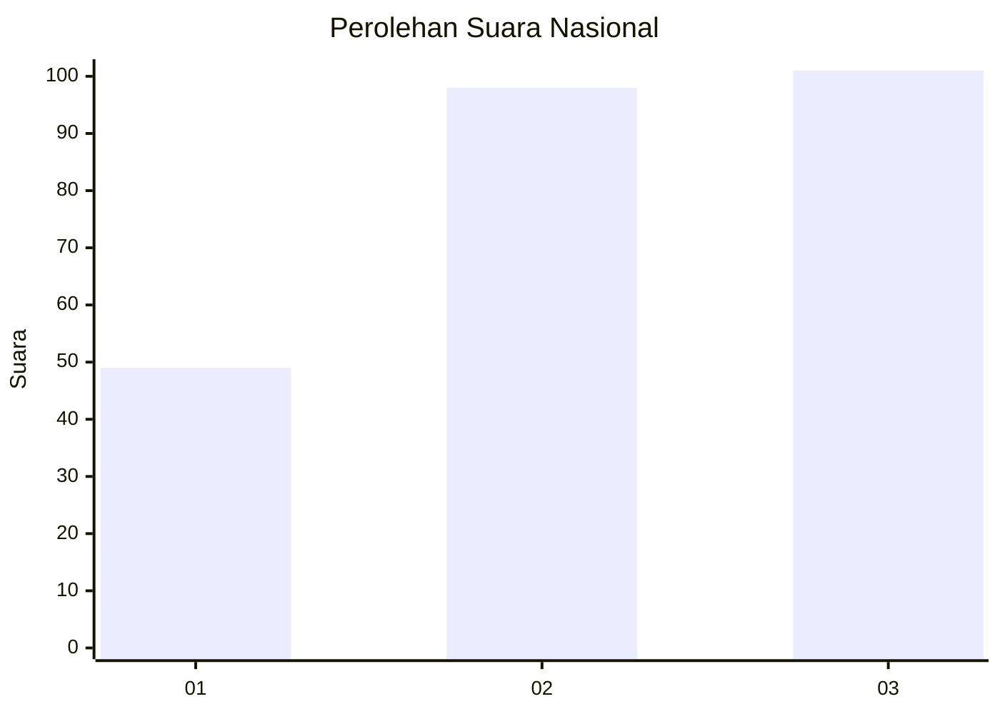
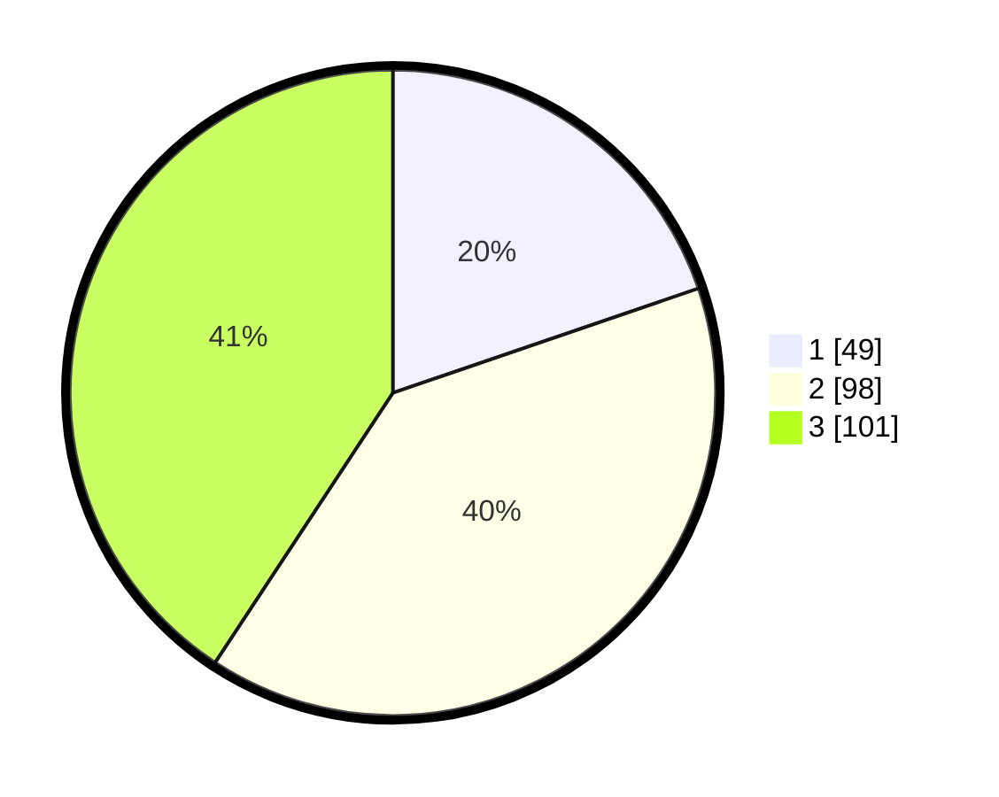

# Hasil

## Grafik

## Tabel

| No. | Nama Paslon    | Suara | Suara (raw) | Persentase |
|:--- |:-------------- | -----:| -----------:| ----------:|
| 1   | ANIES MUHAIMIN | 49    | [49][p-1]   | 19,76      |
| 2   | PRABOWO GIBRAN | 98    | [98][p-2]   | 39,52      |
| 3   | GANJAR MAHFUD  | 101   | [101][p-3]  | 40,73      |

[p-1]: https://github.com/gigit-pemilu/pemilu-2024/blob/main/pilpres/hitung-suara/sub/34-di-yogyakarta/sub/03-gunungkidul/sub/01-wonosari/sub/2001-wonosari/sub/015-tps/sub/paslon-1.txt
[p-2]: https://github.com/gigit-pemilu/pemilu-2024/blob/main/pilpres/hitung-suara/sub/34-di-yogyakarta/sub/03-gunungkidul/sub/01-wonosari/sub/2001-wonosari/sub/015-tps/sub/paslon-2.txt
[p-3]: https://github.com/gigit-pemilu/pemilu-2024/blob/main/pilpres/hitung-suara/sub/34-di-yogyakarta/sub/03-gunungkidul/sub/01-wonosari/sub/2001-wonosari/sub/015-tps/sub/paslon-3.txt

## Foto C Plano

https://sirekap-obj-formc.kpu.go.id/6aac/pemilu/ppwp/34/03/01/20/01/3403012001015-20240214-205213--942919c6-2d8a-425d-848f-c3cd4008175e.jpg

https://sirekap-obj-formc.kpu.go.id/6aac/pemilu/ppwp/34/03/01/20/01/3403012001015-20240214-203117--50e50a5d-0f92-4b6c-937b-9dc947a0bc87.jpg

https://sirekap-obj-formc.kpu.go.id/6aac/pemilu/ppwp/34/03/01/20/01/3403012001015-20240214-203257--c8c3cfca-9b02-40a8-afb9-b4b1bb10ad57.jpg

## Metadata

| Key        | Value               |
| ---------- | ------------------- |
| Time Stamp | 2024-02-15 17:00:25 |

