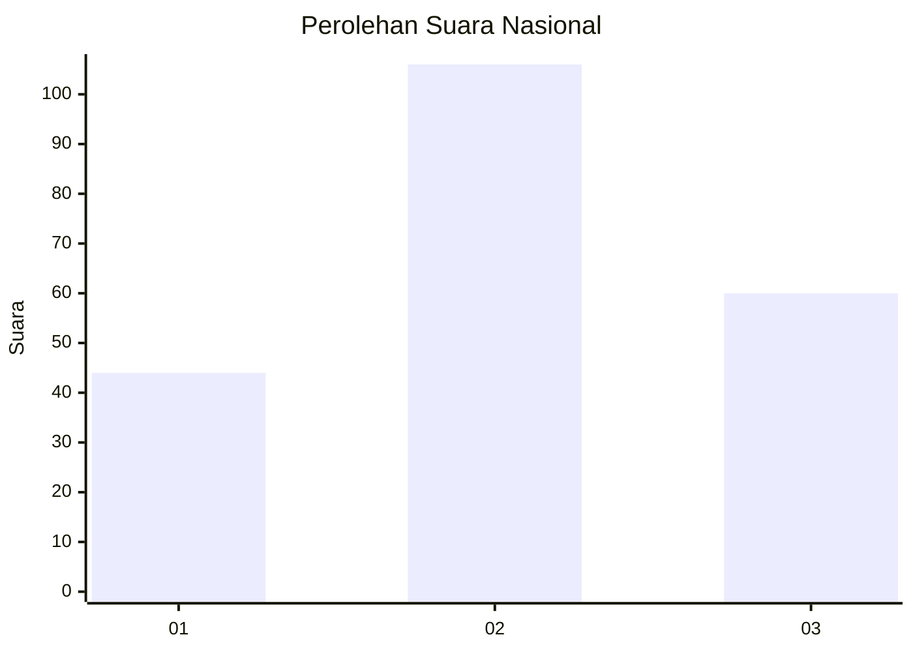
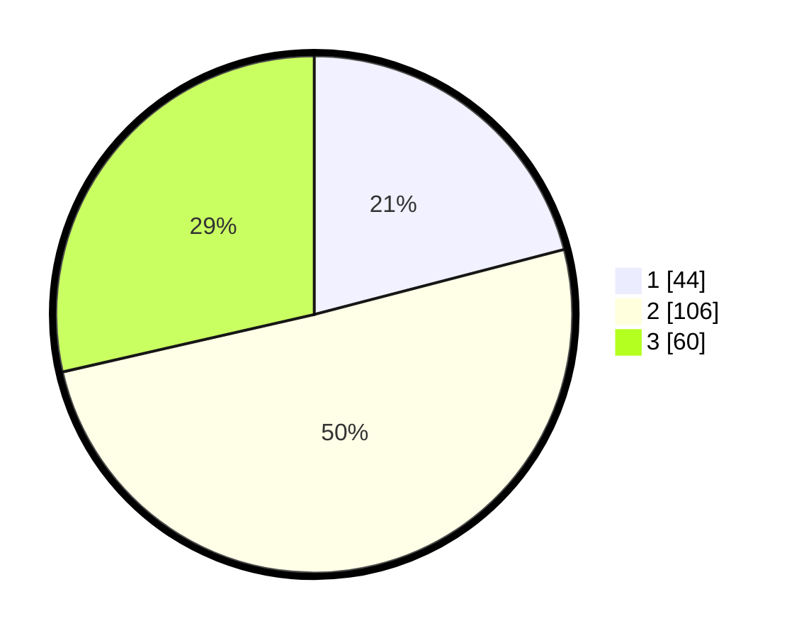

# Hasil

## Grafik

## Tabel

| No. | Nama Paslon    | Suara | Suara (raw) | Persentase |
|:--- |:-------------- | -----:| -----------:| ----------:|
| 1   | ANIES MUHAIMIN | 44    | [44][p-1]   | 20,95      |
| 2   | PRABOWO GIBRAN | 106   | [106][p-2]  | 50,48      |
| 3   | GANJAR MAHFUD  | 60    | [60][p-3]   | 28,57      |

[p-1]: https://github.com/gigit-pemilu/pemilu-2024/blob/main/pilpres/hitung-suara/sub/34-di-yogyakarta/sub/03-gunungkidul/sub/01-wonosari/sub/2001-wonosari/sub/023-tps/sub/paslon-1.txt
[p-2]: https://github.com/gigit-pemilu/pemilu-2024/blob/main/pilpres/hitung-suara/sub/34-di-yogyakarta/sub/03-gunungkidul/sub/01-wonosari/sub/2001-wonosari/sub/023-tps/sub/paslon-2.txt
[p-3]: https://github.com/gigit-pemilu/pemilu-2024/blob/main/pilpres/hitung-suara/sub/34-di-yogyakarta/sub/03-gunungkidul/sub/01-wonosari/sub/2001-wonosari/sub/023-tps/sub/paslon-3.txt

## Foto C Plano

https://sirekap-obj-formc.kpu.go.id/5c0f/pemilu/ppwp/34/03/01/20/01/3403012001023-20240215-000328--5aa5c3a3-eb7d-48dc-bd60-8f3e93d4d4c8.jpg

https://sirekap-obj-formc.kpu.go.id/5c0f/pemilu/ppwp/34/03/01/20/01/3403012001023-20240214-195009--4acbb957-1c64-44bf-ada1-6ee3a8cdad5f.jpg

https://sirekap-obj-formc.kpu.go.id/5c0f/pemilu/ppwp/34/03/01/20/01/3403012001023-20240214-212828--c91729b4-9989-4f74-a52c-be945e910938.jpg

## Metadata

| Key        | Value               |
| ---------- | ------------------- |
| Time Stamp | 2024-02-15 12:00:28 |

