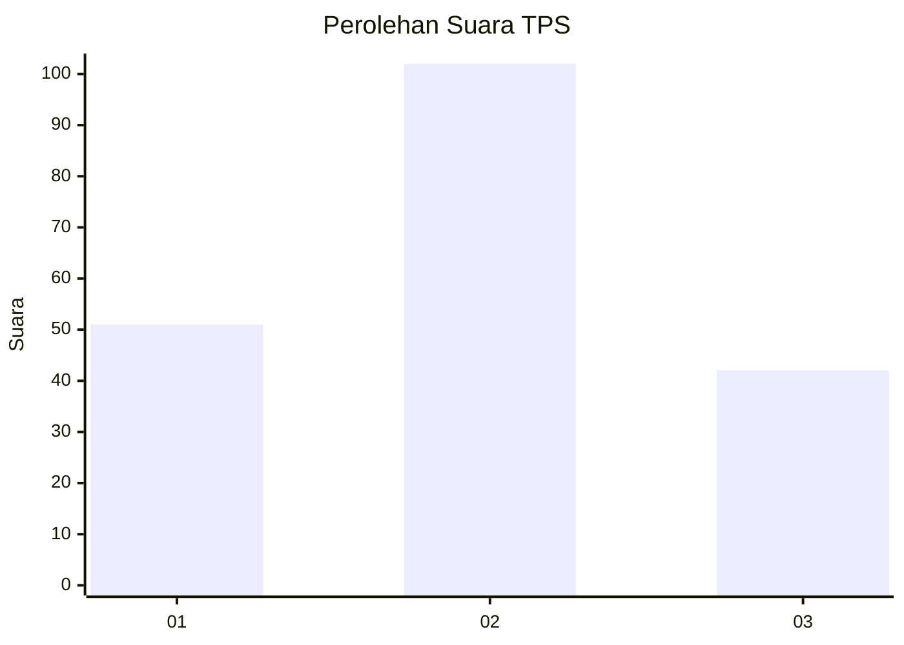
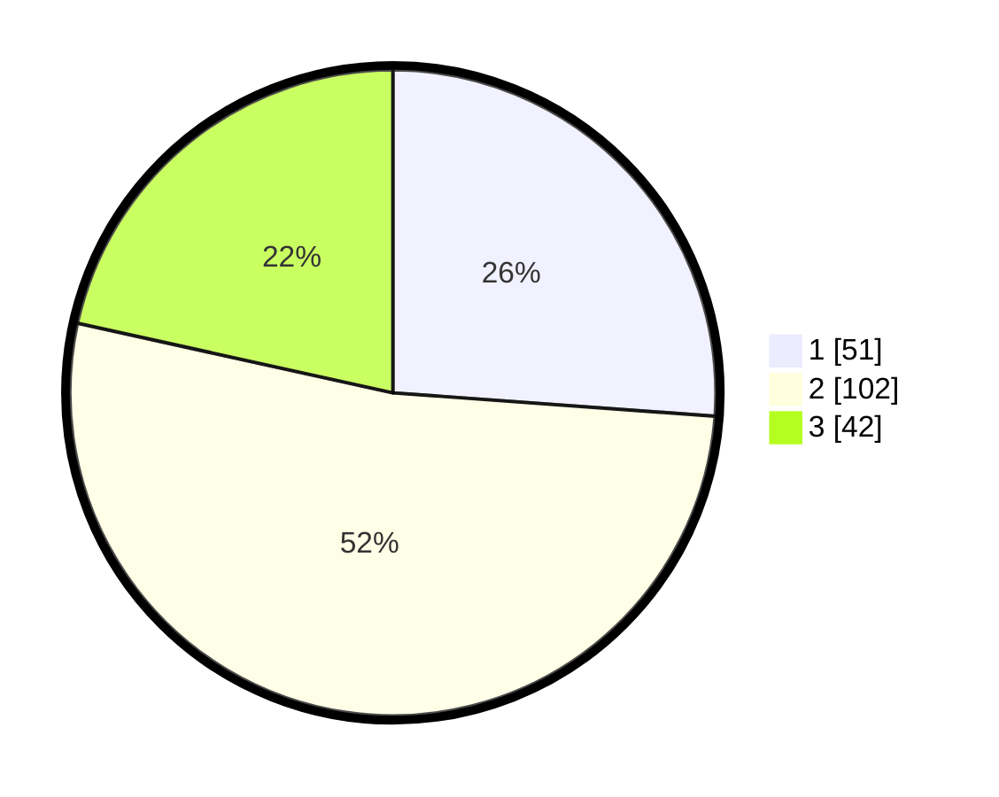

# Hasil

## Grafik

## Tabel

| No. | Nama Paslon    | Suara | Suara (raw) | Persentase |
|:--- |:-------------- | -----:| -----------:| ----------:|
| 1   | ANIES MUHAIMIN | 51    | [51][p-1]   | 26,15      |
| 2   | PRABOWO GIBRAN | 102   | [102][p-2]  | 52,31      |
| 3   | GANJAR MAHFUD  | 42    | [42][p-3]   | 21,54      |

[p-1]: https://github.com/gigit-pemilu/pemilu-2024-34-di-yogyakarta/blob/main/pilpres/hitung-suara/sub/34-di-yogyakarta/sub/03-gunungkidul/sub/01-wonosari/sub/2001-wonosari/sub/027-tps/sub/paslon-1.txt
[p-2]: https://github.com/gigit-pemilu/pemilu-2024-34-di-yogyakarta/blob/main/pilpres/hitung-suara/sub/34-di-yogyakarta/sub/03-gunungkidul/sub/01-wonosari/sub/2001-wonosari/sub/027-tps/sub/paslon-2.txt
[p-3]: https://github.com/gigit-pemilu/pemilu-2024-34-di-yogyakarta/blob/main/pilpres/hitung-suara/sub/34-di-yogyakarta/sub/03-gunungkidul/sub/01-wonosari/sub/2001-wonosari/sub/027-tps/sub/paslon-3.txt

## Foto C Plano

https://sirekap-obj-formc.kpu.go.id/ab95/pemilu/ppwp/34/03/01/20/01/3403012001027-20240216-034704--29d6f188-594e-4641-8c81-b2f8005315c4.jpg

https://sirekap-obj-formc.kpu.go.id/ab95/pemilu/ppwp/34/03/01/20/01/3403012001027-20240214-201138--c01d0e3a-c0bb-419c-baaf-11893f1c8e04.jpg

https://sirekap-obj-formc.kpu.go.id/ab95/pemilu/ppwp/34/03/01/20/01/3403012001027-20240214-211355--e96681fc-f1f2-469c-ba66-7e3da927d2fa.jpg

## Metadata

| Key        | Value               |
| ---------- | ------------------- |
| Time Stamp | 2024-02-16 04:00:27 |

## DATA PEMILIH TETAP

Jumlah pemilih dalam DPT: **210**.
 * L: **96**.
 * P: **114**.

## DATA PENGGUNA HAK PILIH

Jumlah pengguna hak pilih dalam DPT: **183**.
 * L: **85**.
 * P: **98**.

Jumlah pengguna hak pilih dalam DPTb: **14**.
 * L: **4**.
 * P: **10**.

Jumlah pengguna hak pilih dalam DPK: **1**.
 * L: **1**.
 * P: **0**.

Jumlah pengguna hak pilih: **198**.
 * L: **90**.
 * P: **108**.

## JUMLAH SUARA SAH DAN TIDAK SAH

JUMLAH SELURUH SUARA SAH: **195**.

JUMLAH SUARA TIDAK SAH: **3**.

JUMLAH SELURUH SUARA SAH DAN SUARA TIDAK SAH: **198**.

