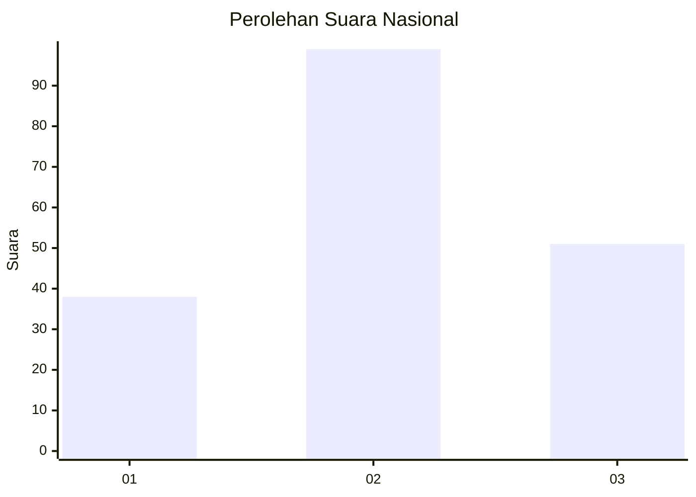
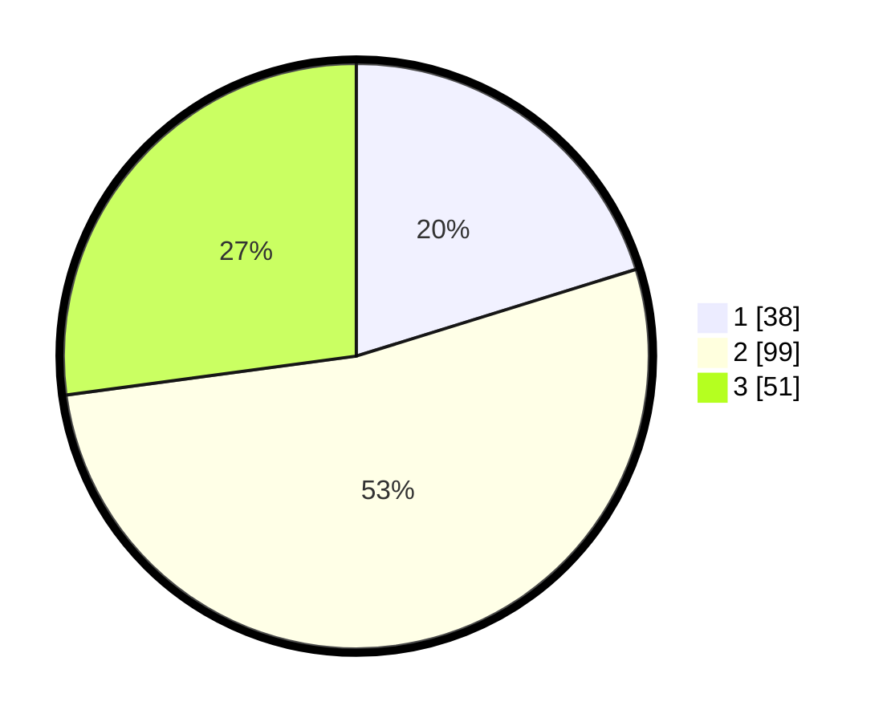

# Hasil

## Grafik

## Tabel

| No. | Nama Paslon    | Suara | Suara (raw) | Persentase |
|:--- |:-------------- | -----:| -----------:| ----------:|
| 1   | ANIES MUHAIMIN | 38    | [38][p-1]   | 20,21      |
| 2   | PRABOWO GIBRAN | 99    | [99][p-2]   | 52,66      |
| 3   | GANJAR MAHFUD  | 51    | [51][p-3]   | 27,13      |

[p-1]: https://github.com/gigit-pemilu/pemilu-2024/blob/main/pilpres/hitung-suara/sub/34-di-yogyakarta/sub/03-gunungkidul/sub/01-wonosari/sub/2001-wonosari/sub/029-tps/sub/paslon-1.txt
[p-2]: https://github.com/gigit-pemilu/pemilu-2024/blob/main/pilpres/hitung-suara/sub/34-di-yogyakarta/sub/03-gunungkidul/sub/01-wonosari/sub/2001-wonosari/sub/029-tps/sub/paslon-2.txt
[p-3]: https://github.com/gigit-pemilu/pemilu-2024/blob/main/pilpres/hitung-suara/sub/34-di-yogyakarta/sub/03-gunungkidul/sub/01-wonosari/sub/2001-wonosari/sub/029-tps/sub/paslon-3.txt

## Foto C Plano

https://sirekap-obj-formc.kpu.go.id/718f/pemilu/ppwp/34/03/01/20/01/3403012001029-20240215-211159--eafec004-7d70-4d46-bf1b-9ccce571fe99.jpg

https://sirekap-obj-formc.kpu.go.id/718f/pemilu/ppwp/34/03/01/20/01/3403012001029-20240215-211202--da7913a4-75f4-4656-8705-c55227521d19.jpg

https://sirekap-obj-formc.kpu.go.id/718f/pemilu/ppwp/34/03/01/20/01/3403012001029-20240215-211201--9e6699d4-9564-45df-b0b3-272b15ae5cb3.jpg

## Metadata

| Key        | Value               |
| ---------- | ------------------- |
| Time Stamp | 2024-02-15 21:30:27 |

## DATA PEMILIH TETAP

Jumlah pemilih dalam DPT: **202**.
 * L: **105**.
 * P: **97**.

## DATA PENGGUNA HAK PILIH

Jumlah pengguna hak pilih dalam DPT: **179**.
 * L: **93**.
 * P: **86**.

Jumlah pengguna hak pilih dalam DPTb: **11**.
 * L: **6**.
 * P: **5**.

Jumlah pengguna hak pilih dalam DPK: **0**.
 * L: **0**.
 * P: **0**.

Jumlah pengguna hak pilih: **190**.
 * L: **99**.
 * P: **91**.

## JUMLAH SUARA SAH DAN TIDAK SAH

JUMLAH SELURUH SUARA SAH: **188**.

JUMLAH SUARA TIDAK SAH: **2**.

JUMLAH SELURUH SUARA SAH DAN SUARA TIDAK SAH: **190**.

