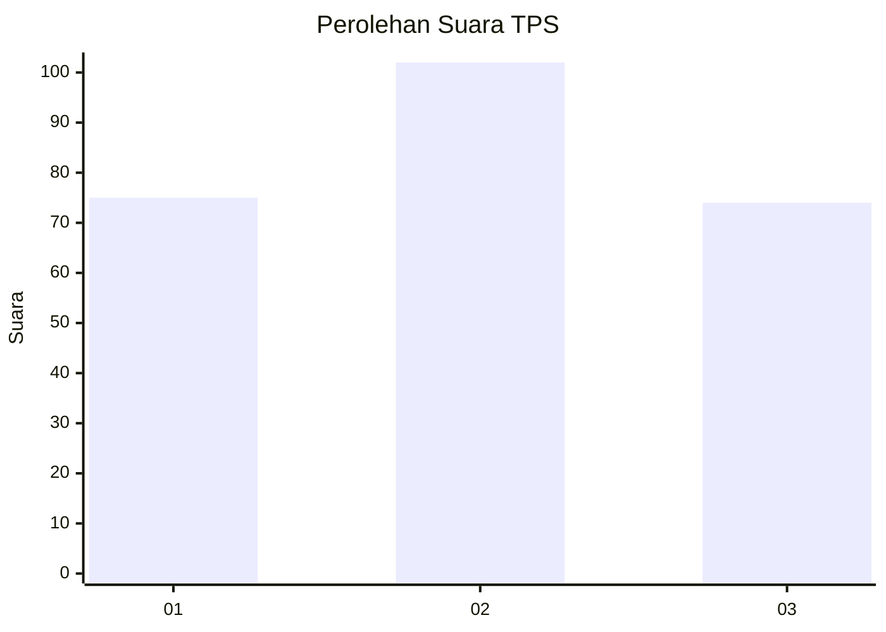
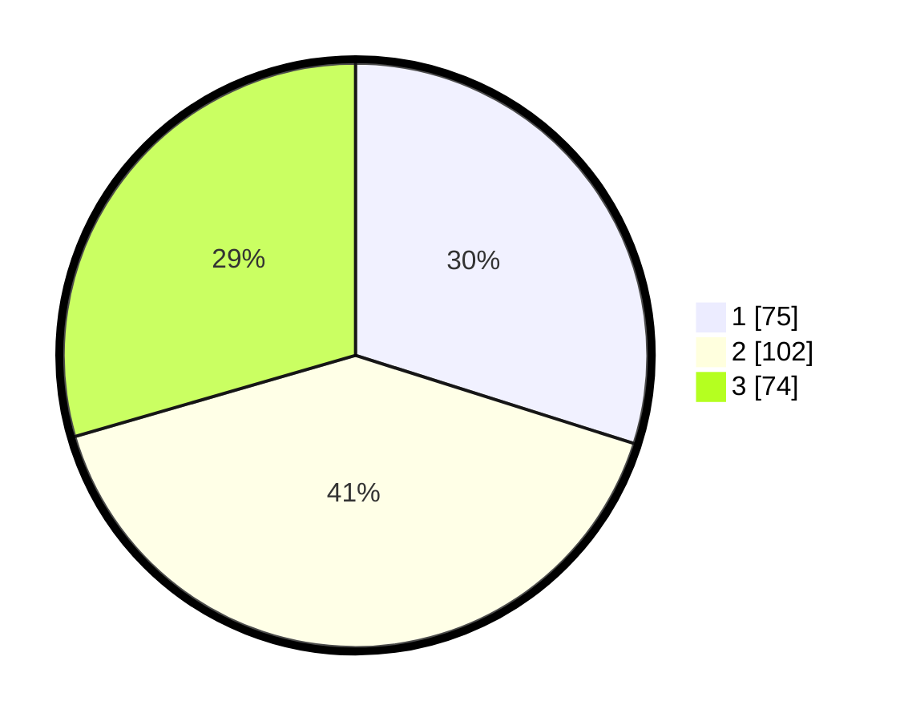

# Hasil

## Grafik

## Tabel

| No. | Nama Paslon    | Suara | Suara (raw) | Persentase |
|:--- |:-------------- | -----:| -----------:| ----------:|
| 1   | ANIES MUHAIMIN | 75    | [75][p-1]   | 29,88      |
| 2   | PRABOWO GIBRAN | 102   | [102][p-2]  | 40,64      |
| 3   | GANJAR MAHFUD  | 74    | [74][p-3]   | 29,48      |

[p-1]: https://github.com/gigit-pemilu/pemilu-2024-34-di-yogyakarta/blob/main/pilpres/hitung-suara/sub/34-di-yogyakarta/sub/03-gunungkidul/sub/01-wonosari/sub/2002-kepek/sub/002-tps/sub/paslon-1.txt
[p-2]: https://github.com/gigit-pemilu/pemilu-2024-34-di-yogyakarta/blob/main/pilpres/hitung-suara/sub/34-di-yogyakarta/sub/03-gunungkidul/sub/01-wonosari/sub/2002-kepek/sub/002-tps/sub/paslon-2.txt
[p-3]: https://github.com/gigit-pemilu/pemilu-2024-34-di-yogyakarta/blob/main/pilpres/hitung-suara/sub/34-di-yogyakarta/sub/03-gunungkidul/sub/01-wonosari/sub/2002-kepek/sub/002-tps/sub/paslon-3.txt

## Foto C Plano

https://sirekap-obj-formc.kpu.go.id/ab72/pemilu/ppwp/34/03/01/20/02/3403012002002-20240216-132716--59ac5311-ce70-42e4-887b-a399aee678ec.jpg

https://sirekap-obj-formc.kpu.go.id/ab72/pemilu/ppwp/34/03/01/20/02/3403012002002-20240216-132717--6833e2de-717e-4e29-9020-df55864c7ee7.jpg

https://sirekap-obj-formc.kpu.go.id/ab72/pemilu/ppwp/34/03/01/20/02/3403012002002-20240216-132716--5ebe8101-8028-4ee3-936f-f3527cc1992d.jpg

## Metadata

| Key        | Value               |
| ---------- | ------------------- |
| Time Stamp | 2024-02-19 06:16:00 |

## DATA PEMILIH TETAP

Jumlah pemilih dalam DPT: **294**.
 * L: **137**.
 * P: **157**.

## DATA PENGGUNA HAK PILIH

Jumlah pengguna hak pilih dalam DPT: **242**.
 * L: **110**.
 * P: **132**.

Jumlah pengguna hak pilih dalam DPTb: **12**.
 * L: **4**.
 * P: **8**.

Jumlah pengguna hak pilih dalam DPK: **4**.
 * L: **2**.
 * P: **2**.

Jumlah pengguna hak pilih: **258**.
 * L: **116**.
 * P: **142**.

## JUMLAH SUARA SAH DAN TIDAK SAH

JUMLAH SELURUH SUARA SAH: **251**.

JUMLAH SUARA TIDAK SAH: **7**.

JUMLAH SELURUH SUARA SAH DAN SUARA TIDAK SAH: **258**.

