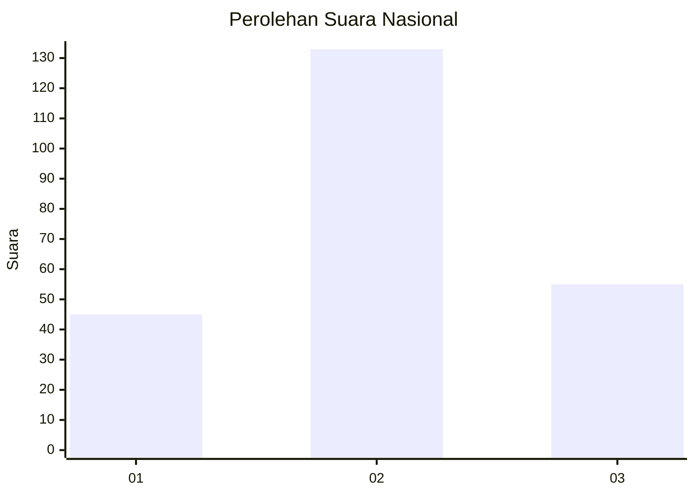
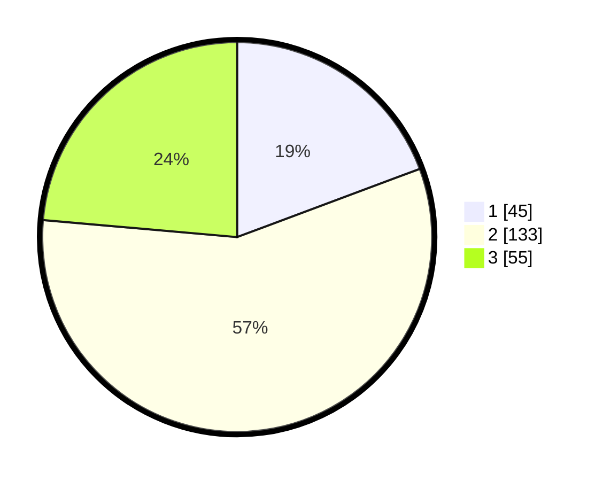

# Hasil

## Grafik

## Tabel

| No. | Nama Paslon    | Suara | Suara (raw) | Persentase |
|:--- |:-------------- | -----:| -----------:| ----------:|
| 1   | ANIES MUHAIMIN | 45    | [45][p-1]   | 19,31      |
| 2   | PRABOWO GIBRAN | 133   | [133][p-2]  | 57,08      |
| 3   | GANJAR MAHFUD  | 55    | [55][p-3]   | 23,61      |

[p-1]: https://github.com/gigit-pemilu/pemilu-2024/blob/main/pilpres/hitung-suara/sub/34-di-yogyakarta/sub/03-gunungkidul/sub/01-wonosari/sub/2002-kepek/sub/014-tps/sub/paslon-1.txt
[p-2]: https://github.com/gigit-pemilu/pemilu-2024/blob/main/pilpres/hitung-suara/sub/34-di-yogyakarta/sub/03-gunungkidul/sub/01-wonosari/sub/2002-kepek/sub/014-tps/sub/paslon-2.txt
[p-3]: https://github.com/gigit-pemilu/pemilu-2024/blob/main/pilpres/hitung-suara/sub/34-di-yogyakarta/sub/03-gunungkidul/sub/01-wonosari/sub/2002-kepek/sub/014-tps/sub/paslon-3.txt

## Foto C Plano

https://sirekap-obj-formc.kpu.go.id/b81d/pemilu/ppwp/34/03/01/20/02/3403012002014-20240215-014018--7c79751b-561e-40c3-ba9d-7775fde67fd1.jpg

https://sirekap-obj-formc.kpu.go.id/b81d/pemilu/ppwp/34/03/01/20/02/3403012002014-20240217-163418--16a32335-3a61-4b92-9d5e-32d1dd0ac0d7.jpg

https://sirekap-obj-formc.kpu.go.id/b81d/pemilu/ppwp/34/03/01/20/02/3403012002014-20240215-224028--204cff49-aef3-4300-8b7b-9c6a32bdd271.jpg

## Metadata

| Key        | Value               |
| ---------- | ------------------- |
| Time Stamp | 2024-02-17 18:00:00 |

