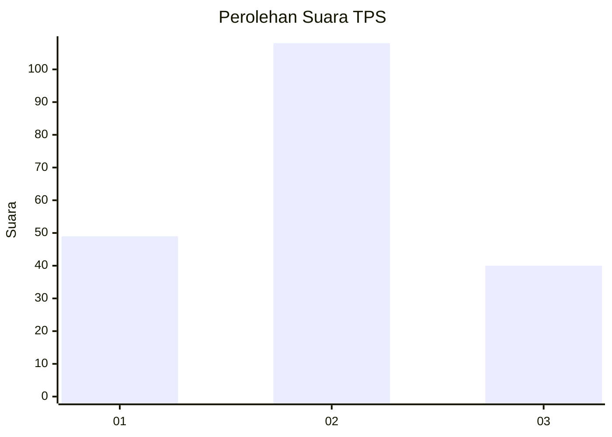
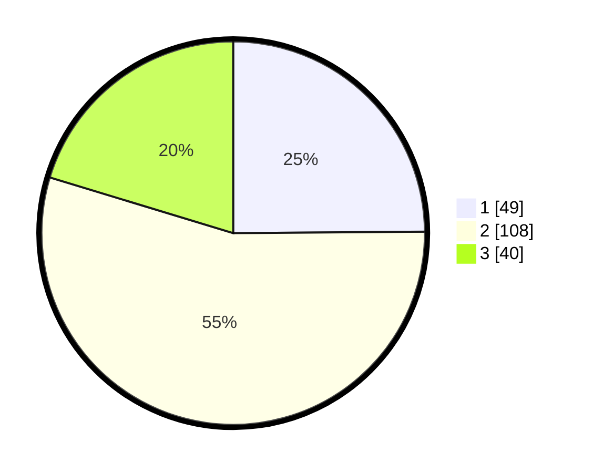

# Hasil

## Grafik

## Tabel

| No. | Nama Paslon    | Suara | Suara (raw) | Persentase |
|:--- |:-------------- | -----:| -----------:| ----------:|
| 1   | ANIES MUHAIMIN | 49    | [49][p-1]   | 24,87      |
| 2   | PRABOWO GIBRAN | 108   | [108][p-2]  | 54,82      |
| 3   | GANJAR MAHFUD  | 40    | [40][p-3]   | 20,30      |

[p-1]: https://github.com/gigit-pemilu/pemilu-2024-34-di-yogyakarta/blob/main/pilpres/hitung-suara/sub/34-di-yogyakarta/sub/03-gunungkidul/sub/01-wonosari/sub/2002-kepek/sub/024-tps/sub/paslon-1.txt
[p-2]: https://github.com/gigit-pemilu/pemilu-2024-34-di-yogyakarta/blob/main/pilpres/hitung-suara/sub/34-di-yogyakarta/sub/03-gunungkidul/sub/01-wonosari/sub/2002-kepek/sub/024-tps/sub/paslon-2.txt
[p-3]: https://github.com/gigit-pemilu/pemilu-2024-34-di-yogyakarta/blob/main/pilpres/hitung-suara/sub/34-di-yogyakarta/sub/03-gunungkidul/sub/01-wonosari/sub/2002-kepek/sub/024-tps/sub/paslon-3.txt

## Foto C Plano

https://sirekap-obj-formc.kpu.go.id/9ac5/pemilu/ppwp/34/03/01/20/02/3403012002024-20240217-210412--89770c6a-8ec8-4982-86a3-5c98af286ddd.jpg

https://sirekap-obj-formc.kpu.go.id/9ac5/pemilu/ppwp/34/03/01/20/02/3403012002024-20240217-210553--245ce991-b229-4918-ad07-bfb498273a04.jpg

https://sirekap-obj-formc.kpu.go.id/9ac5/pemilu/ppwp/34/03/01/20/02/3403012002024-20240217-211012--d7ebee46-5fb9-4019-adac-ad1f49059908.jpg

## Metadata

| Key        | Value               |
| ---------- | ------------------- |
| Time Stamp | 2024-02-20 11:00:00 |

