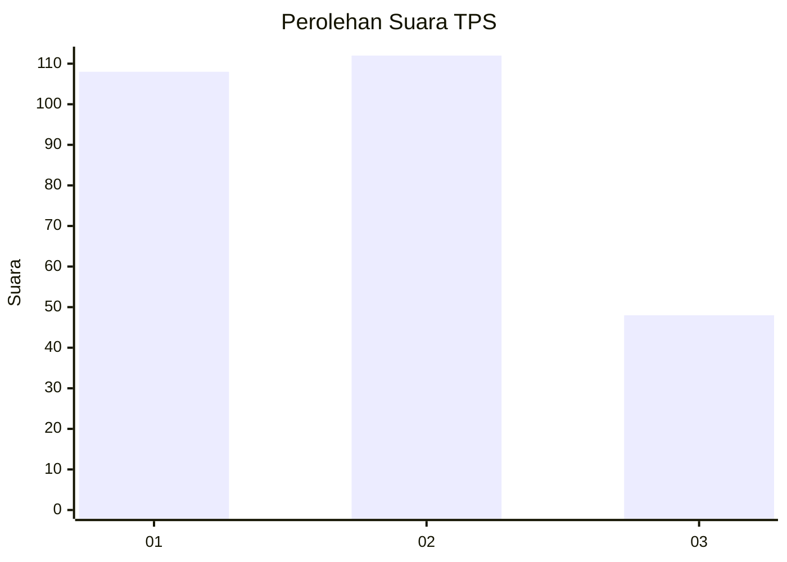
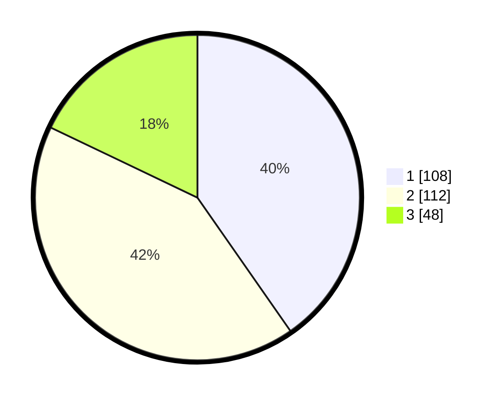

# Hasil

## Grafik

## Tabel

| No. | Nama Paslon    | Suara | Suara (raw) | Persentase |
|:--- |:-------------- | -----:| -----------:| ----------:|
| 1   | ANIES MUHAIMIN | 108   | [108][p-1]  | 40,30      |
| 2   | PRABOWO GIBRAN | 112   | [112][p-2]  | 41,79      |
| 3   | GANJAR MAHFUD  | 48    | [48][p-3]   | 17,91      |

[p-1]: https://github.com/gigit-pemilu/pemilu-2024-34-di-yogyakarta/blob/main/pilpres/hitung-suara/sub/34-di-yogyakarta/sub/03-gunungkidul/sub/01-wonosari/sub/2002-kepek/sub/028-tps/sub/paslon-1.txt
[p-2]: https://github.com/gigit-pemilu/pemilu-2024-34-di-yogyakarta/blob/main/pilpres/hitung-suara/sub/34-di-yogyakarta/sub/03-gunungkidul/sub/01-wonosari/sub/2002-kepek/sub/028-tps/sub/paslon-2.txt
[p-3]: https://github.com/gigit-pemilu/pemilu-2024-34-di-yogyakarta/blob/main/pilpres/hitung-suara/sub/34-di-yogyakarta/sub/03-gunungkidul/sub/01-wonosari/sub/2002-kepek/sub/028-tps/sub/paslon-3.txt

## Foto C Plano

https://sirekap-obj-formc.kpu.go.id/621a/pemilu/ppwp/34/03/01/20/02/3403012002028-20240215-233924--8b0f8037-4700-4624-954a-77f7503580b7.jpg

https://sirekap-obj-formc.kpu.go.id/621a/pemilu/ppwp/34/03/01/20/02/3403012002028-20240215-233931--6a026fd9-d7ce-42ca-afe6-4dd6cfff237f.jpg

https://sirekap-obj-formc.kpu.go.id/621a/pemilu/ppwp/34/03/01/20/02/3403012002028-20240215-233930--f63cc7d9-f66d-4a40-b59b-4fcaa74f195c.jpg

## Metadata

| Key        | Value               |
| ---------- | ------------------- |
| Time Stamp | 2024-02-16 17:00:00 |

## DATA PEMILIH TETAP

Jumlah pemilih dalam DPT: **288**.
 * L: **146**.
 * P: **142**.

## DATA PENGGUNA HAK PILIH

Jumlah pengguna hak pilih dalam DPT: **253**.
 * L: **126**.
 * P: **127**.

Jumlah pengguna hak pilih dalam DPTb: **13**.
 * L: **4**.
 * P: **9**.

Jumlah pengguna hak pilih dalam DPK: **3**.
 * L: **1**.
 * P: **2**.

Jumlah pengguna hak pilih: **269**.
 * L: **131**.
 * P: **138**.

## JUMLAH SUARA SAH DAN TIDAK SAH

JUMLAH SELURUH SUARA SAH: **268**.

JUMLAH SUARA TIDAK SAH: **1**.

JUMLAH SELURUH SUARA SAH DAN SUARA TIDAK SAH: **269**.

