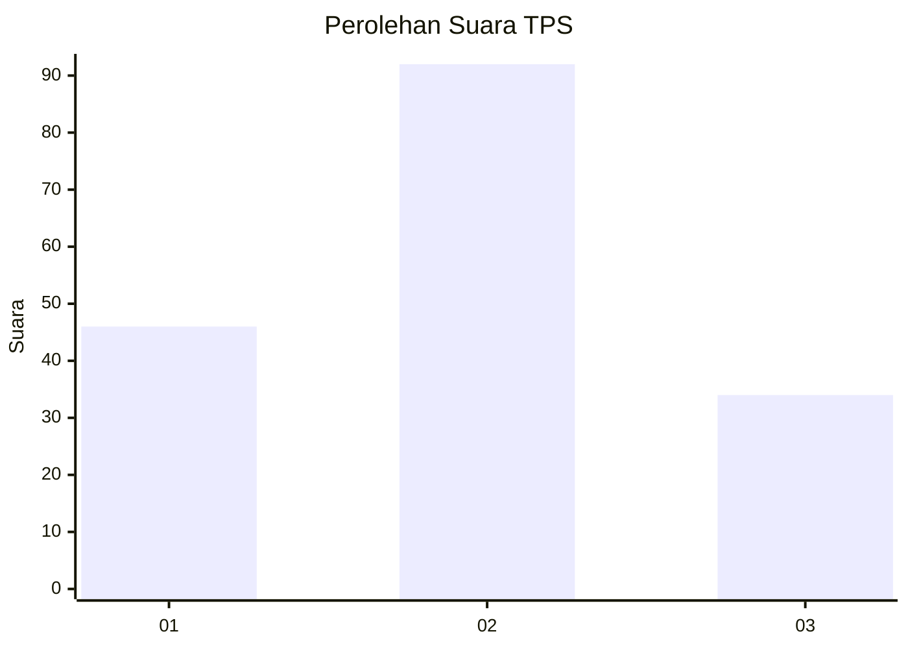
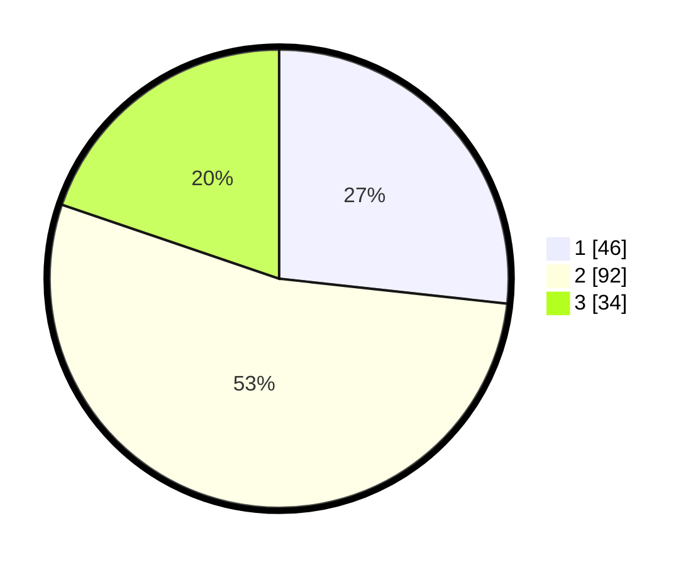

# Hasil

## Grafik

## Tabel

| No. | Nama Paslon    | Suara | Suara (raw) | Persentase |
|:--- |:-------------- | -----:| -----------:| ----------:|
| 1   | ANIES MUHAIMIN | 46    | [46][p-1]   | 26,74      |
| 2   | PRABOWO GIBRAN | 92    | [92][p-2]   | 53,49      |
| 3   | GANJAR MAHFUD  | 34    | [34][p-3]   | 19,77      |

[p-1]: https://github.com/gigit-pemilu/pemilu-2024-34-di-yogyakarta/blob/main/pilpres/hitung-suara/sub/34-di-yogyakarta/sub/03-gunungkidul/sub/01-wonosari/sub/2003-piyaman/sub/002-tps/sub/paslon-1.txt
[p-2]: https://github.com/gigit-pemilu/pemilu-2024-34-di-yogyakarta/blob/main/pilpres/hitung-suara/sub/34-di-yogyakarta/sub/03-gunungkidul/sub/01-wonosari/sub/2003-piyaman/sub/002-tps/sub/paslon-2.txt
[p-3]: https://github.com/gigit-pemilu/pemilu-2024-34-di-yogyakarta/blob/main/pilpres/hitung-suara/sub/34-di-yogyakarta/sub/03-gunungkidul/sub/01-wonosari/sub/2003-piyaman/sub/002-tps/sub/paslon-3.txt

## Foto C Plano

https://sirekap-obj-formc.kpu.go.id/36b6/pemilu/ppwp/34/03/01/20/03/3403012003002-20240216-073201--8e98d76c-3377-4330-9468-1ac195c04123.jpg

https://sirekap-obj-formc.kpu.go.id/36b6/pemilu/ppwp/34/03/01/20/03/3403012003002-20240216-073203--1e91218b-afdb-4289-b33b-06373803b530.jpg

https://sirekap-obj-formc.kpu.go.id/36b6/pemilu/ppwp/34/03/01/20/03/3403012003002-20240216-073202--54b77872-fd3a-41f4-b5df-277514a84fd2.jpg

## Metadata

| Key        | Value               |
| ---------- | ------------------- |
| Time Stamp | 2024-02-17 09:30:03 |

## DATA PEMILIH TETAP

Jumlah pemilih dalam DPT: **202**.
 * L: **103**.
 * P: **99**.

## DATA PENGGUNA HAK PILIH

Jumlah pengguna hak pilih dalam DPT: **180**.
 * L: **88**.
 * P: **92**.

Jumlah pengguna hak pilih dalam DPTb: **0**.
 * L: **0**.
 * P: **0**.

Jumlah pengguna hak pilih dalam DPK: **0**.
 * L: **0**.
 * P: **0**.

Jumlah pengguna hak pilih: **180**.
 * L: **88**.
 * P: **92**.

## JUMLAH SUARA SAH DAN TIDAK SAH

JUMLAH SELURUH SUARA SAH: **172**.

JUMLAH SUARA TIDAK SAH: **8**.

JUMLAH SELURUH SUARA SAH DAN SUARA TIDAK SAH: **180**.

