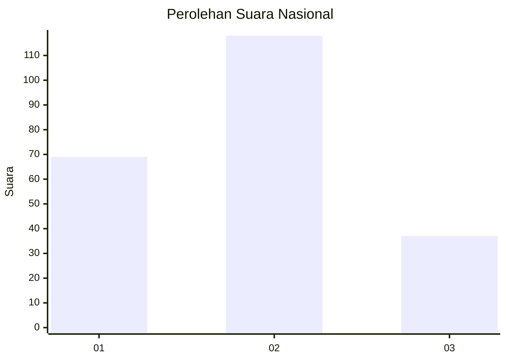
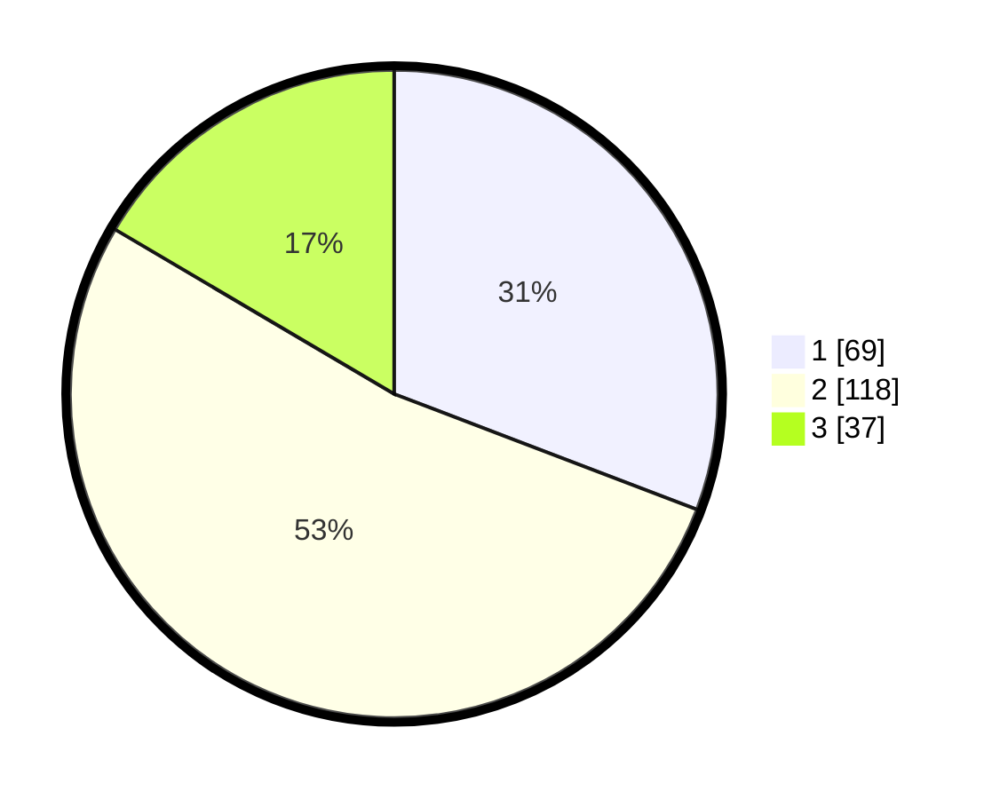

# Hasil

## Grafik

## Tabel

| No. | Nama Paslon    | Suara | Suara (raw) | Persentase |
|:--- |:-------------- | -----:| -----------:| ----------:|
| 1   | ANIES MUHAIMIN | 69    | [69][p-1]   | 30,80      |
| 2   | PRABOWO GIBRAN | 118   | [118][p-2]  | 52,68      |
| 3   | GANJAR MAHFUD  | 37    | [37][p-3]   | 16,52      |

[p-1]: https://github.com/gigit-pemilu/pemilu-2024/blob/main/pilpres/hitung-suara/sub/34-di-yogyakarta/sub/03-gunungkidul/sub/01-wonosari/sub/2003-piyaman/sub/014-tps/sub/paslon-1.txt
[p-2]: https://github.com/gigit-pemilu/pemilu-2024/blob/main/pilpres/hitung-suara/sub/34-di-yogyakarta/sub/03-gunungkidul/sub/01-wonosari/sub/2003-piyaman/sub/014-tps/sub/paslon-2.txt
[p-3]: https://github.com/gigit-pemilu/pemilu-2024/blob/main/pilpres/hitung-suara/sub/34-di-yogyakarta/sub/03-gunungkidul/sub/01-wonosari/sub/2003-piyaman/sub/014-tps/sub/paslon-3.txt

## Foto C Plano

https://sirekap-obj-formc.kpu.go.id/2f1d/pemilu/ppwp/34/03/01/20/03/3403012003014-20240214-185552--743cd46f-6078-4944-b521-463565e15d64.jpg

https://sirekap-obj-formc.kpu.go.id/2f1d/pemilu/ppwp/34/03/01/20/03/3403012003014-20240214-185547--16f33f8a-a30e-4cb9-9b9c-4c313373289f.jpg

https://sirekap-obj-formc.kpu.go.id/2f1d/pemilu/ppwp/34/03/01/20/03/3403012003014-20240215-041856--02774452-6032-4e97-b0e4-aa72cb9f2cc1.jpg

## Metadata

| Key        | Value               |
| ---------- | ------------------- |
| Time Stamp | 2024-02-15 15:00:29 |

