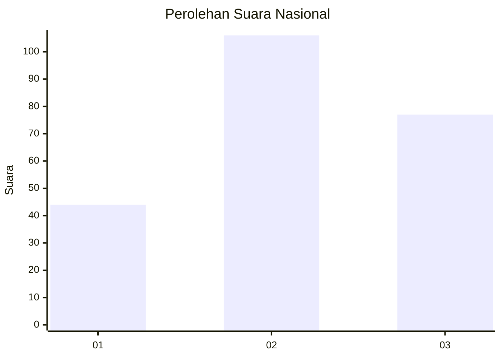
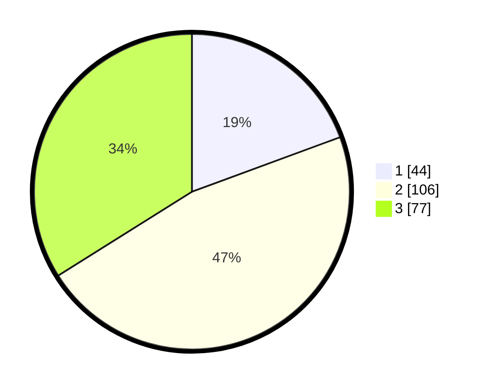

# Hasil

## Grafik

## Tabel

| No. | Nama Paslon    | Suara | Suara (raw) | Persentase |
|:--- |:-------------- | -----:| -----------:| ----------:|
| 1   | ANIES MUHAIMIN | 44    | [44][p-1]   | 19,38      |
| 2   | PRABOWO GIBRAN | 106   | [106][p-2]  | 46,70      |
| 3   | GANJAR MAHFUD  | 77    | [77][p-3]   | 33,92      |

[p-1]: https://github.com/gigit-pemilu/pemilu-2024/blob/main/pilpres/hitung-suara/sub/34-di-yogyakarta/sub/03-gunungkidul/sub/01-wonosari/sub/2003-piyaman/sub/019-tps/sub/paslon-1.txt
[p-2]: https://github.com/gigit-pemilu/pemilu-2024/blob/main/pilpres/hitung-suara/sub/34-di-yogyakarta/sub/03-gunungkidul/sub/01-wonosari/sub/2003-piyaman/sub/019-tps/sub/paslon-2.txt
[p-3]: https://github.com/gigit-pemilu/pemilu-2024/blob/main/pilpres/hitung-suara/sub/34-di-yogyakarta/sub/03-gunungkidul/sub/01-wonosari/sub/2003-piyaman/sub/019-tps/sub/paslon-3.txt

## Foto C Plano

https://sirekap-obj-formc.kpu.go.id/8615/pemilu/ppwp/34/03/01/20/03/3403012003019-20240215-014810--9aded5be-20e8-4ff0-bea4-130f4621c526.jpg

https://sirekap-obj-formc.kpu.go.id/8615/pemilu/ppwp/34/03/01/20/03/3403012003019-20240215-014619--11412cd3-c1c0-414d-b5de-a4748233da18.jpg

https://sirekap-obj-formc.kpu.go.id/8615/pemilu/ppwp/34/03/01/20/03/3403012003019-20240215-015012--908edd4c-1699-4cd6-ad85-0b7e65820631.jpg

## Metadata

| Key        | Value               |
| ---------- | ------------------- |
| Time Stamp | 2024-02-15 19:30:26 |

