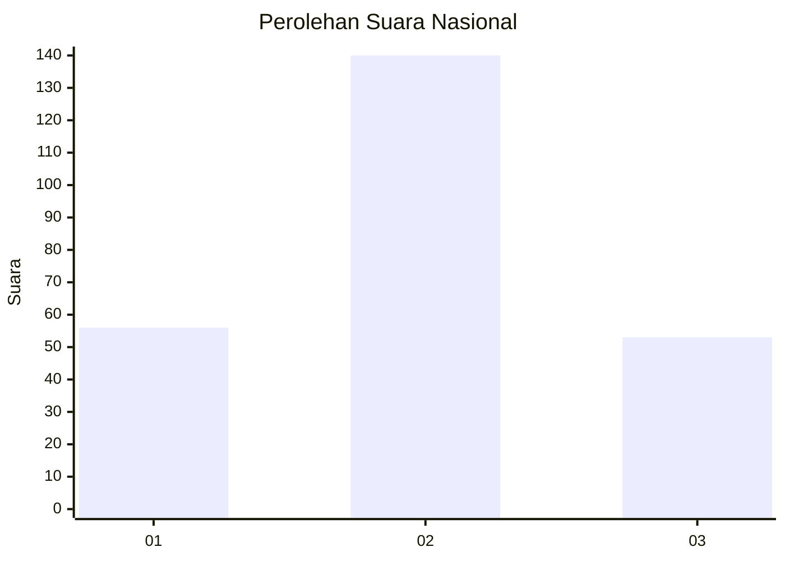
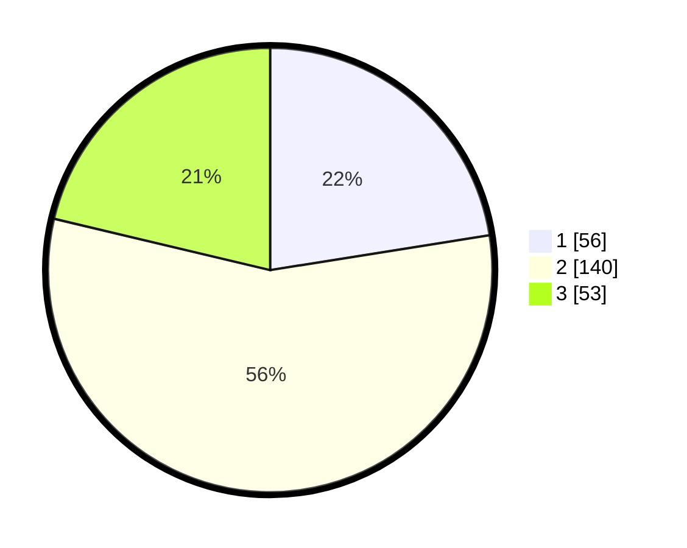

# Hasil

## Grafik

## Tabel

| No. | Nama Paslon    | Suara | Suara (raw) | Persentase |
|:--- |:-------------- | -----:| -----------:| ----------:|
| 1   | ANIES MUHAIMIN | 56    | [56][p-1]   | 22,49      |
| 2   | PRABOWO GIBRAN | 140   | [140][p-2]  | 56,22      |
| 3   | GANJAR MAHFUD  | 53    | [53][p-3]   | 21,29      |

[p-1]: https://github.com/gigit-pemilu/pemilu-2024/blob/main/pilpres/hitung-suara/sub/34-di-yogyakarta/sub/03-gunungkidul/sub/01-wonosari/sub/2005-karangtengah/sub/003-tps/sub/paslon-1.txt
[p-2]: https://github.com/gigit-pemilu/pemilu-2024/blob/main/pilpres/hitung-suara/sub/34-di-yogyakarta/sub/03-gunungkidul/sub/01-wonosari/sub/2005-karangtengah/sub/003-tps/sub/paslon-2.txt
[p-3]: https://github.com/gigit-pemilu/pemilu-2024/blob/main/pilpres/hitung-suara/sub/34-di-yogyakarta/sub/03-gunungkidul/sub/01-wonosari/sub/2005-karangtengah/sub/003-tps/sub/paslon-3.txt

## Foto C Plano

https://sirekap-obj-formc.kpu.go.id/136e/pemilu/ppwp/34/03/01/20/05/3403012005003-20240214-230154--f1424895-7f0a-467a-b0d6-d5a4b0419f77.jpg

https://sirekap-obj-formc.kpu.go.id/136e/pemilu/ppwp/34/03/01/20/05/3403012005003-20240214-231611--85d448c3-33aa-4967-b597-a14ee5ebd4df.jpg

https://sirekap-obj-formc.kpu.go.id/136e/pemilu/ppwp/34/03/01/20/05/3403012005003-20240214-232232--8e72e09f-ecf5-4b3e-bad4-3074d6acbefc.jpg

## Metadata

| Key        | Value               |
| ---------- | ------------------- |
| Time Stamp | 2024-02-15 15:30:25 |

