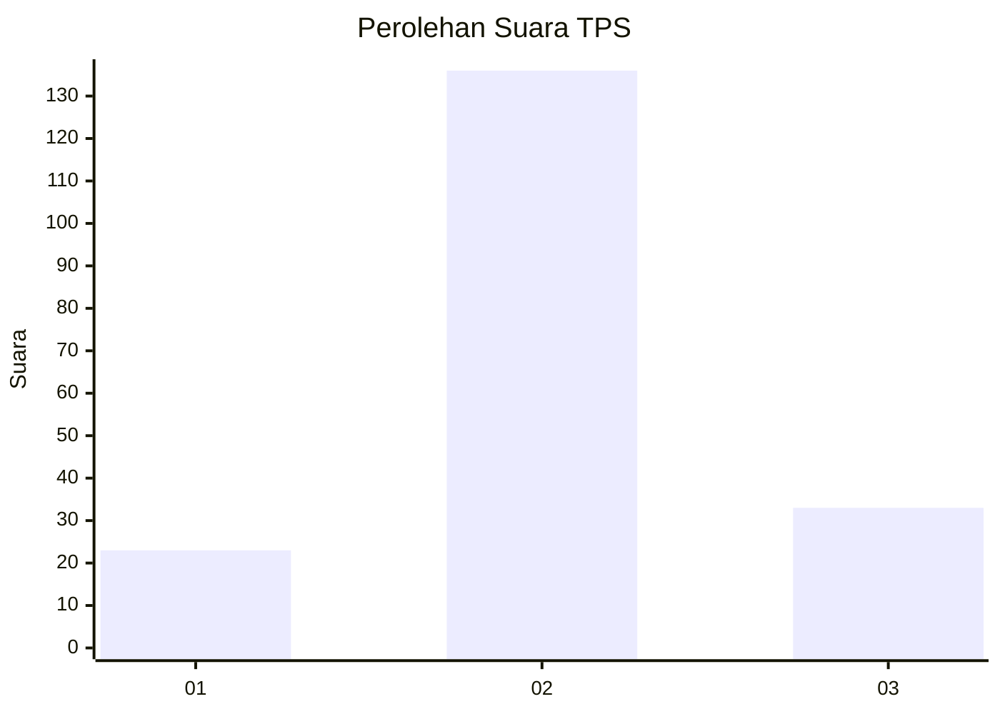
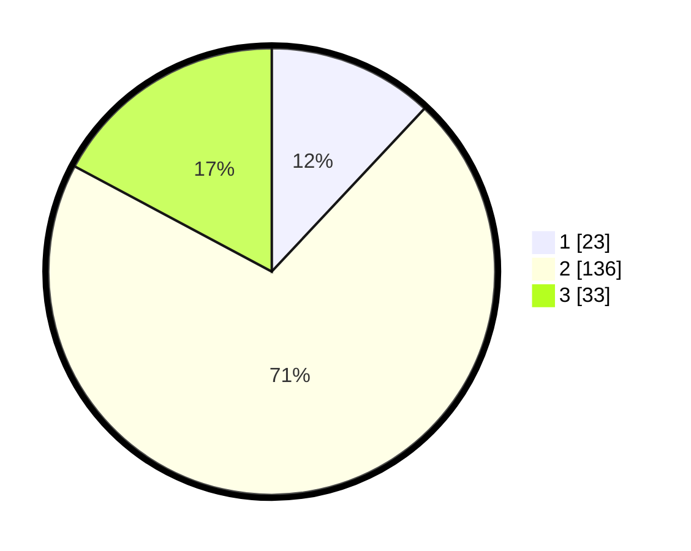

# Hasil

## Grafik

## Tabel

| No. | Nama Paslon    | Suara | Suara (raw) | Persentase |
|:--- |:-------------- | -----:| -----------:| ----------:|
| 1   | ANIES MUHAIMIN | 23    | [23][p-1]   | 11,98      |
| 2   | PRABOWO GIBRAN | 136   | [136][p-2]  | 70,83      |
| 3   | GANJAR MAHFUD  | 33    | [33][p-3]   | 17,19      |

[p-1]: https://github.com/gigit-pemilu/pemilu-2024-34-di-yogyakarta/blob/main/pilpres/hitung-suara/sub/34-di-yogyakarta/sub/03-gunungkidul/sub/01-wonosari/sub/2005-karangtengah/sub/010-tps/sub/paslon-1.txt
[p-2]: https://github.com/gigit-pemilu/pemilu-2024-34-di-yogyakarta/blob/main/pilpres/hitung-suara/sub/34-di-yogyakarta/sub/03-gunungkidul/sub/01-wonosari/sub/2005-karangtengah/sub/010-tps/sub/paslon-2.txt
[p-3]: https://github.com/gigit-pemilu/pemilu-2024-34-di-yogyakarta/blob/main/pilpres/hitung-suara/sub/34-di-yogyakarta/sub/03-gunungkidul/sub/01-wonosari/sub/2005-karangtengah/sub/010-tps/sub/paslon-3.txt

## Foto C Plano

https://sirekap-obj-formc.kpu.go.id/bc72/pemilu/ppwp/34/03/01/20/05/3403012005010-20240214-214523--5c682c57-95b4-46c6-83c5-0a027f050f01.jpg

https://sirekap-obj-formc.kpu.go.id/bc72/pemilu/ppwp/34/03/01/20/05/3403012005010-20240214-214251--26e4333b-83f6-4ebb-ac58-fce0b2a27a09.jpg

https://sirekap-obj-formc.kpu.go.id/bc72/pemilu/ppwp/34/03/01/20/05/3403012005010-20240214-214350--9e8e4974-f123-4763-aa6f-009593821a2b.jpg

## Metadata

| Key        | Value               |
| ---------- | ------------------- |
| Time Stamp | 2024-02-15 21:30:27 |

